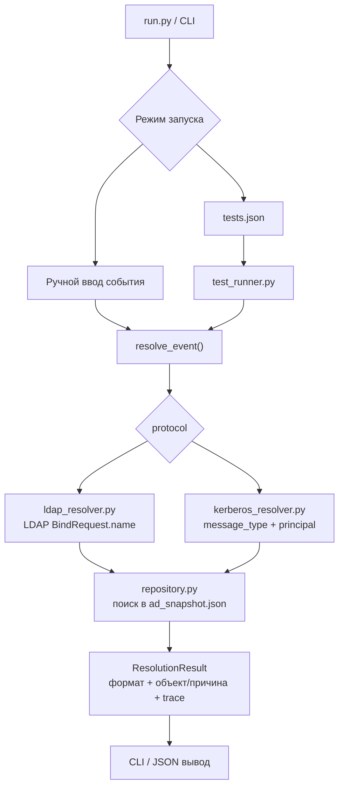
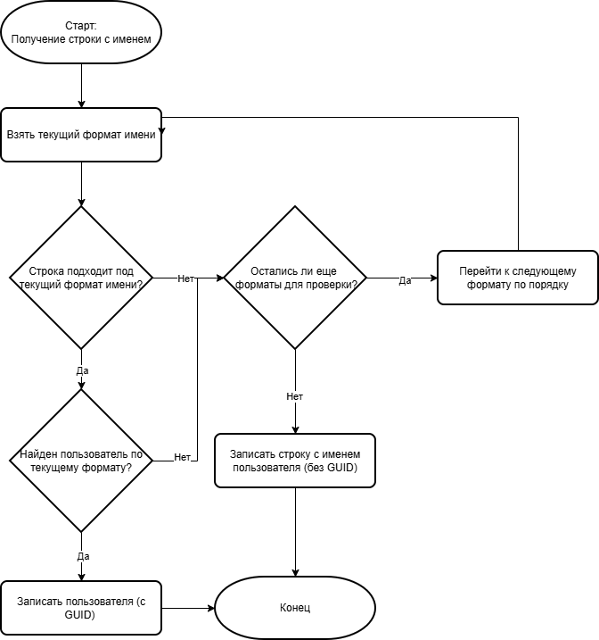

# Прототип AD-like Name Resolution

Прототип показывает, как ITDR-подобный продукт может разобрать имя из уже выделенного LDAP/Kerberos события, определить формат имени, найти объект в локальном снимке AD и вернуть результат проверки.

Проект не подключается к реальному AD, не выполняет LDAP Bind, не делает Kerberos-обмен и не парсит pcap. Здесь проверяется только логика разбора имени и сопоставления с объектами из локальной базы.

## Состав проекта

- `run.py` - точка запуска CLI.
- `ad_snapshot.json` - единая локальная база AD-объектов для ручного режима и тестов.
- `tests.json` - тестовые кейсы по таблицам и алгоритмам статьи.
- `ad_name_resolution/resolver.py` - общий роутер LDAP/Kerberos.
- `ad_name_resolution/ldap_resolver.py` - порядок проверок LDAP Simple Authentication.
- `ad_name_resolution/kerberos_resolver.py` - Kerberos Client Principal Lookup и Server Principal Lookup.
- `ad_name_resolution/repository.py` - функции поиска по локальному снимку AD.
- `ad_name_resolution/cli.py` - ручной режим, меню и вывод результата.
- `ad_name_resolution/test_runner.py` - запуск тестов из JSON.

Общий роутер - это небольшой слой, который сам ничего не ищет в базе. Он смотрит на поле `protocol` во входном событии и передает событие в нужный resolver: LDAP-событие уходит в `ldap_resolver.py`, Kerberos-событие уходит в `kerberos_resolver.py`.

## Схема прототипа



Коротко: CLI или тесты формируют уже разобранное событие, `resolve_event()` выбирает LDAP/Kerberos-ветку, resolver проверяет имя по алгоритму и ходит в локальный AD snapshot через repository. На выходе получается единый `ResolutionResult` с найденным форматом, объектом или причиной ошибки.

## Как идет LDAP-проверка

Для LDAP используется поле `LDAPMessage -> protocolOp: bindRequest -> bindRequest -> name`.

Порядок проверки:

1. `distinguishedName`
2. `userPrincipalName` / generated UPN
3. `DOMAIN\sAMAccountName`
4. `canonicalName`
5. `objectGUID`
6. `displayName`
7. `servicePrincipalName`
8. `MapSPN`
9. `objectSid`
10. `sIDHistory`
11. `canonicalName` с заменой последнего `/` на `\n`

Generated UPN проверяется после явного `userPrincipalName`. Сначала ищется точное значение `userPrincipalName`; если оно не найдено, строка вида `name@domain` может быть сопоставлена как `sAMAccountName=name` и `domainFQDN=domain`.

### Схема LDAP-проверки

Эта схема соответствует текущему LDAP-порядку: берется строка с именем, последовательно проверяются форматы из списка, при первом успешном совпадении возвращается найденный объект, иначе resolver переходит к следующему формату.



## Как идет Kerberos-проверка

Для Kerberos на вход подается уже разобранный principal из трафика: `message_type`, `cname` или `sname`, `name_type`, `name_string[]` и `realm`.

Выбор ветки:

```text
AS-REQ  -> cname -> Client Principal Lookup
TGS-REQ -> sname -> Server Principal Lookup
```

Поддержанные в прототипе `name_type`:

- `1` - `KRB5-NT-PRINCIPAL`
- `2` - `KRB5-NT-SRV-INST`
- `3` - `KRB5-NT-SRV-HST`
- `10` - `KRB5-NT-ENTERPRISE-PRINCIPAL`

`realm` оставлен отдельным полем, как в реальном Kerberos-трафике. CLI может подсказать значение по имени, но в сам resolver `realm` передается отдельно. Это важно: resolver не должен "угадывать" realm из строки имени, потому что в реальном Kerberos-событии realm уже приходит отдельным полем и задает доменный контекст поиска.

### Общая логика Kerberos-разбора

1. Сначала смотрим `message_type`.
2. Если это `AS-REQ`, берем `cname` и идем в `Client Principal Lookup`.
3. Если это `TGS-REQ`, берем `sname` и идем в `Server Principal Lookup`.
4. Из выбранного principal берутся `name_type` и `name_string[]`, а `realm` читается отдельно из события.
5. `realm` используется как контекст домена: например, чтобы понять, в каком домене искать `sAMAccountName`, машинный аккаунт с `$` или специальный объект `krbtgt`.
6. Дальше resolver выбирает ветку по `name_type` и проверяет значения по локальному AD snapshot.

Если тип сообщения, `name_type` или форма `name_string[]` не поддержаны, результат будет `unsupported` или `invalid_input`. Если формат понятен, но объект не найден, возвращается `object_not_found`.

### AS-REQ / Client Principal Lookup

`AS-REQ` используется для поиска клиентского объекта. В прототипе берется `cname`.

Для `KRB5-NT-ENTERPRISE-PRINCIPAL` / `name_type = 10`:

1. Ожидается один элемент в `cname.name_string[]`, например `userA@pastukhov.lab`.
2. Строка сначала ищется как точный `userPrincipalName`.
3. Если точного UPN нет, строка проверяется как generated UPN: `sAMAccountName@domainFQDN`.
4. Если suffix совпадает с доменом из `realm`, левая часть дополнительно проверяется как `sAMAccountName`.
5. Если не найдено, пробуется машинный вариант `sAMAccountName + "$"`.
6. `CrackNames` в прототипе не реализован: продукт работает по локальному AD snapshot и уже проверяет доступные идентификаторы напрямую.

Для `KRB5-NT-PRINCIPAL` / `name_type = 1`:

1. Ожидается один элемент в `cname.name_string[]`, например `userA`.
2. Имя ищется как `sAMAccountName` в контексте `realm`.
3. Если не найдено, пробуется `sAMAccountName + "$"`.
4. Если известен домен из `realm`, формируется UPN-вариант `account@domainFQDN` и проверяется как `userPrincipalName` / generated UPN.
5. Если внутри `NT-PRINCIPAL` пришла строка вида `DOMAIN\user`, домен используется как контекст, а дальше проверяется только account name.
6. `CrackNames` также остается за пределами прототипа.

### TGS-REQ / Server Principal Lookup

`TGS-REQ` используется для поиска сервисного или компьютерного объекта. В прототипе берется `sname`.

Для `KRB5-NT-PRINCIPAL` / `name_type = 1`, `KRB5-NT-SRV-INST` / `name_type = 2` и `KRB5-NT-SRV-HST` / `name_type = 3`:

1. Компоненты `sname.name_string[]` собираются в строку через `/`.
2. Отдельно обрабатывается случай `krbtgt/krbtgt`: для такого service principal берется второй компонент `krbtgt` и ищется объект с `sAMAccountName=krbtgt` в домене, который задан через `realm`.
3. Service-string проверяется как `userPrincipalName`.
4. Если `sname.name_string[]` содержит один элемент, он дополнительно проверяется как `sAMAccountName`.
5. Если не найдено, пробуется `sAMAccountName + "$"`.
6. Если совпадений нет, возвращается `object_not_found`.

Для `KRB5-NT-ENTERPRISE-PRINCIPAL` / `name_type = 10` в `TGS-REQ`:

1. Ожидается один элемент в `sname.name_string[]`, например `HTTP/userA` или `cifs/10-23-RP-DC-01.pastukhov.lab`.
2. Строка сначала ищется как `servicePrincipalName`.
3. Если SPN не найден, строка пробуется как `sAMAccountName`.
4. Затем пробуется `sAMAccountName + "$"`.
5. Для fallback по account name дополнительно проверяется, что у найденного объекта есть хотя бы один зарегистрированный SPN. Без этого объект не считается подходящим server principal.

Общее правило для всех Kerberos-веток: если на конкретном шаге найден ровно один объект, resolver возвращает `found`. Если найдено несколько объектов, возвращается `not_unique` без публикации candidate ids в стабильном JSON-результате. Если шаг дал 0 совпадений, resolver переходит к следующему применимому шагу.

## Объекты в базе

Все тесты используют одну базу `ad_snapshot.json`. Для корнеров добавлены отдельные объекты, чтобы не менять базовые проверки `userA` и `userB`.

| id | Поля объекта | Зачем нужен |
|---|---|---|
| userA | - domainFQDN: pastukhov.lab<br>- domainNetBIOS: PASTUKHOV<br>- sAMAccountName: userA<br>- userPrincipalName: userA@pastukhov.lab<br>- displayName: User A<br>- servicePrincipalName: HTTP/userA<br>- sIDHistory: S-1-5-21-2845156888-2425353457-3474467337-5114 | Базовый пользователь домена pastukhov.lab для проверок LDAP и Kerberos. |
| userB | - domainFQDN: domain3.lab<br>- domainNetBIOS: DOMAIN3<br>- sAMAccountName: userB<br>- userPrincipalName: userB@domain3.lab<br>- displayName: UserB<br>- servicePrincipalName: HTTP/userB<br>- sIDHistory: S-1-5-21-3677553567-317466416-2570716728-5106 | Базовый пользователь домена domain3.lab для проверок второго домена. |
| dc01 | - domainFQDN: pastukhov.lab<br>- domainNetBIOS: PASTUKHOV<br>- sAMAccountName: 10-23-RP-DC-01$<br>- displayName: 10-23-RP-DC-01<br>- servicePrincipalName: cifs/10-23-RP-DC-01.pastukhov.lab, HOST/10-23-RP-DC-01.pastukhov.lab | Компьютерный/сервисный объект для SPN и Kerberos TGS-REQ. |
| krbtgt | - domainFQDN: pastukhov.lab<br>- domainNetBIOS: PASTUKHOV<br>- sAMAccountName: krbtgt | Сервисный объект для отдельного случая krbtgt. |
| userImplicit | - domainFQDN: pastukhov.lab<br>- domainNetBIOS: PASTUKHOV<br>- sAMAccountName: userImplicit<br>- userPrincipalName: пусто | Проверка generated UPN: userPrincipalName не задан, но sAMAccountName@domainFQDN должен находиться. |
| userUpnSet | - domainFQDN: pastukhov.lab<br>- domainNetBIOS: PASTUKHOV<br>- sAMAccountName: userUpnSet<br>- userPrincipalName: userUpnSetX@pastukhov.lab | Проверка отличия явного UPN от generated UPN. |
| userImplicitOwner | - domainFQDN: pastukhov.lab<br>- domainNetBIOS: PASTUKHOV<br>- sAMAccountName: userImplicitOwner<br>- userPrincipalName: пусто | Объект, у которого generated UPN пересекается с явным UPN другого объекта. |
| userConflict | - domainFQDN: pastukhov.lab<br>- domainNetBIOS: PASTUKHOV<br>- sAMAccountName: userConflict<br>- userPrincipalName: userImplicitOwner@pastukhov.lab | Объект с явным UPN, который должен иметь приоритет над generated UPN другого объекта. |
| userTrustPastukhov | - domainFQDN: pastukhov.lab<br>- domainNetBIOS: PASTUKHOV<br>- sAMAccountName: userTrust<br>- userPrincipalName: userTrust@pastukhov.lab | Проверка одинакового UPN-like значения в разных доменных контекстах: объект pastukhov.lab. |
| userTrustDomain3 | - domainFQDN: domain3.lab<br>- domainNetBIOS: DOMAIN3<br>- sAMAccountName: userTrust<br>- userPrincipalName: userTrust@pastukhov.lab | Проверка одинакового UPN-like значения в разных доменных контекстах: объект domain3.lab. |
| dnEscapedComma | - domainFQDN: pastukhov.lab<br>- domainNetBIOS: PASTUKHOV<br>- sAMAccountName: dnEscapedComma<br>- userPrincipalName: dnEscapedComma@pastukhov.lab | DN со спецсимволом запятая. |
| dnEscapedPlus | - domainFQDN: pastukhov.lab<br>- domainNetBIOS: PASTUKHOV<br>- sAMAccountName: dnEscapedPlus<br>- userPrincipalName: dnEscapedPlus@pastukhov.lab | DN со спецсимволом плюс. |
| dnEscapedQuote | - domainFQDN: pastukhov.lab<br>- domainNetBIOS: PASTUKHOV<br>- sAMAccountName: dnEscapedQuote<br>- userPrincipalName: dnEscapedQuote@pastukhov.lab | DN с кавычками. |
| dnEscapedBackslash | - domainFQDN: pastukhov.lab<br>- domainNetBIOS: PASTUKHOV<br>- sAMAccountName: dnEscapedBackslash<br>- userPrincipalName: dnEscapedBackslash@pastukhov.lab | DN с обратным слешем. |
| dnEscapedAngle | - domainFQDN: pastukhov.lab<br>- domainNetBIOS: PASTUKHOV<br>- sAMAccountName: dnEscapedAngle<br>- userPrincipalName: dnEscapedAngle@pastukhov.lab | DN с угловыми скобками. |
| dnEscapedSemicolon | - domainFQDN: pastukhov.lab<br>- domainNetBIOS: PASTUKHOV<br>- sAMAccountName: dnEscapedSemicolon<br>- userPrincipalName: dnEscapedSemicolon@pastukhov.lab | DN с точкой с запятой. |
| dnEscapedEquals | - domainFQDN: pastukhov.lab<br>- domainNetBIOS: PASTUKHOV<br>- sAMAccountName: dnEscapedEquals<br>- userPrincipalName: dnEscapedEquals@pastukhov.lab | DN со знаком равно. |
| dnSlash | - domainFQDN: pastukhov.lab<br>- domainNetBIOS: PASTUKHOV<br>- sAMAccountName: dnSlash<br>- userPrincipalName: dnSlash@pastukhov.lab | DN со слешем. |
| dnEscapedHash | - domainFQDN: pastukhov.lab<br>- domainNetBIOS: PASTUKHOV<br>- sAMAccountName: dnEscapedHash<br>- userPrincipalName: dnEscapedHash@pastukhov.lab | DN с экранированным # в начале CN. |
| cornerSamTarget | - domainFQDN: pastukhov.lab<br>- domainNetBIOS: PASTUKHOV<br>- sAMAccountName: cornerSamTarget<br>- userPrincipalName: cornerSamTarget@pastukhov.lab<br>- displayName: Corner SAM Target | Целевой объект для проверки, что sAMAccountName/UPN-подобные форматы проверяются раньше displayName. |
| cornerUpnTarget | - domainFQDN: pastukhov.lab<br>- domainNetBIOS: PASTUKHOV<br>- sAMAccountName: cornerUpnTarget<br>- userPrincipalName: cornerUpnTarget@pastukhov.lab | Целевой объект для проверки приоритета userPrincipalName над displayName. |
| cornerDownlevelTarget | - domainFQDN: pastukhov.lab<br>- domainNetBIOS: PASTUKHOV<br>- sAMAccountName: cornerDownlevelTarget<br>- userPrincipalName: cornerDownlevelTarget@pastukhov.lab | Целевой объект для проверки приоритета DOMAIN\user над displayName. |
| cornerDnTarget | - domainFQDN: pastukhov.lab<br>- domainNetBIOS: PASTUKHOV<br>- sAMAccountName: cornerDnTarget<br>- userPrincipalName: cornerDnTarget@pastukhov.lab | Целевой объект для проверки приоритета distinguishedName над displayName. |
| cornerCanonicalTarget | - domainFQDN: pastukhov.lab<br>- domainNetBIOS: PASTUKHOV<br>- sAMAccountName: cornerCanonicalTarget<br>- userPrincipalName: cornerCanonicalTarget@pastukhov.lab | Целевой объект для проверки приоритета canonicalName над displayName. |
| cornerGuidTarget | - domainFQDN: pastukhov.lab<br>- domainNetBIOS: PASTUKHOV<br>- sAMAccountName: cornerGuidTarget<br>- userPrincipalName: cornerGuidTarget@pastukhov.lab | Целевой объект для проверки приоритета objectGUID над displayName. |
| cornerSpnTarget | - domainFQDN: pastukhov.lab<br>- domainNetBIOS: PASTUKHOV<br>- sAMAccountName: cornerSpnTarget<br>- userPrincipalName: cornerSpnTarget@pastukhov.lab<br>- servicePrincipalName: HTTP/cornerSpnTarget | Целевой объект для проверки пересечения SPN/displayName. |
| cornerSidTarget | - domainFQDN: pastukhov.lab<br>- domainNetBIOS: PASTUKHOV<br>- sAMAccountName: cornerSidTarget<br>- userPrincipalName: cornerSidTarget@pastukhov.lab | Целевой объект для проверки пересечения objectSid/displayName. |
| userDisplaySam | - domainFQDN: pastukhov.lab<br>- domainNetBIOS: PASTUKHOV<br>- sAMAccountName: userDisplaySam<br>- userPrincipalName: userDisplaySam@pastukhov.lab<br>- displayName: cornerSamTarget | displayName намеренно совпадает с sAMAccountName другого объекта. |
| userDisplayUpn | - domainFQDN: pastukhov.lab<br>- domainNetBIOS: PASTUKHOV<br>- sAMAccountName: userDisplayUpn<br>- userPrincipalName: userDisplayUpn@pastukhov.lab<br>- displayName: cornerUpnTarget@pastukhov.lab | displayName намеренно совпадает с UPN другого объекта. |
| userDisplayNetbios | - domainFQDN: pastukhov.lab<br>- domainNetBIOS: PASTUKHOV<br>- sAMAccountName: userDisplayNetbios<br>- userPrincipalName: userDisplayNetbios@pastukhov.lab<br>- displayName: PASTUKHOV\cornerDownlevelTarget | displayName намеренно совпадает с down-level именем другого объекта. |
| userDisplayDn | - domainFQDN: pastukhov.lab<br>- domainNetBIOS: PASTUKHOV<br>- sAMAccountName: userDisplayDn<br>- userPrincipalName: userDisplayDn@pastukhov.lab<br>- displayName: CN=cornerDnTarget,CN=Users,DC=pastukhov,DC=lab | displayName намеренно совпадает с DN другого объекта. |
| userDisplayCanonical | - domainFQDN: pastukhov.lab<br>- domainNetBIOS: PASTUKHOV<br>- sAMAccountName: userDisplayCanonical<br>- userPrincipalName: userDisplayCanonical@pastukhov.lab<br>- displayName: pastukhov.lab/Users/cornerCanonicalTarget | displayName намеренно совпадает с canonicalName другого объекта. |
| userDisplayGuid | - domainFQDN: pastukhov.lab<br>- domainNetBIOS: PASTUKHOV<br>- sAMAccountName: userDisplayGuid<br>- userPrincipalName: userDisplayGuid@pastukhov.lab<br>- displayName: {cccccccc-0000-0000-0000-000000000066} | displayName намеренно совпадает с GUID другого объекта. |
| userDisplaySpn | - domainFQDN: pastukhov.lab<br>- domainNetBIOS: PASTUKHOV<br>- sAMAccountName: userDisplaySpn<br>- userPrincipalName: userDisplaySpn@pastukhov.lab<br>- displayName: HTTP/cornerSpnTarget | displayName намеренно совпадает с SPN другого объекта. |
| userDisplaySid | - domainFQDN: pastukhov.lab<br>- domainNetBIOS: PASTUKHOV<br>- sAMAccountName: userDisplaySid<br>- userPrincipalName: userDisplaySid@pastukhov.lab<br>- displayName: S-1-5-21-2845156888-2425353457-3474467337-1668 | displayName намеренно совпадает с SID другого объекта. |
| userSameDisplayOne | - domainFQDN: pastukhov.lab<br>- domainNetBIOS: PASTUKHOV<br>- sAMAccountName: userSameDisplayOne<br>- userPrincipalName: userSameDisplayOne@pastukhov.lab<br>- displayName: Same Display | Первый объект с одинаковым displayName. |
| userSameDisplayTwo | - domainFQDN: pastukhov.lab<br>- domainNetBIOS: PASTUKHOV<br>- sAMAccountName: userSameDisplayTwo<br>- userPrincipalName: userSameDisplayTwo@pastukhov.lab<br>- displayName: Same Display | Второй объект с таким же displayName для проверки not_unique. |

## Тестовые кейсы

Описания кейсов читаются так: какое событие подается на вход -> какой формат должен быть определен -> какой объект или причина ожидается. Колонки про версии Windows из статьи сюда не переносятся: прототип проверяет формат имени, ветку алгоритма и найденный объект.

| id | Раздел | Что проверяется |
|---|---|---|
| ldap_sam_userA_not_accepted | LDAP: форматы из таблицы | LDAP: вход "userA" -> ожидаемый формат: displayName -> результат: object_not_found |
| ldap_upn_userA | LDAP: форматы из таблицы | LDAP: вход "userA@pastukhov.lab" -> ожидаемый формат: userPrincipalName -> результат: userA |
| ldap_upn_userB | LDAP: форматы из таблицы | LDAP: вход "userB@domain3.lab" -> ожидаемый формат: userPrincipalName -> результат: userB |
| ldap_downlevel_userA | LDAP: форматы из таблицы | LDAP: вход "PASTUKHOV\userA" -> ожидаемый формат: downLevelLogonName -> результат: userA |
| ldap_downlevel_userB | LDAP: форматы из таблицы | LDAP: вход "DOMAIN3\userB" -> ожидаемый формат: downLevelLogonName -> результат: userB |
| ldap_dn_userA | LDAP: форматы из таблицы | LDAP: вход "CN=userA,CN=Users,DC=pastukhov,DC=lab" -> ожидаемый формат: distinguishedName -> результат: userA |
| ldap_dn_userB | LDAP: форматы из таблицы | LDAP: вход "CN=userB,CN=Users,DC=domain3,DC=lab" -> ожидаемый формат: distinguishedName -> результат: userB |
| ldap_canonical_userA | LDAP: форматы из таблицы | LDAP: вход "pastukhov.lab/Users/userA" -> ожидаемый формат: canonicalName -> результат: userA |
| ldap_canonical_userB | LDAP: форматы из таблицы | LDAP: вход "domain3.lab/Users/userB" -> ожидаемый формат: canonicalName -> результат: userB |
| ldap_display_userA | LDAP: форматы из таблицы | LDAP: вход "User A" -> ожидаемый формат: displayName -> результат: userA |
| ldap_display_userB | LDAP: форматы из таблицы | LDAP: вход "UserB" -> ожидаемый формат: displayName -> результат: userB |
| ldap_guid_userA | LDAP: форматы из таблицы | LDAP: вход "{5c69b042-e0e9-475a-ae37-1751ef9e05e7}" -> ожидаемый формат: objectGUID -> результат: userA |
| ldap_guid_userB | LDAP: форматы из таблицы | LDAP: вход "{36eba909-f454-4695-918b-dcdf33b7cd88}" -> ожидаемый формат: objectGUID -> результат: userB |
| ldap_spn_userA | LDAP: форматы из таблицы | LDAP: вход "HTTP/userA" -> ожидаемый формат: servicePrincipalName -> результат: userA |
| ldap_spn_userB | LDAP: форматы из таблицы | LDAP: вход "HTTP/userB" -> ожидаемый формат: servicePrincipalName -> результат: userB |
| ldap_object_sid_userA | LDAP: форматы из таблицы | LDAP: вход "S-1-5-21-2845156888-2425353457-3474467337-1114" -> ожидаемый формат: objectSid -> результат: userA |
| ldap_object_sid_userB | LDAP: форматы из таблицы | LDAP: вход "S-1-5-21-3677553567-317466416-2570716728-1106" -> ожидаемый формат: objectSid -> результат: userB |
| ldap_mapspn_userA | LDAP: форматы из таблицы | LDAP: вход "HOST/userA" -> ожидаемый формат: MapSPN -> результат: userA |
| ldap_mapspn_userB | LDAP: форматы из таблицы | LDAP: вход "HOST/userB" -> ожидаемый формат: MapSPN -> результат: userB |
| ldap_sid_history_userA | LDAP: дополнительные шаги алгоритма | LDAP: вход "S-1-5-21-2845156888-2425353457-3474467337-5114" -> ожидаемый формат: sIDHistory -> результат: userA |
| ldap_canonical_lf_userA | LDAP: дополнительные шаги алгоритма | LDAP: вход "pastukhov.lab/Users\nuserA" -> ожидаемый формат: canonicalNameWithLF -> результат: userA |
| ldap_dnEscapedComma | LDAP: спецсимволы в DN | LDAP: вход "CN=user\,A,CN=Users,DC=pastukhov,DC=lab" -> ожидаемый формат: distinguishedName -> результат: dnEscapedComma |
| ldap_dnEscapedPlus | LDAP: спецсимволы в DN | LDAP: вход "CN=user\+A,CN=Users,DC=pastukhov,DC=lab" -> ожидаемый формат: distinguishedName -> результат: dnEscapedPlus |
| ldap_dnEscapedQuote | LDAP: спецсимволы в DN | LDAP: вход "CN=user\"A\",CN=Users,DC=pastukhov,DC=lab" -> ожидаемый формат: distinguishedName -> результат: dnEscapedQuote |
| ldap_dnEscapedBackslash | LDAP: спецсимволы в DN | LDAP: вход "CN=user\\A,CN=Users,DC=pastukhov,DC=lab" -> ожидаемый формат: distinguishedName -> результат: dnEscapedBackslash |
| ldap_dnEscapedAngle | LDAP: спецсимволы в DN | LDAP: вход "CN=user\<A\>,CN=Users,DC=pastukhov,DC=lab" -> ожидаемый формат: distinguishedName -> результат: dnEscapedAngle |
| ldap_dnEscapedSemicolon | LDAP: спецсимволы в DN | LDAP: вход "CN=user\;A,CN=Users,DC=pastukhov,DC=lab" -> ожидаемый формат: distinguishedName -> результат: dnEscapedSemicolon |
| ldap_dnEscapedEquals | LDAP: спецсимволы в DN | LDAP: вход "CN=user\=A,CN=Users,DC=pastukhov,DC=lab" -> ожидаемый формат: distinguishedName -> результат: dnEscapedEquals |
| ldap_dnSlash | LDAP: спецсимволы в DN | LDAP: вход "CN=user/A,CN=Users,DC=pastukhov,DC=lab" -> ожидаемый формат: distinguishedName -> результат: dnSlash |
| ldap_dnEscapedHash | LDAP: спецсимволы в DN | LDAP: вход "CN=\#userA,CN=Users,DC=pastukhov,DC=lab" -> ожидаемый формат: distinguishedName -> результат: dnEscapedHash |
| ldap_generated_upn | LDAP: пересечения полей и приоритеты | LDAP: вход "userImplicit@pastukhov.lab" -> ожидаемый формат: generatedUPN -> результат: userImplicit |
| ldap_implicit_upn_still_resolves_when_explicit_set | LDAP: пересечения полей и приоритеты | LDAP: вход "userUpnSet@pastukhov.lab" -> ожидаемый формат: generatedUPN -> результат: userUpnSet |
| ldap_explicit_changed_upn | LDAP: пересечения полей и приоритеты | LDAP: вход "userUpnSetX@pastukhov.lab" -> ожидаемый формат: userPrincipalName -> результат: userUpnSet |
| ldap_explicit_upn_wins | LDAP: пересечения полей и приоритеты | LDAP: вход "userImplicitOwner@pastukhov.lab" -> ожидаемый формат: userPrincipalName -> результат: userConflict |
| ldap_trust_local_pastukhov_wins | LDAP: пересечения полей и приоритеты | LDAP: вход "userTrust@pastukhov.lab" -> ожидаемый формат: userPrincipalName -> результат: userTrustPastukhov |
| ldap_trust_local_domain3_wins | LDAP: пересечения полей и приоритеты | LDAP: вход "userTrust@pastukhov.lab" -> ожидаемый формат: userPrincipalName -> результат: userTrustDomain3 |
| ldap_duplicate_display_name | LDAP: пересечения полей и приоритеты | LDAP: вход "Same Display" -> ожидаемый формат: displayName -> результат: not_unique |
| ldap_display_equals_sam | LDAP: пересечения полей и приоритеты | LDAP: вход "cornerSamTarget" -> ожидаемый формат: displayName -> результат: userDisplaySam |
| ldap_display_equals_upn | LDAP: пересечения полей и приоритеты | LDAP: вход "cornerUpnTarget@pastukhov.lab" -> ожидаемый формат: userPrincipalName -> результат: cornerUpnTarget |
| ldap_display_equals_downlevel | LDAP: пересечения полей и приоритеты | LDAP: вход "PASTUKHOV\cornerDownlevelTarget" -> ожидаемый формат: downLevelLogonName -> результат: cornerDownlevelTarget |
| ldap_display_equals_dn | LDAP: пересечения полей и приоритеты | LDAP: вход "CN=cornerDnTarget,CN=Users,DC=pastukhov,DC=lab" -> ожидаемый формат: distinguishedName -> результат: cornerDnTarget |
| ldap_display_equals_canonical | LDAP: пересечения полей и приоритеты | LDAP: вход "pastukhov.lab/Users/cornerCanonicalTarget" -> ожидаемый формат: canonicalName -> результат: cornerCanonicalTarget |
| ldap_display_equals_guid | LDAP: пересечения полей и приоритеты | LDAP: вход "{cccccccc-0000-0000-0000-000000000066}" -> ожидаемый формат: objectGUID -> результат: cornerGuidTarget |
| ldap_display_equals_spn | LDAP: пересечения полей и приоритеты | LDAP: вход "HTTP/cornerSpnTarget" -> ожидаемый формат: displayName -> результат: userDisplaySpn |
| ldap_display_equals_sid | LDAP: пересечения полей и приоритеты | LDAP: вход "S-1-5-21-2845156888-2425353457-3474467337-1668" -> ожидаемый формат: displayName -> результат: userDisplaySid |
| krb_as_enterprise_upn_userA | Kerberos: Client Principal Lookup | Kerberos AS-REQ: cname name-type=10, name-string=[userA@pastukhov.lab], realm=PASTUKHOV.LAB -> Client Principal Lookup; ожидаемый формат: NT-ENTERPRISE/userPrincipalName -> результат: userA |
| krb_as_enterprise_upn_userB | Kerberos: Client Principal Lookup | Kerberos AS-REQ: cname name-type=10, name-string=[userB@domain3.lab], realm=DOMAIN3.LAB -> Client Principal Lookup; ожидаемый формат: NT-ENTERPRISE/userPrincipalName -> результат: userB |
| krb_as_enterprise_generated_upn | Kerberos: Client Principal Lookup | Kerberos AS-REQ: cname name-type=10, name-string=[userImplicit@pastukhov.lab], realm=PASTUKHOV.LAB -> Client Principal Lookup; ожидаемый формат: NT-ENTERPRISE/generatedUPN -> результат: userImplicit |
| krb_as_enterprise_implicit_upn_with_explicit_set | Kerberos: Client Principal Lookup | Kerberos AS-REQ: cname name-type=10, name-string=[userUpnSet@pastukhov.lab], realm=PASTUKHOV.LAB -> Client Principal Lookup; ожидаемый формат: NT-ENTERPRISE/generatedUPN -> результат: userUpnSet |
| krb_as_enterprise_explicit_changed_upn | Kerberos: Client Principal Lookup | Kerberos AS-REQ: cname name-type=10, name-string=[userUpnSetX@pastukhov.lab], realm=PASTUKHOV.LAB -> Client Principal Lookup; ожидаемый формат: NT-ENTERPRISE/userPrincipalName -> результат: userUpnSet |
| krb_as_enterprise_explicit_wins | Kerberos: Client Principal Lookup | Kerberos AS-REQ: cname name-type=10, name-string=[userImplicitOwner@pastukhov.lab], realm=PASTUKHOV.LAB -> Client Principal Lookup; ожидаемый формат: NT-ENTERPRISE/userPrincipalName -> результат: userConflict |
| krb_as_principal_sam_userA | Kerberos: Client Principal Lookup | Kerberos AS-REQ: cname name-type=1, name-string=[userA], realm=PASTUKHOV.LAB -> Client Principal Lookup; ожидаемый формат: NT-PRINCIPAL/sAMAccountName -> результат: userA |
| krb_as_principal_sam_userB | Kerberos: Client Principal Lookup | Kerberos AS-REQ: cname name-type=1, name-string=[userB], realm=DOMAIN3.LAB -> Client Principal Lookup; ожидаемый формат: NT-PRINCIPAL/sAMAccountName -> результат: userB |
| krb_as_principal_sam_dollar | Kerberos: Client Principal Lookup | Kerberos AS-REQ: cname name-type=1, name-string=[10-23-RP-DC-01], realm=PASTUKHOV.LAB -> Client Principal Lookup; ожидаемый формат: NT-PRINCIPAL/sAMAccountName+$ -> результат: dc01 |
| krb_as_principal_upn_fallback | Kerberos: Client Principal Lookup | Kerberos AS-REQ: cname name-type=1, name-string=[userUpnSetX], realm=PASTUKHOV.LAB -> Client Principal Lookup; ожидаемый формат: NT-PRINCIPAL/userPrincipalName -> результат: userUpnSet |
| krb_as_dn_not_accepted | Kerberos: Client Principal Lookup | Kerberos AS-REQ: cname name-type=10, name-string=[CN=userA,CN=Users,DC=pastukhov,DC=lab], realm=PASTUKHOV.LAB -> Client Principal Lookup; ожидаемый формат: NT-ENTERPRISE -> результат: object_not_found |
| krb_tgs_srv_inst_userprincipalname_not_found | Kerberos: Server Principal Lookup | Kerberos TGS-REQ: sname name-type=2, name-string=[cifs, 10-23-RP-DC-01.pastukhov.lab], realm=PASTUKHOV.LAB -> Server Principal Lookup; ожидаемый формат: NT-SRV-INST/userPrincipalName -> результат: object_not_found |
| krb_tgs_krbtgt_special_case | Kerberos: Server Principal Lookup | Kerberos TGS-REQ: sname name-type=2, name-string=[krbtgt, krbtgt], realm=PASTUKHOV.LAB -> Server Principal Lookup; ожидаемый формат: NT-SRV-INST/krbtgt/sAMAccountName -> результат: krbtgt |
| krb_tgs_srv_inst_sam_dollar | Kerberos: Server Principal Lookup | Kerberos TGS-REQ: sname name-type=2, name-string=[10-23-RP-DC-01], realm=PASTUKHOV.LAB -> Server Principal Lookup; ожидаемый формат: NT-SRV-INST/sAMAccountName+$ -> результат: dc01 |
| krb_tgs_enterprise_spn_dc | Kerberos: Server Principal Lookup | Kerberos TGS-REQ: sname name-type=10, name-string=[cifs/10-23-RP-DC-01.pastukhov.lab], realm=PASTUKHOV.LAB -> Server Principal Lookup; ожидаемый формат: NT-ENTERPRISE/servicePrincipalName -> результат: dc01 |
| krb_tgs_enterprise_spn_userA | Kerberos: Server Principal Lookup | Kerberos TGS-REQ: sname name-type=10, name-string=[HTTP/userA], realm=PASTUKHOV.LAB -> Server Principal Lookup; ожидаемый формат: NT-ENTERPRISE/servicePrincipalName -> результат: userA |
| krb_tgs_enterprise_sam_with_spn | Kerberos: Server Principal Lookup | Kerberos TGS-REQ: sname name-type=10, name-string=[userA], realm=PASTUKHOV.LAB -> Server Principal Lookup; ожидаемый формат: NT-ENTERPRISE/sAMAccountName -> результат: userA |
| krb_tgs_enterprise_fallback_without_spn_fails | Kerberos: Server Principal Lookup | Kerberos TGS-REQ: sname name-type=10, name-string=[userUpnSet], realm=PASTUKHOV.LAB -> Server Principal Lookup; ожидаемый формат: NT-ENTERPRISE/sAMAccountName -> результат: object_not_found |

## Как запускать

Ручной режим:

```powershell
python run.py
```

Запустить все тесты:

```powershell
python run.py --run-all
```

Посмотреть список тестов:

```powershell
python run.py --list-tests
```

Запустить один раздел:

```powershell
python run.py --run-category ldap_corner
```
