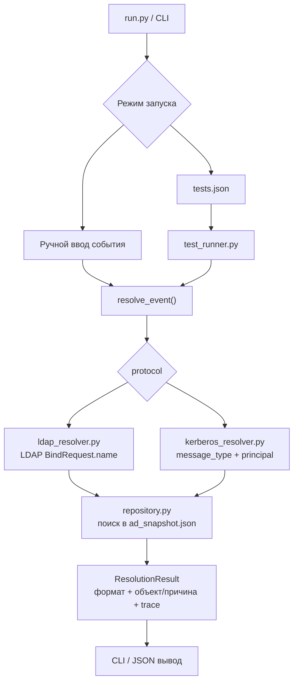

# Прототип AD-like Name Resolution

Прототип показывает, как ITDR-подобный продукт может разобрать имя из уже выделенного LDAP/Kerberos события, определить формат имени, найти объект в локальном снимке AD и вернуть результат проверки.

Проект не подключается к реальному AD, не выполняет LDAP Bind, не делает Kerberos-обмен и не парсит pcap. Здесь проверяется только логика разбора имени и сопоставления с объектами из локальной базы.

## Состав проекта

- `run.py` - точка запуска CLI.
- `ad_snapshot.json` - единая локальная база AD-объектов для ручного режима и тестов.
- `tests.json` - тестовые кейсы по таблицам и алгоритмам статьи.
- `ad_name_resolution/resolver.py` - общий роутер LDAP/Kerberos.
- `ad_name_resolution/ldap_resolver.py` - порядок проверок LDAP Simple Authentication.
- `ad_name_resolution/kerberos_resolver.py` - Kerberos Client Principal Lookup и Server Principal Lookup.
- `ad_name_resolution/repository.py` - функции поиска по локальному снимку AD.
- `ad_name_resolution/cli.py` - ручной режим, меню и вывод результата.
- `ad_name_resolution/test_runner.py` - запуск тестов из JSON.

Общий роутер - это небольшой слой, который сам ничего не ищет в базе. Он смотрит на поле `protocol` во входном событии и передает событие в нужный resolver: LDAP-событие уходит в `ldap_resolver.py`, Kerberos-событие уходит в `kerberos_resolver.py`.

## Схема прототипа



Коротко: CLI или тесты формируют уже разобранное событие, `resolve_event()` выбирает LDAP/Kerberos-ветку, resolver проверяет имя по алгоритму и ходит в локальный AD snapshot через repository. На выходе получается единый `ResolutionResult` с найденным форматом, объектом или причиной ошибки.

## Как идет LDAP-проверка

Для LDAP используется поле `LDAPMessage -> protocolOp: bindRequest -> bindRequest -> name`.

Порядок проверки:

1. `distinguishedName`
2. `userPrincipalName` / generated UPN
3. `DOMAIN\sAMAccountName`
4. `canonicalName`
5. `objectGUID`
6. `displayName`
7. `servicePrincipalName`
8. `MapSPN`
9. `objectSid`
10. `sIDHistory`
11. `canonicalName` с заменой последнего `/` на `\n`

Generated UPN проверяется после явного `userPrincipalName`. Сначала ищется точное значение `userPrincipalName`; если оно не найдено, строка вида `name@domain` может быть сопоставлена как `sAMAccountName=name` и `domainFQDN=domain`.

### Схема LDAP-проверки

Эта схема соответствует текущему LDAP-порядку: берется строка с именем, последовательно проверяются форматы из списка, при первом успешном совпадении возвращается найденный объект, иначе resolver переходит к следующему формату.


## Как идет Kerberos-проверка

Для Kerberos на вход подается уже разобранный principal из трафика: `message_type`, `cname` или `sname`, `name_type`, `name_string[]` и `realm`.

Выбор ветки:

```text
AS-REQ  -> cname -> Client Principal Lookup
AS-REQ  -> sname -> Server Principal Lookup для проверок AS sname из KDC-прогона
TGS-REQ -> sname -> Server Principal Lookup
```

Поддержанные в прототипе `name_type`:

- `1` - `KRB5-NT-PRINCIPAL`
- `2` - `KRB5-NT-SRV-INST`
- `3` - `KRB5-NT-SRV-HST`
- `6` - `KRB5-NT-X500-PRINCIPAL`
- `10` - `KRB5-NT-ENTERPRISE-PRINCIPAL`
- `-128` - `KRB5-NT-MS-PRINCIPAL`
- `-129` - `KRB5-NT-MS-PRINCIPAL-AND-ID`
- `-130` - `KRB5-NT-ENT-PRINCIPAL-AND-ID`

`realm` оставлен отдельным полем, как в реальном Kerberos-трафике. CLI может подсказать значение по имени, но в сам resolver `realm` передается отдельно. Это важно: resolver не должен "угадывать" realm из строки имени, потому что в реальном Kerberos-событии realm уже приходит отдельным полем и задает доменный контекст поиска.

### Общая логика Kerberos-разбора

1. Сначала смотрим `message_type`.
2. Если это `AS-REQ` с `cname`, идем в `Client Principal Lookup`.
3. Если это `AS-REQ` с явно выбранным `sname` или `TGS-REQ`, идем в `Server Principal Lookup`.
4. Из выбранного principal берутся `name_type` и `name_string[]`, а `realm` читается отдельно из события.
5. `realm` используется как контекст домена: например, чтобы понять, в каком домене искать `sAMAccountName`, машинный аккаунт с `$` или специальный объект `krbtgt`.
6. Дальше resolver выбирает ветку по `name_type` и проверяет значения по локальному AD snapshot.

Если тип сообщения, `name_type` или форма `name_string[]` не поддержаны, результат будет `unsupported` или `invalid_input`. Если формат понятен, но объект не найден, возвращается `object_not_found`.

### AS-REQ / Client Principal Lookup

`AS-REQ` используется для поиска клиентского объекта. В прототипе берется `cname`.

Для `KRB5-NT-ENTERPRISE-PRINCIPAL` / `name_type = 10`:

1. Ожидается один элемент в `cname.name_string[]`, например `userA@pastukhov.lab`.
2. Строка сначала ищется как точный `userPrincipalName`.
3. Если точного UPN нет, строка проверяется как generated UPN: `sAMAccountName@domainFQDN`.
4. Если suffix совпадает с доменом из `realm`, левая часть дополнительно проверяется как `sAMAccountName`.
5. Если не найдено, пробуется машинный вариант `sAMAccountName + "$"`.
6. `CrackNames` в прототипе не реализован: продукт работает по локальному AD snapshot и уже проверяет доступные идентификаторы напрямую.

Для `KRB5-NT-ENT-PRINCIPAL-AND-ID` / `name_type = -130`:

1. DN в `cname.name_string[]` проверяется по `distinguishedName`.
2. UPN-like строка идет по тому же порядку, что `NT-ENTERPRISE`: explicit UPN, затем generated UPN.

Для `KRB5-NT-MS-PRINCIPAL` / `name_type = -128` и `KRB5-NT-MS-PRINCIPAL-AND-ID` / `name_type = -129`:

1. UPN-like строка проверяется как generated UPN: `sAMAccountName@domainFQDN`.
2. Явный `userPrincipalName`, отличающийся от generated UPN, для этих типов не выбирается.
3. Короткое имя проверяется как `sAMAccountName`, затем как `sAMAccountName + "$"`.

Для `KRB5-NT-X500-PRINCIPAL` / `name_type = 6`:

1. DN в `cname.name_string[]` проверяется по `distinguishedName`.
2. Остальные строковые форматы не считаются DN и возвращают `object_not_found`.

Для `KRB5-NT-SRV-INST` / `name_type = 2` в `AS-REQ cname`:

1. Многоэлементное имя собирается в строку через `/`.
2. Такая строка проверяется как `servicePrincipalName`.

Для `KRB5-NT-PRINCIPAL` / `name_type = 1`:

1. Ожидается один элемент в `cname.name_string[]`, например `userA`.
2. Имя ищется как `sAMAccountName` в контексте `realm`.
3. Если не найдено, пробуется `sAMAccountName + "$"`.
4. Если известен домен из `realm`, формируется UPN-вариант `account@domainFQDN` и проверяется как `userPrincipalName` / generated UPN.
5. Если внутри `NT-PRINCIPAL` пришла строка вида `DOMAIN\user`, домен используется как контекст, а дальше проверяется только account name.
6. `CrackNames` также остается за пределами прототипа.

### TGS-REQ / Server Principal Lookup

`TGS-REQ` используется для поиска сервисного или компьютерного объекта. В прототипе берется `sname`.

Для `KRB5-NT-PRINCIPAL` / `name_type = 1`, `KRB5-NT-SRV-INST` / `name_type = 2` и `KRB5-NT-SRV-HST` / `name_type = 3`:

1. Компоненты `sname.name_string[]` собираются в строку через `/`.
2. Отдельно обрабатывается случай `krbtgt/krbtgt`: для такого service principal берется второй компонент `krbtgt` и ищется объект с `sAMAccountName=krbtgt` в домене, который задан через `realm`.
3. Если в `sname.name_string[]` несколько компонентов, service-string проверяется как `servicePrincipalName`.
4. Если `sname.name_string[]` содержит один элемент, он проверяется как `sAMAccountName`, затем как `sAMAccountName + "$"`.
5. Для fallback по account name дополнительно проверяется, что у найденного объекта есть хотя бы один зарегистрированный SPN.
6. Если совпадений нет или у account нет SPN, возвращается `object_not_found`.

Для `KRB5-NT-ENTERPRISE-PRINCIPAL` / `name_type = 10` в `TGS-REQ`:

1. Ожидается один элемент в `sname.name_string[]`, например `HTTP/userA` или `cifs/10-23-RP-DC-01.pastukhov.lab`.
2. Строка сначала ищется как `servicePrincipalName`.
3. Если SPN не найден, UPN-like строка ищется как `userPrincipalName`, но только для объектов с зарегистрированным SPN.
4. Затем строка пробуется как `sAMAccountName` и `sAMAccountName + "$"`.
5. Для fallback по account name также проверяется, что у найденного объекта есть хотя бы один зарегистрированный SPN. Без этого объект не считается подходящим server principal.

Общее правило для всех Kerberos-веток: если на конкретном шаге найден ровно один объект, resolver возвращает найденный объект. Если шаг дал 0 совпадений, resolver переходит к следующему применимому шагу или возвращает `object_not_found`.

## Объекты в базе

Все тесты используют одну базу `ad_snapshot.json`. Для Kerberos KDC-матрицы добавлены объекты `kx*`, которые соответствуют сущностям из `kerberos-corner-results-v2.zip/full_results.csv`.

В таблице ниже колонка `id` соответствует полю `id` объекта, а в колонке "Поля объекта" перечислены все остальные поля из реального `ad_snapshot.json`.

| id | Поля объекта | Зачем нужен |
|---|---|---|
| userA | - object_type: user<br>- sAMAccountName: userA<br>- userPrincipalName: userA@pastukhov.lab<br>- distinguishedName: CN=userA,CN=Users,DC=pastukhov,DC=lab<br>- canonicalName: pastukhov.lab/Users/userA<br>- displayName: User A<br>- objectGUID: {5c69b042-e0e9-475a-ae37-1751ef9e05e7}<br>- objectSid: S-1-5-21-2845156888-2425353457-3474467337-1114<br>- servicePrincipalName: HTTP/userA<br>- sIDHistory: S-1-5-21-2845156888-2425353457-3474467337-5114<br>- domainFQDN: pastukhov.lab<br>- domainNetBIOS: PASTUKHOV | Объект локального AD snapshot для тестов прототипа. |
| userB | - object_type: user<br>- sAMAccountName: userB<br>- userPrincipalName: userB@domain3.lab<br>- distinguishedName: CN=userB,CN=Users,DC=domain3,DC=lab<br>- canonicalName: domain3.lab/Users/userB<br>- displayName: UserB<br>- objectGUID: {36eba909-f454-4695-918b-dcdf33b7cd88}<br>- objectSid: S-1-5-21-3677553567-317466416-2570716728-1106<br>- servicePrincipalName: HTTP/userB<br>- sIDHistory: S-1-5-21-3677553567-317466416-2570716728-5106<br>- domainFQDN: domain3.lab<br>- domainNetBIOS: DOMAIN3 | Объект локального AD snapshot для тестов прототипа. |
| dc01 | - object_type: computer<br>- sAMAccountName: 10-23-RP-DC-01$<br>- userPrincipalName: <br>- distinguishedName: CN=10-23-RP-DC-01,OU=Domain Controllers,DC=pastukhov,DC=lab<br>- canonicalName: pastukhov.lab/Domain Controllers/10-23-RP-DC-01<br>- displayName: 10-23-RP-DC-01<br>- objectGUID: {9a0e2d41-587a-4f0b-9e32-000000000001}<br>- objectSid: S-1-5-21-2845156888-2425353457-3474467337-1001<br>- servicePrincipalName: cifs/10-23-RP-DC-01.pastukhov.lab, HOST/10-23-RP-DC-01.pastukhov.lab<br>- sIDHistory: []<br>- domainFQDN: pastukhov.lab<br>- domainNetBIOS: PASTUKHOV | Объект локального AD snapshot для тестов прототипа. |
| krbtgt | - object_type: service<br>- sAMAccountName: krbtgt<br>- userPrincipalName: <br>- distinguishedName: CN=krbtgt,CN=Users,DC=pastukhov,DC=lab<br>- canonicalName: pastukhov.lab/Users/krbtgt<br>- displayName: krbtgt<br>- objectGUID: {aaaaaaaa-0000-0000-0000-000000000003}<br>- objectSid: S-1-5-21-2845156888-2425353457-3474467337-502<br>- servicePrincipalName: []<br>- sIDHistory: []<br>- domainFQDN: pastukhov.lab<br>- domainNetBIOS: PASTUKHOV | Объект локального AD snapshot для тестов прототипа. |
| userImplicit | - object_type: user<br>- sAMAccountName: userImplicit<br>- userPrincipalName: <br>- distinguishedName: CN=userImplicit,CN=Users,DC=pastukhov,DC=lab<br>- canonicalName: pastukhov.lab/Users/userImplicit<br>- displayName: userImplicit<br>- objectGUID: {c23bf214-9e2d-4bf8-a799-f9dd34f0c0aa}<br>- objectSid: S-1-5-21-2845156888-2425353457-3474467337-1201<br>- servicePrincipalName: []<br>- sIDHistory: []<br>- domainFQDN: pastukhov.lab<br>- domainNetBIOS: PASTUKHOV | Объект локального AD snapshot для тестов прототипа. |
| userUpnSet | - object_type: user<br>- sAMAccountName: userUpnSet<br>- userPrincipalName: userUpnSetX@pastukhov.lab<br>- distinguishedName: CN=userUpnSet,CN=Users,DC=pastukhov,DC=lab<br>- canonicalName: pastukhov.lab/Users/userUpnSet<br>- displayName: userUpnSet<br>- objectGUID: {559f5da0-da9e-4734-a93e-63ceadb20cf6}<br>- objectSid: S-1-5-21-2845156888-2425353457-3474467337-1202<br>- servicePrincipalName: []<br>- sIDHistory: []<br>- domainFQDN: pastukhov.lab<br>- domainNetBIOS: PASTUKHOV | Объект локального AD snapshot для тестов прототипа. |
| userUpnAlias | - object_type: user<br>- sAMAccountName: userUpnAlias<br>- userPrincipalName: user3@pastukhov.lab<br>- distinguishedName: CN=userUpnAlias,CN=Users,DC=pastukhov,DC=lab<br>- canonicalName: pastukhov.lab/Users/userUpnAlias<br>- displayName: userUpnAlias<br>- objectGUID: {aaaaaaaa-0000-0000-0000-000000000023}<br>- objectSid: S-1-5-21-2845156888-2425353457-3474467337-1206<br>- servicePrincipalName: []<br>- sIDHistory: []<br>- domainFQDN: pastukhov.lab<br>- domainNetBIOS: PASTUKHOV | Объект локального AD snapshot для тестов прототипа. |
| userImplicitOwner | - object_type: user<br>- sAMAccountName: userImplicitOwner<br>- userPrincipalName: <br>- distinguishedName: CN=userImplicitOwner,CN=Users,DC=pastukhov,DC=lab<br>- canonicalName: pastukhov.lab/Users/userImplicitOwner<br>- displayName: userImplicitOwner<br>- objectGUID: {64b4b4d5-d4dd-425f-80d8-a36fcf650a8e}<br>- objectSid: S-1-5-21-2845156888-2425353457-3474467337-1203<br>- servicePrincipalName: []<br>- sIDHistory: []<br>- domainFQDN: pastukhov.lab<br>- domainNetBIOS: PASTUKHOV | Объект локального AD snapshot для тестов прототипа. |
| userConflict | - object_type: user<br>- sAMAccountName: userConflict<br>- userPrincipalName: userImplicitOwner@pastukhov.lab<br>- distinguishedName: CN=userConflict,CN=Users,DC=pastukhov,DC=lab<br>- canonicalName: pastukhov.lab/Users/userConflict<br>- displayName: userConflict<br>- objectGUID: {103b49ae-f526-4056-a8d5-97d596023770}<br>- objectSid: S-1-5-21-2845156888-2425353457-3474467337-1204<br>- servicePrincipalName: []<br>- sIDHistory: []<br>- domainFQDN: pastukhov.lab<br>- domainNetBIOS: PASTUKHOV | Объект локального AD snapshot для тестов прототипа. |
| userTrustPastukhov | - object_type: user<br>- sAMAccountName: userTrust<br>- userPrincipalName: userTrust@pastukhov.lab<br>- distinguishedName: CN=userTrust,CN=Users,DC=pastukhov,DC=lab<br>- canonicalName: pastukhov.lab/Users/userTrust<br>- displayName: userTrust<br>- objectGUID: {aaaaaaaa-0000-0000-0000-000000000021}<br>- objectSid: S-1-5-21-2845156888-2425353457-3474467337-1205<br>- servicePrincipalName: []<br>- sIDHistory: []<br>- domainFQDN: pastukhov.lab<br>- domainNetBIOS: PASTUKHOV | Объект локального AD snapshot для тестов прототипа. |
| userTrustDomain3 | - object_type: user<br>- sAMAccountName: userTrust<br>- userPrincipalName: userTrust@pastukhov.lab<br>- distinguishedName: CN=userTrust,CN=Users,DC=domain3,DC=lab<br>- canonicalName: domain3.lab/Users/userTrust<br>- displayName: userTrust<br>- objectGUID: {aaaaaaaa-0000-0000-0000-000000000022}<br>- objectSid: S-1-5-21-3677553567-317466416-2570716728-1205<br>- servicePrincipalName: []<br>- sIDHistory: []<br>- domainFQDN: domain3.lab<br>- domainNetBIOS: DOMAIN3 | Объект локального AD snapshot для тестов прототипа. |
| dnEscapedComma | - object_type: user<br>- sAMAccountName: dnEscapedComma<br>- userPrincipalName: dnEscapedComma@pastukhov.lab<br>- distinguishedName: CN=user\\,A,CN=Users,DC=pastukhov,DC=lab<br>- canonicalName: pastukhov.lab/Users/dnEscapedComma<br>- displayName: dnEscapedComma<br>- objectGUID: {aaaaaaaa-0000-0000-0000-000000000031}<br>- objectSid: S-1-5-21-2845156888-2425353457-3474467337-1331<br>- servicePrincipalName: []<br>- sIDHistory: []<br>- domainFQDN: pastukhov.lab<br>- domainNetBIOS: PASTUKHOV | Объект локального AD snapshot для тестов прототипа. |
| dnEscapedPlus | - object_type: user<br>- sAMAccountName: dnEscapedPlus<br>- userPrincipalName: dnEscapedPlus@pastukhov.lab<br>- distinguishedName: CN=user\\+A,CN=Users,DC=pastukhov,DC=lab<br>- canonicalName: pastukhov.lab/Users/dnEscapedPlus<br>- displayName: dnEscapedPlus<br>- objectGUID: {aaaaaaaa-0000-0000-0000-000000000032}<br>- objectSid: S-1-5-21-2845156888-2425353457-3474467337-1332<br>- servicePrincipalName: []<br>- sIDHistory: []<br>- domainFQDN: pastukhov.lab<br>- domainNetBIOS: PASTUKHOV | Объект локального AD snapshot для тестов прототипа. |
| dnEscapedQuote | - object_type: user<br>- sAMAccountName: dnEscapedQuote<br>- userPrincipalName: dnEscapedQuote@pastukhov.lab<br>- distinguishedName: CN=user\\"A\\",CN=Users,DC=pastukhov,DC=lab<br>- canonicalName: pastukhov.lab/Users/dnEscapedQuote<br>- displayName: dnEscapedQuote<br>- objectGUID: {aaaaaaaa-0000-0000-0000-000000000033}<br>- objectSid: S-1-5-21-2845156888-2425353457-3474467337-1333<br>- servicePrincipalName: []<br>- sIDHistory: []<br>- domainFQDN: pastukhov.lab<br>- domainNetBIOS: PASTUKHOV | Объект локального AD snapshot для тестов прототипа. |
| dnEscapedBackslash | - object_type: user<br>- sAMAccountName: dnEscapedBackslash<br>- userPrincipalName: dnEscapedBackslash@pastukhov.lab<br>- distinguishedName: CN=user\\\\A,CN=Users,DC=pastukhov,DC=lab<br>- canonicalName: pastukhov.lab/Users/dnEscapedBackslash<br>- displayName: dnEscapedBackslash<br>- objectGUID: {aaaaaaaa-0000-0000-0000-000000000034}<br>- objectSid: S-1-5-21-2845156888-2425353457-3474467337-1334<br>- servicePrincipalName: []<br>- sIDHistory: []<br>- domainFQDN: pastukhov.lab<br>- domainNetBIOS: PASTUKHOV | Объект локального AD snapshot для тестов прототипа. |
| dnEscapedAngle | - object_type: user<br>- sAMAccountName: dnEscapedAngle<br>- userPrincipalName: dnEscapedAngle@pastukhov.lab<br>- distinguishedName: CN=user\\<A\\>,CN=Users,DC=pastukhov,DC=lab<br>- canonicalName: pastukhov.lab/Users/dnEscapedAngle<br>- displayName: dnEscapedAngle<br>- objectGUID: {aaaaaaaa-0000-0000-0000-000000000035}<br>- objectSid: S-1-5-21-2845156888-2425353457-3474467337-1335<br>- servicePrincipalName: []<br>- sIDHistory: []<br>- domainFQDN: pastukhov.lab<br>- domainNetBIOS: PASTUKHOV | Объект локального AD snapshot для тестов прототипа. |
| dnEscapedSemicolon | - object_type: user<br>- sAMAccountName: dnEscapedSemicolon<br>- userPrincipalName: dnEscapedSemicolon@pastukhov.lab<br>- distinguishedName: CN=user\\;A,CN=Users,DC=pastukhov,DC=lab<br>- canonicalName: pastukhov.lab/Users/dnEscapedSemicolon<br>- displayName: dnEscapedSemicolon<br>- objectGUID: {aaaaaaaa-0000-0000-0000-000000000036}<br>- objectSid: S-1-5-21-2845156888-2425353457-3474467337-1336<br>- servicePrincipalName: []<br>- sIDHistory: []<br>- domainFQDN: pastukhov.lab<br>- domainNetBIOS: PASTUKHOV | Объект локального AD snapshot для тестов прототипа. |
| dnEscapedEquals | - object_type: user<br>- sAMAccountName: dnEscapedEquals<br>- userPrincipalName: dnEscapedEquals@pastukhov.lab<br>- distinguishedName: CN=user\\=A,CN=Users,DC=pastukhov,DC=lab<br>- canonicalName: pastukhov.lab/Users/dnEscapedEquals<br>- displayName: dnEscapedEquals<br>- objectGUID: {aaaaaaaa-0000-0000-0000-000000000037}<br>- objectSid: S-1-5-21-2845156888-2425353457-3474467337-1337<br>- servicePrincipalName: []<br>- sIDHistory: []<br>- domainFQDN: pastukhov.lab<br>- domainNetBIOS: PASTUKHOV | Объект локального AD snapshot для тестов прототипа. |
| dnSlash | - object_type: user<br>- sAMAccountName: dnSlash<br>- userPrincipalName: dnSlash@pastukhov.lab<br>- distinguishedName: CN=user/A,CN=Users,DC=pastukhov,DC=lab<br>- canonicalName: pastukhov.lab/Users/dnSlash<br>- displayName: dnSlash<br>- objectGUID: {aaaaaaaa-0000-0000-0000-000000000038}<br>- objectSid: S-1-5-21-2845156888-2425353457-3474467337-1338<br>- servicePrincipalName: []<br>- sIDHistory: []<br>- domainFQDN: pastukhov.lab<br>- domainNetBIOS: PASTUKHOV | Объект локального AD snapshot для тестов прототипа. |
| dnEscapedHash | - object_type: user<br>- sAMAccountName: dnEscapedHash<br>- userPrincipalName: dnEscapedHash@pastukhov.lab<br>- distinguishedName: CN=\\#userA,CN=Users,DC=pastukhov,DC=lab<br>- canonicalName: pastukhov.lab/Users/dnEscapedHash<br>- displayName: dnEscapedHash<br>- objectGUID: {aaaaaaaa-0000-0000-0000-000000000039}<br>- objectSid: S-1-5-21-2845156888-2425353457-3474467337-1339<br>- servicePrincipalName: []<br>- sIDHistory: []<br>- domainFQDN: pastukhov.lab<br>- domainNetBIOS: PASTUKHOV | Объект локального AD snapshot для тестов прототипа. |
| cornerSamTarget | - object_type: user<br>- sAMAccountName: cornerSamTarget<br>- userPrincipalName: cornerSamTarget@pastukhov.lab<br>- distinguishedName: CN=cornerSamTarget,CN=Users,DC=pastukhov,DC=lab<br>- canonicalName: pastukhov.lab/Users/cornerSamTarget<br>- displayName: Corner SAM Target<br>- objectGUID: {cccccccc-0000-0000-0000-000000000061}<br>- objectSid: S-1-5-21-2845156888-2425353457-3474467337-1661<br>- servicePrincipalName: []<br>- sIDHistory: []<br>- domainFQDN: pastukhov.lab<br>- domainNetBIOS: PASTUKHOV | Объект локального AD snapshot для тестов прототипа. |
| cornerUpnTarget | - object_type: user<br>- sAMAccountName: cornerUpnTarget<br>- userPrincipalName: cornerUpnTarget@pastukhov.lab<br>- distinguishedName: CN=cornerUpnTarget,CN=Users,DC=pastukhov,DC=lab<br>- canonicalName: pastukhov.lab/Users/cornerUpnTarget<br>- displayName: cornerUpnTarget<br>- objectGUID: {cccccccc-0000-0000-0000-000000000062}<br>- objectSid: S-1-5-21-2845156888-2425353457-3474467337-1662<br>- servicePrincipalName: []<br>- sIDHistory: []<br>- domainFQDN: pastukhov.lab<br>- domainNetBIOS: PASTUKHOV | Объект локального AD snapshot для тестов прототипа. |
| cornerDownlevelTarget | - object_type: user<br>- sAMAccountName: cornerDownlevelTarget<br>- userPrincipalName: cornerDownlevelTarget@pastukhov.lab<br>- distinguishedName: CN=cornerDownlevelTarget,CN=Users,DC=pastukhov,DC=lab<br>- canonicalName: pastukhov.lab/Users/cornerDownlevelTarget<br>- displayName: cornerDownlevelTarget<br>- objectGUID: {cccccccc-0000-0000-0000-000000000063}<br>- objectSid: S-1-5-21-2845156888-2425353457-3474467337-1663<br>- servicePrincipalName: []<br>- sIDHistory: []<br>- domainFQDN: pastukhov.lab<br>- domainNetBIOS: PASTUKHOV | Объект локального AD snapshot для тестов прототипа. |
| cornerDnTarget | - object_type: user<br>- sAMAccountName: cornerDnTarget<br>- userPrincipalName: cornerDnTarget@pastukhov.lab<br>- distinguishedName: CN=cornerDnTarget,CN=Users,DC=pastukhov,DC=lab<br>- canonicalName: pastukhov.lab/Users/cornerDnTarget<br>- displayName: cornerDnTarget<br>- objectGUID: {cccccccc-0000-0000-0000-000000000064}<br>- objectSid: S-1-5-21-2845156888-2425353457-3474467337-1664<br>- servicePrincipalName: []<br>- sIDHistory: []<br>- domainFQDN: pastukhov.lab<br>- domainNetBIOS: PASTUKHOV | Объект локального AD snapshot для тестов прототипа. |
| cornerCanonicalTarget | - object_type: user<br>- sAMAccountName: cornerCanonicalTarget<br>- userPrincipalName: cornerCanonicalTarget@pastukhov.lab<br>- distinguishedName: CN=cornerCanonicalTarget,CN=Users,DC=pastukhov,DC=lab<br>- canonicalName: pastukhov.lab/Users/cornerCanonicalTarget<br>- displayName: cornerCanonicalTarget<br>- objectGUID: {cccccccc-0000-0000-0000-000000000065}<br>- objectSid: S-1-5-21-2845156888-2425353457-3474467337-1665<br>- servicePrincipalName: []<br>- sIDHistory: []<br>- domainFQDN: pastukhov.lab<br>- domainNetBIOS: PASTUKHOV | Объект локального AD snapshot для тестов прототипа. |
| cornerGuidTarget | - object_type: user<br>- sAMAccountName: cornerGuidTarget<br>- userPrincipalName: cornerGuidTarget@pastukhov.lab<br>- distinguishedName: CN=cornerGuidTarget,CN=Users,DC=pastukhov,DC=lab<br>- canonicalName: pastukhov.lab/Users/cornerGuidTarget<br>- displayName: cornerGuidTarget<br>- objectGUID: {cccccccc-0000-0000-0000-000000000066}<br>- objectSid: S-1-5-21-2845156888-2425353457-3474467337-1666<br>- servicePrincipalName: []<br>- sIDHistory: []<br>- domainFQDN: pastukhov.lab<br>- domainNetBIOS: PASTUKHOV | Объект локального AD snapshot для тестов прототипа. |
| cornerSpnTarget | - object_type: user<br>- sAMAccountName: cornerSpnTarget<br>- userPrincipalName: cornerSpnTarget@pastukhov.lab<br>- distinguishedName: CN=cornerSpnTarget,CN=Users,DC=pastukhov,DC=lab<br>- canonicalName: pastukhov.lab/Users/cornerSpnTarget<br>- displayName: cornerSpnTarget<br>- objectGUID: {cccccccc-0000-0000-0000-000000000067}<br>- objectSid: S-1-5-21-2845156888-2425353457-3474467337-1667<br>- servicePrincipalName: HTTP/cornerSpnTarget<br>- sIDHistory: []<br>- domainFQDN: pastukhov.lab<br>- domainNetBIOS: PASTUKHOV | Объект локального AD snapshot для тестов прототипа. |
| cornerSidTarget | - object_type: user<br>- sAMAccountName: cornerSidTarget<br>- userPrincipalName: cornerSidTarget@pastukhov.lab<br>- distinguishedName: CN=cornerSidTarget,CN=Users,DC=pastukhov,DC=lab<br>- canonicalName: pastukhov.lab/Users/cornerSidTarget<br>- displayName: cornerSidTarget<br>- objectGUID: {cccccccc-0000-0000-0000-000000000068}<br>- objectSid: S-1-5-21-2845156888-2425353457-3474467337-1668<br>- servicePrincipalName: []<br>- sIDHistory: []<br>- domainFQDN: pastukhov.lab<br>- domainNetBIOS: PASTUKHOV | Объект локального AD snapshot для тестов прототипа. |
| userDisplaySam | - object_type: user<br>- sAMAccountName: userDisplaySam<br>- userPrincipalName: userDisplaySam@pastukhov.lab<br>- distinguishedName: CN=userDisplaySam,CN=Users,DC=pastukhov,DC=lab<br>- canonicalName: pastukhov.lab/Users/userDisplaySam<br>- displayName: cornerSamTarget<br>- objectGUID: {bbbbbbbb-0000-0000-0000-000000000081}<br>- objectSid: S-1-5-21-2845156888-2425353457-3474467337-1781<br>- servicePrincipalName: []<br>- sIDHistory: []<br>- domainFQDN: pastukhov.lab<br>- domainNetBIOS: PASTUKHOV | Объект локального AD snapshot для тестов прототипа. |
| userDisplayUpn | - object_type: user<br>- sAMAccountName: userDisplayUpn<br>- userPrincipalName: userDisplayUpn@pastukhov.lab<br>- distinguishedName: CN=userDisplayUpn,CN=Users,DC=pastukhov,DC=lab<br>- canonicalName: pastukhov.lab/Users/userDisplayUpn<br>- displayName: cornerUpnTarget@pastukhov.lab<br>- objectGUID: {bbbbbbbb-0000-0000-0000-000000000082}<br>- objectSid: S-1-5-21-2845156888-2425353457-3474467337-1782<br>- servicePrincipalName: []<br>- sIDHistory: []<br>- domainFQDN: pastukhov.lab<br>- domainNetBIOS: PASTUKHOV | Объект локального AD snapshot для тестов прототипа. |
| userDisplayNetbios | - object_type: user<br>- sAMAccountName: userDisplayNetbios<br>- userPrincipalName: userDisplayNetbios@pastukhov.lab<br>- distinguishedName: CN=userDisplayNetbios,CN=Users,DC=pastukhov,DC=lab<br>- canonicalName: pastukhov.lab/Users/userDisplayNetbios<br>- displayName: PASTUKHOV\\cornerDownlevelTarget<br>- objectGUID: {bbbbbbbb-0000-0000-0000-000000000083}<br>- objectSid: S-1-5-21-2845156888-2425353457-3474467337-1783<br>- servicePrincipalName: []<br>- sIDHistory: []<br>- domainFQDN: pastukhov.lab<br>- domainNetBIOS: PASTUKHOV | Объект локального AD snapshot для тестов прототипа. |
| userDisplayDn | - object_type: user<br>- sAMAccountName: userDisplayDn<br>- userPrincipalName: userDisplayDn@pastukhov.lab<br>- distinguishedName: CN=userDisplayDn,CN=Users,DC=pastukhov,DC=lab<br>- canonicalName: pastukhov.lab/Users/userDisplayDn<br>- displayName: CN=cornerDnTarget,CN=Users,DC=pastukhov,DC=lab<br>- objectGUID: {bbbbbbbb-0000-0000-0000-000000000084}<br>- objectSid: S-1-5-21-2845156888-2425353457-3474467337-1784<br>- servicePrincipalName: []<br>- sIDHistory: []<br>- domainFQDN: pastukhov.lab<br>- domainNetBIOS: PASTUKHOV | Объект локального AD snapshot для тестов прототипа. |
| userDisplayCanonical | - object_type: user<br>- sAMAccountName: userDisplayCanonical<br>- userPrincipalName: userDisplayCanonical@pastukhov.lab<br>- distinguishedName: CN=userDisplayCanonical,CN=Users,DC=pastukhov,DC=lab<br>- canonicalName: pastukhov.lab/Users/userDisplayCanonical<br>- displayName: pastukhov.lab/Users/cornerCanonicalTarget<br>- objectGUID: {bbbbbbbb-0000-0000-0000-000000000085}<br>- objectSid: S-1-5-21-2845156888-2425353457-3474467337-1785<br>- servicePrincipalName: []<br>- sIDHistory: []<br>- domainFQDN: pastukhov.lab<br>- domainNetBIOS: PASTUKHOV | Объект локального AD snapshot для тестов прототипа. |
| userDisplayGuid | - object_type: user<br>- sAMAccountName: userDisplayGuid<br>- userPrincipalName: userDisplayGuid@pastukhov.lab<br>- distinguishedName: CN=userDisplayGuid,CN=Users,DC=pastukhov,DC=lab<br>- canonicalName: pastukhov.lab/Users/userDisplayGuid<br>- displayName: {cccccccc-0000-0000-0000-000000000066}<br>- objectGUID: {bbbbbbbb-0000-0000-0000-000000000086}<br>- objectSid: S-1-5-21-2845156888-2425353457-3474467337-1786<br>- servicePrincipalName: []<br>- sIDHistory: []<br>- domainFQDN: pastukhov.lab<br>- domainNetBIOS: PASTUKHOV | Объект локального AD snapshot для тестов прототипа. |
| userDisplaySpn | - object_type: user<br>- sAMAccountName: userDisplaySpn<br>- userPrincipalName: userDisplaySpn@pastukhov.lab<br>- distinguishedName: CN=userDisplaySpn,CN=Users,DC=pastukhov,DC=lab<br>- canonicalName: pastukhov.lab/Users/userDisplaySpn<br>- displayName: HTTP/cornerSpnTarget<br>- objectGUID: {bbbbbbbb-0000-0000-0000-000000000087}<br>- objectSid: S-1-5-21-2845156888-2425353457-3474467337-1787<br>- servicePrincipalName: []<br>- sIDHistory: []<br>- domainFQDN: pastukhov.lab<br>- domainNetBIOS: PASTUKHOV | Объект локального AD snapshot для тестов прототипа. |
| userDisplayMapSpn | - object_type: user<br>- sAMAccountName: userDisplayMapSpn<br>- userPrincipalName: userDisplayMapSpn@pastukhov.lab<br>- distinguishedName: CN=userDisplayMapSpn,CN=Users,DC=pastukhov,DC=lab<br>- canonicalName: pastukhov.lab/Users/userDisplayMapSpn<br>- displayName: HOST/cornerSpnTarget<br>- objectGUID: {bbbbbbbb-0000-0000-0000-000000000089}<br>- objectSid: S-1-5-21-2845156888-2425353457-3474467337-1789<br>- servicePrincipalName: []<br>- sIDHistory: []<br>- domainFQDN: pastukhov.lab<br>- domainNetBIOS: PASTUKHOV | Объект локального AD snapshot для тестов прототипа. |
| userDisplaySid | - object_type: user<br>- sAMAccountName: userDisplaySid<br>- userPrincipalName: userDisplaySid@pastukhov.lab<br>- distinguishedName: CN=userDisplaySid,CN=Users,DC=pastukhov,DC=lab<br>- canonicalName: pastukhov.lab/Users/userDisplaySid<br>- displayName: S-1-5-21-2845156888-2425353457-3474467337-1668<br>- objectGUID: {bbbbbbbb-0000-0000-0000-000000000088}<br>- objectSid: S-1-5-21-2845156888-2425353457-3474467337-1788<br>- servicePrincipalName: []<br>- sIDHistory: []<br>- domainFQDN: pastukhov.lab<br>- domainNetBIOS: PASTUKHOV | Объект локального AD snapshot для тестов прототипа. |
| kxBase | - object_type: user<br>- sAMAccountName: kxBase<br>- userPrincipalName: kxBase@pastukhov.lab<br>- distinguishedName: CN=kxBase,CN=Users,DC=pastukhov,DC=lab<br>- canonicalName: pastukhov.lab/Users/kxBase<br>- displayName: KX Base<br>- objectGUID: {f0b32a89-9678-4e34-9fa3-b206aeadba3b}<br>- objectSid: S-1-5-21-2845156888-2425353457-3474467337-1158<br>- servicePrincipalName: []<br>- sIDHistory: []<br>- domainFQDN: pastukhov.lab<br>- domainNetBIOS: PASTUKHOV | Базовый пользователь из KDC-прогона для ordinary SAM, UPN, DN и negative cname cases. |
| kxSvc | - object_type: user<br>- sAMAccountName: kxSvc<br>- userPrincipalName: kxSvc@pastukhov.lab<br>- distinguishedName: CN=kxSvc,CN=Users,DC=pastukhov,DC=lab<br>- canonicalName: pastukhov.lab/Users/kxSvc<br>- displayName: KX Service<br>- objectGUID: {dddddddd-0000-0000-0000-000000000101}<br>- objectSid: S-1-5-21-2845156888-2425353457-3474467337-1159<br>- servicePrincipalName: HTTP/kxspn22, HTTP/kxspn22.pastukhov.lab, HOST/kxspn22, HOST/kxspn22.pastukhov.lab<br>- sIDHistory: []<br>- domainFQDN: pastukhov.lab<br>- domainNetBIOS: PASTUKHOV | Сервисная учетная запись из KDC-прогона с HTTP/HOST SPN. |
| kxImplicit | - object_type: user<br>- sAMAccountName: kxImplicit<br>- userPrincipalName: <br>- distinguishedName: CN=kxImplicit,CN=Users,DC=pastukhov,DC=lab<br>- canonicalName: pastukhov.lab/Users/kxImplicit<br>- displayName: KX Implicit<br>- objectGUID: {dddddddd-0000-0000-0000-000000000102}<br>- objectSid: S-1-5-21-2845156888-2425353457-3474467337-1160<br>- servicePrincipalName: []<br>- sIDHistory: []<br>- domainFQDN: pastukhov.lab<br>- domainNetBIOS: PASTUKHOV | Пользователь из KDC-прогона без явного userPrincipalName для generated UPN. |
| kxUpnSet | - object_type: user<br>- sAMAccountName: kxUpnSet<br>- userPrincipalName: kxUpnSetX@pastukhov.lab<br>- distinguishedName: CN=kxUpnSet,CN=Users,DC=pastukhov,DC=lab<br>- canonicalName: pastukhov.lab/Users/kxUpnSet<br>- displayName: KX UPN Set<br>- objectGUID: {dddddddd-0000-0000-0000-000000000103}<br>- objectSid: S-1-5-21-2845156888-2425353457-3474467337-1161<br>- servicePrincipalName: []<br>- sIDHistory: []<br>- domainFQDN: pastukhov.lab<br>- domainNetBIOS: PASTUKHOV | Пользователь из KDC-прогона, у которого explicit UPN отличается от generated UPN. |
| kxOwner | - object_type: user<br>- sAMAccountName: kxOwner<br>- userPrincipalName: <br>- distinguishedName: CN=kxOwner,CN=Users,DC=pastukhov,DC=lab<br>- canonicalName: pastukhov.lab/Users/kxOwner<br>- displayName: KX Owner<br>- objectGUID: {dddddddd-0000-0000-0000-000000000104}<br>- objectSid: S-1-5-21-2845156888-2425353457-3474467337-1162<br>- servicePrincipalName: []<br>- sIDHistory: []<br>- domainFQDN: pastukhov.lab<br>- domainNetBIOS: PASTUKHOV | Объект из KDC-прогона для explicit UPN vs generated UPN conflict: generated UPN. |
| kxConflict | - object_type: user<br>- sAMAccountName: kxConflict<br>- userPrincipalName: kxOwner@pastukhov.lab<br>- distinguishedName: CN=kxConflict,CN=Users,DC=pastukhov,DC=lab<br>- canonicalName: pastukhov.lab/Users/kxConflict<br>- displayName: KX Conflict<br>- objectGUID: {dddddddd-0000-0000-0000-000000000105}<br>- objectSid: S-1-5-21-2845156888-2425353457-3474467337-1163<br>- servicePrincipalName: []<br>- sIDHistory: []<br>- domainFQDN: pastukhov.lab<br>- domainNetBIOS: PASTUKHOV | Объект из KDC-прогона для explicit UPN vs generated UPN conflict: explicit UPN. |
| kxAlias | - object_type: user<br>- sAMAccountName: kxAlias<br>- userPrincipalName: kxShort@pastukhov.lab<br>- distinguishedName: CN=kxAlias,CN=Users,DC=pastukhov,DC=lab<br>- canonicalName: pastukhov.lab/Users/kxAlias<br>- displayName: KX Alias<br>- objectGUID: {dddddddd-0000-0000-0000-000000000106}<br>- objectSid: S-1-5-21-2845156888-2425353457-3474467337-1164<br>- servicePrincipalName: []<br>- sIDHistory: []<br>- domainFQDN: pastukhov.lab<br>- domainNetBIOS: PASTUKHOV | Объект из KDC-прогона для короткого имени, найденного через UPN prefix. |
| kxTrust | - object_type: user<br>- sAMAccountName: kxTrust<br>- userPrincipalName: kxTrust@pastukhov.lab<br>- distinguishedName: CN=kxTrust,CN=Users,DC=pastukhov,DC=lab<br>- canonicalName: pastukhov.lab/Users/kxTrust<br>- displayName: KX Trust<br>- objectGUID: {dddddddd-0000-0000-0000-000000000107}<br>- objectSid: S-1-5-21-2845156888-2425353457-3474467337-1165<br>- servicePrincipalName: []<br>- sIDHistory: []<br>- domainFQDN: pastukhov.lab<br>- domainNetBIOS: PASTUKHOV | Объект из KDC-прогона для UPN-like значения с suffix pastukhov.lab. |
| kxNoSpn | - object_type: user<br>- sAMAccountName: kxNoSpn<br>- userPrincipalName: kxNoSpn@pastukhov.lab<br>- distinguishedName: CN=kxNoSpn,CN=Users,DC=pastukhov,DC=lab<br>- canonicalName: pastukhov.lab/Users/kxNoSpn<br>- displayName: KX No SPN<br>- objectGUID: {dddddddd-0000-0000-0000-000000000108}<br>- objectSid: S-1-5-21-2845156888-2425353457-3474467337-1166<br>- servicePrincipalName: []<br>- sIDHistory: []<br>- domainFQDN: pastukhov.lab<br>- domainNetBIOS: PASTUKHOV | Объект из KDC-прогона без SPN для negative server principal cases. |

## Разделы тестов

| id раздела | Название | Кол-во тестов |
|---|---|---|
| `ldap_table` | LDAP: базовые форматы имени | 19 |
| `ldap_algorithm` | LDAP: дополнительные форматы | 2 |
| `ldap_dn_special` | LDAP: DN со спецсимволами | 9 |
| `ldap_corner` | LDAP: корнеры и приоритет форматов | 15 |
| `kerberos_client_lookup` | Kerberos: AS-REQ / Client Principal Lookup | 44 |
| `kerberos_server_lookup` | Kerberos: Server Principal Lookup | 33 |

## Таблица тестов и corner cases

| № | Название | Описание | Формат / ветка | Ожидаемый результат | Откуда взяли | Раздел |
|---|---|---|---|---|---|---|
| 1 | Базовый LDAP: короткое имя userA без домена не находится | 1. Создать пользователя <USER> с sAMAccountName=<USER>.<br>2. Выполнить LDAP Simple Bind с BindRequest.name="<USER>".<br>3. Ожидаемый результат: объект не найден. | displayName / not_found | объект не найден | Статья и проверка WinServer: порядок LDAP-форматов | LDAP: базовые форматы имени |
| 2 | Базовый LDAP: найти userA по UPN | 1. Создать пользователя <USER> с userPrincipalName=<USER>@<DOMAIN_FQDN>.<br>2. Выполнить LDAP Simple Bind с BindRequest.name="<USER>@<DOMAIN_FQDN>".<br>3. Ожидаемый результат: найден объект <USER>. | userPrincipalName | найден объект <USER> | Статья и проверка WinServer: порядок LDAP-форматов | LDAP: базовые форматы имени |
| 3 | Базовый LDAP: найти userB по UPN | 1. Создать пользователя <USER> с userPrincipalName=<USER>@<DOMAIN_FQDN>.<br>2. Выполнить LDAP Simple Bind с BindRequest.name="<USER>@<DOMAIN_FQDN>".<br>3. Ожидаемый результат: найден объект <USER>. | userPrincipalName | найден объект <USER> | Статья и проверка WinServer: порядок LDAP-форматов | LDAP: базовые форматы имени |
| 4 | Базовый LDAP: найти userA по DOMAIN\\user | 1. Создать пользователя <USER> с sAMAccountName=<USER> в домене <DOMAIN_NETBIOS>.<br>2. Выполнить LDAP Simple Bind с BindRequest.name="<DOMAIN_NETBIOS>\\<USER>".<br>3. Ожидаемый результат: найден объект <USER>. | downLevelLogonName | найден объект <USER> | Статья и проверка WinServer: порядок LDAP-форматов | LDAP: базовые форматы имени |
| 5 | Базовый LDAP: найти userB по DOMAIN\\user | 1. Создать пользователя <USER> с sAMAccountName=<USER> в домене <DOMAIN_NETBIOS>.<br>2. Выполнить LDAP Simple Bind с BindRequest.name="<DOMAIN_NETBIOS>\\<USER>".<br>3. Ожидаемый результат: найден объект <USER>. | downLevelLogonName | найден объект <USER> | Статья и проверка WinServer: порядок LDAP-форматов | LDAP: базовые форматы имени |
| 6 | Базовый LDAP: найти userA по DN | 1. Создать пользователя <USER> и скопировать его distinguishedName.<br>2. Выполнить LDAP Simple Bind с BindRequest.name="CN=<USER>,CN=Users,DC=<DOMAIN_COMPONENT>,DC=<DOMAIN_COMPONENT>".<br>3. Ожидаемый результат: найден объект <USER>. | distinguishedName | найден объект <USER> | Статья и проверка WinServer: порядок LDAP-форматов | LDAP: базовые форматы имени |
| 7 | Базовый LDAP: найти userB по DN | 1. Создать пользователя <USER> и скопировать его distinguishedName.<br>2. Выполнить LDAP Simple Bind с BindRequest.name="CN=<USER>,CN=Users,DC=<DOMAIN_COMPONENT>,DC=<DOMAIN_COMPONENT>".<br>3. Ожидаемый результат: найден объект <USER>. | distinguishedName | найден объект <USER> | Статья и проверка WinServer: порядок LDAP-форматов | LDAP: базовые форматы имени |
| 8 | Базовый LDAP: найти userA по canonicalName | 1. Создать пользователя <USER> и скопировать его canonicalName.<br>2. Выполнить LDAP Simple Bind с BindRequest.name="<DOMAIN_FQDN>/Users/<USER>".<br>3. Ожидаемый результат: найден объект <USER>. | canonicalName | найден объект <USER> | Статья и проверка WinServer: порядок LDAP-форматов | LDAP: базовые форматы имени |
| 9 | Базовый LDAP: найти userB по canonicalName | 1. Создать пользователя <USER> и скопировать его canonicalName.<br>2. Выполнить LDAP Simple Bind с BindRequest.name="<DOMAIN_FQDN>/Users/<USER>".<br>3. Ожидаемый результат: найден объект <USER>. | canonicalName | найден объект <USER> | Статья и проверка WinServer: порядок LDAP-форматов | LDAP: базовые форматы имени |
| 10 | Базовый LDAP: найти userA по displayName | 1. Создать пользователя <USER> с displayName=<USER> Display.<br>2. Выполнить LDAP Simple Bind с BindRequest.name="User A".<br>3. Ожидаемый результат: найден объект <USER>. | displayName | найден объект <USER> | Статья и проверка WinServer: порядок LDAP-форматов | LDAP: базовые форматы имени |
| 11 | Базовый LDAP: найти userB по displayName | 1. Создать пользователя <USER> с displayName=<USER> Display.<br>2. Выполнить LDAP Simple Bind с BindRequest.name="UserB".<br>3. Ожидаемый результат: найден объект <USER>. | displayName | найден объект <USER> | Статья и проверка WinServer: порядок LDAP-форматов | LDAP: базовые форматы имени |
| 12 | Базовый LDAP: найти userA по objectGUID | 1. Создать пользователя <USER> и скопировать его objectGUID.<br>2. Выполнить LDAP Simple Bind с BindRequest.name="<objectGUID пользователя>".<br>3. Ожидаемый результат: найден объект <USER>. | objectGUID | найден объект <USER> | Статья и проверка WinServer: порядок LDAP-форматов | LDAP: базовые форматы имени |
| 13 | Базовый LDAP: найти userB по objectGUID | 1. Создать пользователя <USER> и скопировать его objectGUID.<br>2. Выполнить LDAP Simple Bind с BindRequest.name="<objectGUID пользователя>".<br>3. Ожидаемый результат: найден объект <USER>. | objectGUID | найден объект <USER> | Статья и проверка WinServer: порядок LDAP-форматов | LDAP: базовые форматы имени |
| 14 | Базовый LDAP: найти userA по SPN | 1. Создать пользователя <USER> с sAMAccountName=<USER>.<br>2. Выполнить LDAP Simple Bind с BindRequest.name="HTTP/<USER>".<br>3. Ожидаемый результат: найден объект <USER>. | servicePrincipalName | найден объект <USER> | Статья и проверка WinServer: порядок LDAP-форматов | LDAP: базовые форматы имени |
| 15 | Базовый LDAP: найти userB по SPN | 1. Создать пользователя <USER> с sAMAccountName=<USER>.<br>2. Выполнить LDAP Simple Bind с BindRequest.name="HTTP/<USER>".<br>3. Ожидаемый результат: найден объект <USER>. | servicePrincipalName | найден объект <USER> | Статья и проверка WinServer: порядок LDAP-форматов | LDAP: базовые форматы имени |
| 16 | Базовый LDAP: найти userA по objectSid | 1. Создать пользователя <USER> и скопировать его objectSid.<br>2. Выполнить LDAP Simple Bind с BindRequest.name="<objectSid пользователя>".<br>3. Ожидаемый результат: найден объект <USER>. | objectSid | найден объект <USER> | Статья и проверка WinServer: порядок LDAP-форматов | LDAP: базовые форматы имени |
| 17 | Базовый LDAP: найти userB по objectSid | 1. Создать пользователя <USER> и скопировать его objectSid.<br>2. Выполнить LDAP Simple Bind с BindRequest.name="<objectSid пользователя>".<br>3. Ожидаемый результат: найден объект <USER>. | objectSid | найден объект <USER> | Статья и проверка WinServer: порядок LDAP-форматов | LDAP: базовые форматы имени |
| 18 | Базовый LDAP: найти userA через MapSPN | 1. Создать пользователя <USER> с sAMAccountName=<USER>.<br>2. Выполнить LDAP Simple Bind с BindRequest.name="HOST/<USER>".<br>3. Ожидаемый результат: найден объект <USER>. | MapSPN | найден объект <USER> | Статья и проверка WinServer: порядок LDAP-форматов | LDAP: базовые форматы имени |
| 19 | Базовый LDAP: найти userB через MapSPN | 1. Создать пользователя <USER> с sAMAccountName=<USER>.<br>2. Выполнить LDAP Simple Bind с BindRequest.name="HOST/<USER>".<br>3. Ожидаемый результат: найден объект <USER>. | MapSPN | найден объект <USER> | Статья и проверка WinServer: порядок LDAP-форматов | LDAP: базовые форматы имени |
| 20 | Базовый LDAP: найти userA по sIDHistory | 1. Создать пользователя <USER> с sAMAccountName=<USER>.<br>2. Выполнить LDAP Simple Bind с BindRequest.name="S-1-5-21-2845156888-2425353457-3474467337-5114".<br>3. Ожидаемый результат: найден объект <USER>. | sIDHistory | найден объект <USER> | Статья и проверка WinServer: порядок LDAP-форматов | LDAP: дополнительные форматы |
| 21 | Базовый LDAP: найти userA по canonicalName с переводом строки | 1. Создать пользователя <USER> и скопировать его canonicalName.<br>2. Выполнить LDAP Simple Bind с BindRequest.name="<DOMAIN_FQDN>/Users\n<USER>".<br>3. Ожидаемый результат: найден объект <USER>. | canonicalNameWithLF | найден объект <USER> | Статья и проверка WinServer: порядок LDAP-форматов | LDAP: дополнительные форматы |
| 22 | Корнер LDAP DN: запятая в CN | 1. Создать пользователя <USER> и скопировать его distinguishedName.<br>2. Выполнить LDAP Simple Bind с BindRequest.name="CN=user\\,A,CN=Users,DC=<DOMAIN_COMPONENT>,DC=<DOMAIN_COMPONENT>".<br>3. Ожидаемый результат: найден объект <USER>. | distinguishedName | найден объект <USER> | Статья и проверка WinServer: порядок LDAP-форматов | LDAP: DN со спецсимволами |
| 23 | Корнер LDAP DN: плюс в CN | 1. Создать пользователя <USER> и скопировать его distinguishedName.<br>2. Выполнить LDAP Simple Bind с BindRequest.name="CN=user\\+A,CN=Users,DC=<DOMAIN_COMPONENT>,DC=<DOMAIN_COMPONENT>".<br>3. Ожидаемый результат: найден объект <USER>. | distinguishedName | найден объект <USER> | Статья и проверка WinServer: порядок LDAP-форматов | LDAP: DN со спецсимволами |
| 24 | Корнер LDAP DN: кавычки в CN | 1. Создать пользователя <USER> и скопировать его distinguishedName.<br>2. Выполнить LDAP Simple Bind с BindRequest.name="CN=user\\"A\\",CN=Users,DC=<DOMAIN_COMPONENT>,DC=<DOMAIN_COMPONENT>".<br>3. Ожидаемый результат: найден объект <USER>. | distinguishedName | найден объект <USER> | Статья и проверка WinServer: порядок LDAP-форматов | LDAP: DN со спецсимволами |
| 25 | Корнер LDAP DN: обратный слеш в CN | 1. Создать пользователя <USER> и скопировать его distinguishedName.<br>2. Выполнить LDAP Simple Bind с BindRequest.name="CN=user\\\\A,CN=Users,DC=<DOMAIN_COMPONENT>,DC=<DOMAIN_COMPONENT>".<br>3. Ожидаемый результат: найден объект <USER>. | distinguishedName | найден объект <USER> | Статья и проверка WinServer: порядок LDAP-форматов | LDAP: DN со спецсимволами |
| 26 | Корнер LDAP DN: угловые скобки в CN | 1. Создать пользователя <USER> и скопировать его distinguishedName.<br>2. Выполнить LDAP Simple Bind с BindRequest.name="CN=user\\<A\\>,CN=Users,DC=<DOMAIN_COMPONENT>,DC=<DOMAIN_COMPONENT>".<br>3. Ожидаемый результат: найден объект <USER>. | distinguishedName | найден объект <USER> | Статья и проверка WinServer: порядок LDAP-форматов | LDAP: DN со спецсимволами |
| 27 | Корнер LDAP DN: точка с запятой в CN | 1. Создать пользователя <USER> и скопировать его distinguishedName.<br>2. Выполнить LDAP Simple Bind с BindRequest.name="CN=user\\;A,CN=Users,DC=<DOMAIN_COMPONENT>,DC=<DOMAIN_COMPONENT>".<br>3. Ожидаемый результат: найден объект <USER>. | distinguishedName | найден объект <USER> | Статья и проверка WinServer: порядок LDAP-форматов | LDAP: DN со спецсимволами |
| 28 | Корнер LDAP DN: знак равно в CN | 1. Создать пользователя <USER> и скопировать его distinguishedName.<br>2. Выполнить LDAP Simple Bind с BindRequest.name="CN=user\\=A,CN=Users,DC=<DOMAIN_COMPONENT>,DC=<DOMAIN_COMPONENT>".<br>3. Ожидаемый результат: найден объект <USER>. | distinguishedName | найден объект <USER> | Статья и проверка WinServer: порядок LDAP-форматов | LDAP: DN со спецсимволами |
| 29 | Корнер LDAP DN: слеш в CN | 1. Создать пользователя <USER> и скопировать его distinguishedName.<br>2. Выполнить LDAP Simple Bind с BindRequest.name="CN=user/A,CN=Users,DC=<DOMAIN_COMPONENT>,DC=<DOMAIN_COMPONENT>".<br>3. Ожидаемый результат: найден объект <USER>. | distinguishedName | найден объект <USER> | Статья и проверка WinServer: порядок LDAP-форматов | LDAP: DN со спецсимволами |
| 30 | Корнер LDAP DN: # в начале CN | 1. Создать пользователя <USER> и скопировать его distinguishedName.<br>2. Выполнить LDAP Simple Bind с BindRequest.name="CN=\\#<USER>,CN=Users,DC=<DOMAIN_COMPONENT>,DC=<DOMAIN_COMPONENT>".<br>3. Ожидаемый результат: найден объект <USER>. | distinguishedName | найден объект <USER> | Статья и проверка WinServer: порядок LDAP-форматов | LDAP: DN со спецсимволами |
| 31 | Корнер LDAP: generated UPN находит объект без явного UPN | 1. Создать пользователя <USER> с userPrincipalName=<USER>@<DOMAIN_FQDN>.<br>2. Выполнить LDAP Simple Bind с BindRequest.name="<USER>@<DOMAIN_FQDN>".<br>3. Ожидаемый результат: найден объект <USER>. | generatedUPN | найден объект <USER> | Статья и проверка WinServer: порядок LDAP-форматов | LDAP: корнеры и приоритет форматов |
| 32 | Корнер LDAP: generated UPN работает при другом явном UPN | 1. Создать пользователя <USER> с userPrincipalName=<USER>@<DOMAIN_FQDN>.<br>2. Выполнить LDAP Simple Bind с BindRequest.name="<USER>@<DOMAIN_FQDN>".<br>3. Ожидаемый результат: найден объект <USER> через generated UPN. | generatedUPN | найден объект <USER> через generated UPN | Статья и проверка WinServer: порядок LDAP-форматов | LDAP: корнеры и приоритет форматов |
| 33 | Корнер LDAP: явный UPN отличается от generated UPN | 1. Создать пользователя <USER> с userPrincipalName=<USER>@<DOMAIN_FQDN>.<br>2. Выполнить LDAP Simple Bind с BindRequest.name="<USER>@<DOMAIN_FQDN>".<br>3. Ожидаемый результат: найден объект <USER>. | userPrincipalName | найден объект <USER> | Статья и проверка WinServer: порядок LDAP-форматов | LDAP: корнеры и приоритет форматов |
| 34 | Корнер LDAP: явный UPN выигрывает у generated UPN | 1. Создать пользователя <CONFLICT> с userPrincipalName=<CONFLICT>@<DOMAIN_FQDN>.<br>2. Выполнить LDAP Simple Bind с BindRequest.name="<OWNER>@<DOMAIN_FQDN>".<br>3. Ожидаемый результат: выбран объект <CONFLICT>. | userPrincipalName | выбран объект <CONFLICT> | Статья и проверка WinServer: порядок LDAP-форматов | LDAP: корнеры и приоритет форматов |
| 35 | Корнер LDAP: одинаковый UPN-like в контексте pastukhov.lab | 1. Создать пользователя <USER> с userPrincipalName=<USER>@<DOMAIN_FQDN>.<br>2. Выполнить LDAP Simple Bind с BindRequest.name="userTrust@<DOMAIN_FQDN>".<br>3. Ожидаемый результат: найден объект <USER>. | userPrincipalName + domain_context | найден объект <USER> | Статья и проверка WinServer: порядок LDAP-форматов | LDAP: корнеры и приоритет форматов |
| 36 | Корнер LDAP: одинаковый UPN-like в контексте domain3.lab | 1. Создать пользователя <USER> с userPrincipalName=<USER>@<DOMAIN_FQDN>.<br>2. Выполнить LDAP Simple Bind с BindRequest.name="userTrust@<DOMAIN_FQDN>".<br>3. Ожидаемый результат: найден объект <USER>. | userPrincipalName + domain_context | найден объект <USER> | Статья и проверка WinServer: порядок LDAP-форматов | LDAP: корнеры и приоритет форматов |
| 37 | Корнер LDAP: displayName совпал с SAM другого объекта | 1. Создать пользователя <USER> с displayName=<USER> Display.<br>2. Выполнить LDAP Simple Bind с BindRequest.name="cornerSamTarget".<br>3. Ожидаемый результат: найден объект <USER>. | displayName | найден объект <USER> | Статья и проверка WinServer: порядок LDAP-форматов | LDAP: корнеры и приоритет форматов |
| 38 | Корнер LDAP: UPN выигрывает у displayName | 1. Создать пользователя <USER> с displayName=<USER> Display.<br>2. Выполнить LDAP Simple Bind с BindRequest.name="cornerUpnTarget@<DOMAIN_FQDN>".<br>3. Ожидаемый результат: найден объект <USER>. | userPrincipalName | найден объект <USER> | Статья и проверка WinServer: порядок LDAP-форматов | LDAP: корнеры и приоритет форматов |
| 39 | Корнер LDAP: DOMAIN\\user выигрывает у displayName | 1. Создать пользователя <USER> с displayName=<USER> Display.<br>2. Выполнить LDAP Simple Bind с BindRequest.name="<DOMAIN_NETBIOS>\\cornerDownlevelTarget".<br>3. Ожидаемый результат: найден объект <USER>. | downLevelLogonName | найден объект <USER> | Статья и проверка WinServer: порядок LDAP-форматов | LDAP: корнеры и приоритет форматов |
| 40 | Корнер LDAP: DN выигрывает у displayName | 1. Создать пользователя <USER> и скопировать его distinguishedName.<br>2. Выполнить LDAP Simple Bind с BindRequest.name="CN=cornerDnTarget,CN=Users,DC=<DOMAIN_COMPONENT>,DC=<DOMAIN_COMPONENT>".<br>3. Ожидаемый результат: найден объект <USER>. | distinguishedName | найден объект <USER> | Статья и проверка WinServer: порядок LDAP-форматов | LDAP: корнеры и приоритет форматов |
| 41 | Корнер LDAP: canonicalName выигрывает у displayName | 1. Создать пользователя <USER> и скопировать его canonicalName.<br>2. Выполнить LDAP Simple Bind с BindRequest.name="<DOMAIN_FQDN>/Users/cornerCanonicalTarget".<br>3. Ожидаемый результат: найден объект <USER>. | canonicalName | найден объект <USER> | Статья и проверка WinServer: порядок LDAP-форматов | LDAP: корнеры и приоритет форматов |
| 42 | Корнер LDAP: objectGUID выигрывает у displayName | 1. Создать пользователя <USER> с displayName=<USER> Display.<br>2. Выполнить LDAP Simple Bind с BindRequest.name="{cccccccc-0000-0000-0000-000000000066}".<br>3. Ожидаемый результат: найден объект <USER>. | objectGUID | найден объект <USER> | Статья и проверка WinServer: порядок LDAP-форматов | LDAP: корнеры и приоритет форматов |
| 43 | Корнер LDAP: displayName проверяется раньше SPN | 1. Создать пользователя <USER> с displayName=<USER> Display.<br>2. Выполнить LDAP Simple Bind с BindRequest.name="HTTP/cornerSpnTarget".<br>3. Ожидаемый результат: найден объект <USER>. | displayName | найден объект <USER> | Статья и проверка WinServer: порядок LDAP-форматов | LDAP: корнеры и приоритет форматов |
| 44 | Корнер LDAP: displayName проверяется раньше MapSPN | 1. Создать пользователя <USER> с displayName=<USER> Display.<br>2. Выполнить LDAP Simple Bind с BindRequest.name="HOST/cornerSpnTarget".<br>3. Ожидаемый результат: найден объект <USER>. | displayName | найден объект <USER> | Статья и проверка WinServer: порядок LDAP-форматов | LDAP: корнеры и приоритет форматов |
| 45 | Корнер LDAP: displayName проверяется раньше SID | 1. Создать пользователя <USER> с displayName=<USER> Display.<br>2. Выполнить LDAP Simple Bind с BindRequest.name="S-1-5-21-2845156888-2425353457-3474467337-1668".<br>3. Ожидаемый результат: найден объект <USER>. | displayName | найден объект <USER> | Статья и проверка WinServer: порядок LDAP-форматов | LDAP: корнеры и приоритет форматов |
| 46 | Базовый Kerberos AS-REQ: найти userA по UPN | 1. Создать пользователя <USER> с sAMAccountName=<USER>.<br>2. Выполнить Kerberos AS-REQ с клиентским principal: cname.name-type=10 / NT-ENTERPRISE, cname.name-string=["<USER>@<DOMAIN_FQDN>"], realm=<REALM>.<br>3. Ожидаемый результат: найден объект <USER>. | NT-ENTERPRISE/userPrincipalName | найден объект <USER> | kerberos-corner-results-v2.zip/full_results.csv + статья: Kerberos Principal Lookup | Kerberos: AS-REQ / Client Principal Lookup |
| 47 | Базовый Kerberos AS-REQ: найти userB по UPN | 1. Создать пользователя <USER> с sAMAccountName=<USER>.<br>2. Выполнить Kerberos AS-REQ с клиентским principal: cname.name-type=10 / NT-ENTERPRISE, cname.name-string=["<USER>@<DOMAIN_FQDN>"], realm=<REALM>.<br>3. Ожидаемый результат: найден объект <USER>. | NT-ENTERPRISE/userPrincipalName | найден объект <USER> | kerberos-corner-results-v2.zip/full_results.csv + статья: Kerberos Principal Lookup | Kerberos: AS-REQ / Client Principal Lookup |
| 48 | Корнер Kerberos AS-REQ: generated UPN находит userImplicit | 1. Создать пользователя <USER> с sAMAccountName=<USER>.<br>2. Выполнить Kerberos AS-REQ с клиентским principal: cname.name-type=10 / NT-ENTERPRISE, cname.name-string=["<USER>@<DOMAIN_FQDN>"], realm=<REALM>.<br>3. Ожидаемый результат: найден объект <USER>. | NT-ENTERPRISE/generatedUPN | найден объект <USER> | kerberos-corner-results-v2.zip/full_results.csv + статья: Kerberos Principal Lookup | Kerberos: AS-REQ / Client Principal Lookup |
| 49 | Корнер Kerberos AS-REQ: generated UPN при другом явном UPN | 1. Создать пользователя <USER> с sAMAccountName=<USER> и пустым userPrincipalName.<br>2. Выполнить Kerberos AS-REQ с клиентским principal: cname.name-type=10 / NT-ENTERPRISE, cname.name-string=["<USER>@<DOMAIN_FQDN>"], realm=<REALM>.<br>3. Ожидаемый результат: найден объект <USER> через generated UPN. | NT-ENTERPRISE/generatedUPN | найден объект <USER> через generated UPN | kerberos-corner-results-v2.zip/full_results.csv + статья: Kerberos Principal Lookup | Kerberos: AS-REQ / Client Principal Lookup |
| 50 | Корнер Kerberos AS-REQ: явный UPN отличается от generated UPN | 1. Создать пользователя <USER> с sAMAccountName=<USER>.<br>2. Выполнить Kerberos AS-REQ с клиентским principal: cname.name-type=10 / NT-ENTERPRISE, cname.name-string=["<USER>@<DOMAIN_FQDN>"], realm=<REALM>.<br>3. Ожидаемый результат: найден объект <USER>. | NT-ENTERPRISE/userPrincipalName | найден объект <USER> | kerberos-corner-results-v2.zip/full_results.csv + статья: Kerberos Principal Lookup | Kerberos: AS-REQ / Client Principal Lookup |
| 51 | Корнер Kerberos AS-REQ: NT-MS-PRINCIPAL не ищет измененный explicit UPN | 1. Создать пользователя <USER> с sAMAccountName=<USER>.<br>2. Выполнить Kerberos AS-REQ с клиентским principal: cname.name-type=-128 / NT-MS-PRINCIPAL, cname.name-string=["<USER>@<DOMAIN_FQDN>"], realm=<REALM>.<br>3. Ожидаемый результат: объект не найден. | NT-MS-PRINCIPAL/generatedUPN / not_found | объект не найден | kerberos-corner-results-v2.zip/full_results.csv + статья: Kerberos Principal Lookup | Kerberos: AS-REQ / Client Principal Lookup |
| 52 | Корнер Kerberos AS-REQ: явный UPN выигрывает у generated UPN | 1. Создать пользователя <USER> с sAMAccountName=<USER>.<br>2. Выполнить Kerberos AS-REQ с клиентским principal: cname.name-type=10 / NT-ENTERPRISE, cname.name-string=["<OWNER>@<DOMAIN_FQDN>"], realm=<REALM>.<br>3. Ожидаемый результат: выбран объект <CONFLICT>. | NT-ENTERPRISE/userPrincipalName | выбран объект <CONFLICT> | kerberos-corner-results-v2.zip/full_results.csv + статья: Kerberos Principal Lookup | Kerberos: AS-REQ / Client Principal Lookup |
| 53 | Корнер Kerberos AS-REQ: NT-MS-PRINCIPAL выбирает generated UPN | 1. Создать пользователя <USER> с sAMAccountName=<USER>.<br>2. Выполнить Kerberos AS-REQ с клиентским principal: cname.name-type=-128 / NT-MS-PRINCIPAL, cname.name-string=["<OWNER>@<DOMAIN_FQDN>"], realm=<REALM>.<br>3. Ожидаемый результат: найден объект <OWNER>. | NT-MS-PRINCIPAL/generatedUPN | найден объект <OWNER> | kerberos-corner-results-v2.zip/full_results.csv + статья: Kerberos Principal Lookup | Kerberos: AS-REQ / Client Principal Lookup |
| 54 | Базовый Kerberos AS-REQ: найти userA по account name | 1. Создать пользователя <USER> с sAMAccountName=<USER>.<br>2. Выполнить Kerberos AS-REQ с клиентским principal: cname.name-type=1 / NT-PRINCIPAL, cname.name-string=["<USER>"], realm=<REALM>.<br>3. Ожидаемый результат: найден объект <USER>. | NT-PRINCIPAL/sAMAccountName | найден объект <USER> | kerberos-corner-results-v2.zip/full_results.csv + статья: Kerberos Principal Lookup | Kerberos: AS-REQ / Client Principal Lookup |
| 55 | Базовый Kerberos AS-REQ: найти userB по account name | 1. Создать пользователя <USER> с sAMAccountName=<USER>.<br>2. Выполнить Kerberos AS-REQ с клиентским principal: cname.name-type=1 / NT-PRINCIPAL, cname.name-string=["<USER>"], realm=<REALM>.<br>3. Ожидаемый результат: найден объект <USER>. | NT-PRINCIPAL/sAMAccountName | найден объект <USER> | kerberos-corner-results-v2.zip/full_results.csv + статья: Kerberos Principal Lookup | Kerberos: AS-REQ / Client Principal Lookup |
| 56 | Корнер Kerberos AS-REQ: найти компьютер через account+$ | 1. Создать пользователя <USER> с sAMAccountName=<USER>.<br>2. Выполнить Kerberos AS-REQ с клиентским principal: cname.name-type=1 / NT-PRINCIPAL, cname.name-string=["<DC_HOST>"], realm=<REALM>.<br>3. Ожидаемый результат: найден сервисный объект <SERVICE_ACCOUNT>. | NT-PRINCIPAL/sAMAccountName+$ | найден сервисный объект <SERVICE_ACCOUNT> | kerberos-corner-results-v2.zip/full_results.csv + статья: Kerberos Principal Lookup | Kerberos: AS-REQ / Client Principal Lookup |
| 57 | Корнер Kerberos AS-REQ: короткое имя user3 найдено через UPN-вариант | 1. Создать пользователя <USER> с sAMAccountName=<USER>.<br>2. Выполнить Kerberos AS-REQ с клиентским principal: cname.name-type=1 / NT-PRINCIPAL, cname.name-string=["<USER>"], realm=<REALM>.<br>3. Ожидаемый результат: найден объект <USER>. | NT-PRINCIPAL/userPrincipalName | найден объект <USER> | kerberos-corner-results-v2.zip/full_results.csv + статья: Kerberos Principal Lookup | Kerberos: AS-REQ / Client Principal Lookup |
| 58 | Корнер Kerberos AS-REQ: SPN в cname находит сервис при NT-SRV-INST | 1. Создать пользователя <USER> с sAMAccountName=<USER>.<br>2. Выполнить Kerberos AS-REQ с клиентским principal: cname.name-type=2 / NT-SRV-INST, cname.name-string=["HTTP", "<USER>"], realm=<REALM>.<br>3. Ожидаемый результат: найден объект <USER>. | NT-SRV-INST/servicePrincipalName | найден объект <USER> | kerberos-corner-results-v2.zip/full_results.csv + статья: Kerberos Principal Lookup | Kerberos: AS-REQ / Client Principal Lookup |
| 59 | Корнер Kerberos AS-REQ: DN не считается principal-форматом | 1. Создать пользователя <USER> и скопировать его distinguishedName.<br>2. Выполнить Kerberos AS-REQ с клиентским principal: cname.name-type=10 / NT-ENTERPRISE, cname.name-string=["CN=<USER>,CN=Users,DC=<DOMAIN_COMPONENT>,DC=<DOMAIN_COMPONENT>"], realm=<REALM>.<br>3. Ожидаемый результат: объект не найден. | NT-ENTERPRISE / not_found | объект не найден | kerberos-corner-results-v2.zip/full_results.csv + статья: Kerberos Principal Lookup | Kerberos: AS-REQ / Client Principal Lookup |
| 60 | Корнер Kerberos AS-REQ: DN принимается при NT-X500-PRINCIPAL | 1. Создать пользователя <USER> и скопировать его distinguishedName.<br>2. Выполнить Kerberos AS-REQ с клиентским principal: cname.name-type=6 / NT-X500-PRINCIPAL, cname.name-string=["CN=<USER>,CN=Users,DC=<DOMAIN_COMPONENT>,DC=<DOMAIN_COMPONENT>"], realm=<REALM>.<br>3. Ожидаемый результат: найден объект <USER>. | NT-X500-PRINCIPAL/distinguishedName | найден объект <USER> | kerberos-corner-results-v2.zip/full_results.csv + статья: Kerberos Principal Lookup | Kerberos: AS-REQ / Client Principal Lookup |
| 61 | Корнер Kerberos AS-REQ: DN принимается при NT-ENT-PRINCIPAL-AND-ID | 1. Создать пользователя <USER> и скопировать его distinguishedName.<br>2. Выполнить Kerberos AS-REQ с клиентским principal: cname.name-type=-130 / NT-ENT-PRINCIPAL-AND-ID, cname.name-string=["CN=<USER>,CN=Users,DC=<DOMAIN_COMPONENT>,DC=<DOMAIN_COMPONENT>"], realm=<REALM>.<br>3. Ожидаемый результат: найден объект <USER>. | NT-ENT-PRINCIPAL-AND-ID/distinguishedName | найден объект <USER> | kerberos-corner-results-v2.zip/full_results.csv + статья: Kerberos Principal Lookup | Kerberos: AS-REQ / Client Principal Lookup |
| 62 | Корнер Kerberos AS-REQ: canonicalName не принимается как cname | 1. Создать пользователя <USER> и скопировать его canonicalName.<br>2. Выполнить Kerberos AS-REQ с клиентским principal: cname.name-type=10 / NT-ENTERPRISE, cname.name-string=["<DOMAIN_FQDN>/Users/<USER>"], realm=<REALM>.<br>3. Ожидаемый результат: объект не найден. | NT-ENTERPRISE / canonicalName / not_found | объект не найден | kerberos-corner-results-v2.zip/full_results.csv + статья: Kerberos Principal Lookup | Kerberos: AS-REQ / Client Principal Lookup |
| 63 | Корнер Kerberos AS-REQ: displayName не принимается как cname | 1. Создать пользователя <USER> с displayName=<USER> Display.<br>2. Выполнить Kerberos AS-REQ с клиентским principal: cname.name-type=10 / NT-ENTERPRISE, cname.name-string=["User A"], realm=<REALM>.<br>3. Ожидаемый результат: объект не найден. | NT-ENTERPRISE / displayName / not_found | объект не найден | kerberos-corner-results-v2.zip/full_results.csv + статья: Kerberos Principal Lookup | Kerberos: AS-REQ / Client Principal Lookup |
| 64 | Корнер Kerberos AS-REQ: objectGUID не принимается как cname | 1. Создать пользователя <USER> и скопировать его objectGUID.<br>2. Выполнить Kerberos AS-REQ с клиентским principal: cname.name-type=10 / NT-ENTERPRISE, cname.name-string=["<objectGUID пользователя>"], realm=<REALM>.<br>3. Ожидаемый результат: объект не найден. | NT-ENTERPRISE / objectGUID / not_found | объект не найден | kerberos-corner-results-v2.zip/full_results.csv + статья: Kerberos Principal Lookup | Kerberos: AS-REQ / Client Principal Lookup |
| 65 | Корнер Kerberos AS-REQ: objectSid не принимается как cname | 1. Создать пользователя <USER> и скопировать его objectSid.<br>2. Выполнить Kerberos AS-REQ с клиентским principal: cname.name-type=10 / NT-ENTERPRISE, cname.name-string=["<objectSid пользователя>"], realm=<REALM>.<br>3. Ожидаемый результат: объект не найден. | NT-ENTERPRISE / objectSid / not_found | объект не найден | kerberos-corner-results-v2.zip/full_results.csv + статья: Kerberos Principal Lookup | Kerberos: AS-REQ / Client Principal Lookup |
| 66 | Корнер Kerberos TGS-REQ: NT-SRV-INST находит сервис по SPN | 1. Создать пользователя <USER> с sAMAccountName=<USER>.<br>2. Выполнить Kerberos TGS-REQ с server principal: sname.name-type=2 / NT-SRV-INST, sname.name-string=["HTTP", "<USER>"], realm=<REALM>.<br>3. Ожидаемый результат: найден объект <USER>. | NT-SRV-INST/servicePrincipalName | найден объект <USER> | kerberos-corner-results-v2.zip/full_results.csv + статья: Kerberos Principal Lookup | Kerberos: Server Principal Lookup |
| 67 | Корнер Kerberos TGS-REQ: NT-PRINCIPAL находит сервис по SPN | 1. Создать пользователя <USER> с sAMAccountName=<USER>.<br>2. Выполнить Kerberos TGS-REQ с server principal: sname.name-type=1 / NT-PRINCIPAL, sname.name-string=["HTTP", "<USER>"], realm=<REALM>.<br>3. Ожидаемый результат: найден объект <USER>. | NT-PRINCIPAL/servicePrincipalName | найден объект <USER> | kerberos-corner-results-v2.zip/full_results.csv + статья: Kerberos Principal Lookup | Kerberos: Server Principal Lookup |
| 68 | Корнер Kerberos TGS-REQ: NT-SRV-HST находит сервис по SPN | 1. Создать пользователя <USER> с sAMAccountName=<USER>.<br>2. Выполнить Kerberos TGS-REQ с server principal: sname.name-type=3 / NT-SRV-HST, sname.name-string=["HTTP", "<USER>"], realm=<REALM>.<br>3. Ожидаемый результат: найден объект <USER>. | NT-SRV-HST/servicePrincipalName | найден объект <USER> | kerberos-corner-results-v2.zip/full_results.csv + статья: Kerberos Principal Lookup | Kerberos: Server Principal Lookup |
| 69 | Корнер Kerberos TGS-REQ: специальный случай krbtgt/krbtgt | 1. Создать или использовать встроенную учетную запись krbtgt в домене <DOMAIN_FQDN>.<br>2. Выполнить Kerberos TGS-REQ с server principal: sname.name-type=2 / NT-SRV-INST, sname.name-string=["krbtgt", "krbtgt"], realm=<REALM>.<br>3. Ожидаемый результат: найден объект krbtgt. | NT-SRV-INST/krbtgt/sAMAccountName | найден объект krbtgt | kerberos-corner-results-v2.zip/full_results.csv + статья: Kerberos Principal Lookup | Kerberos: Server Principal Lookup |
| 70 | Корнер Kerberos TGS-REQ: найти компьютер через account+$ | 1. Создать пользователя <USER> с sAMAccountName=<USER>.<br>2. Выполнить Kerberos TGS-REQ с server principal: sname.name-type=2 / NT-SRV-INST, sname.name-string=["<DC_HOST>"], realm=<REALM>.<br>3. Ожидаемый результат: найден сервисный объект <SERVICE_ACCOUNT>. | NT-SRV-INST/sAMAccountName+$ | найден сервисный объект <SERVICE_ACCOUNT> | kerberos-corner-results-v2.zip/full_results.csv + статья: Kerberos Principal Lookup | Kerberos: Server Principal Lookup |
| 71 | Корнер Kerberos TGS-REQ: NT-SRV-INST account без SPN не подходит | 1. Создать пользователя <USER> с sAMAccountName=<USER>.<br>2. Выполнить Kerberos TGS-REQ с server principal: sname.name-type=2 / NT-SRV-INST, sname.name-string=["<USER>"], realm=<REALM>.<br>3. Ожидаемый результат: объект не найден. | NT-SRV-INST/sAMAccountName / not_found | объект не найден | kerberos-corner-results-v2.zip/full_results.csv + статья: Kerberos Principal Lookup | Kerberos: Server Principal Lookup |
| 72 | Базовый Kerberos TGS-REQ: найти DC по SPN | 1. Создать пользователя <USER> с sAMAccountName=<USER>.<br>2. Выполнить Kerberos TGS-REQ с server principal: sname.name-type=10 / NT-ENTERPRISE, sname.name-string=["cifs/<DC_HOST>.<DOMAIN_FQDN>"], realm=<REALM>.<br>3. Ожидаемый результат: найден сервисный объект <SERVICE_ACCOUNT>. | NT-ENTERPRISE/servicePrincipalName | найден сервисный объект <SERVICE_ACCOUNT> | kerberos-corner-results-v2.zip/full_results.csv + статья: Kerberos Principal Lookup | Kerberos: Server Principal Lookup |
| 73 | Базовый Kerberos TGS-REQ: найти userA по SPN | 1. Создать пользователя <USER> с sAMAccountName=<USER>.<br>2. Выполнить Kerberos TGS-REQ с server principal: sname.name-type=10 / NT-ENTERPRISE, sname.name-string=["HTTP/<USER>"], realm=<REALM>.<br>3. Ожидаемый результат: найден объект <USER>. | NT-ENTERPRISE/servicePrincipalName | найден объект <USER> | kerberos-corner-results-v2.zip/full_results.csv + статья: Kerberos Principal Lookup | Kerberos: Server Principal Lookup |
| 74 | Корнер Kerberos TGS-REQ: NT-ENTERPRISE находит server principal по UPN при наличии SPN | 1. Создать пользователя <USER> с sAMAccountName=<USER>.<br>2. Выполнить Kerberos TGS-REQ с server principal: sname.name-type=10 / NT-ENTERPRISE, sname.name-string=["<USER>@<DOMAIN_FQDN>"], realm=<REALM>.<br>3. Ожидаемый результат: найден объект <USER>. | NT-ENTERPRISE/userPrincipalName | найден объект <USER> | kerberos-corner-results-v2.zip/full_results.csv + статья: Kerberos Principal Lookup | Kerberos: Server Principal Lookup |
| 75 | Корнер Kerberos TGS-REQ: найти userA по account name при наличии SPN | 1. Создать пользователя <USER> с sAMAccountName=<USER>.<br>2. Выполнить Kerberos TGS-REQ с server principal: sname.name-type=10 / NT-ENTERPRISE, sname.name-string=["<USER>"], realm=<REALM>.<br>3. Ожидаемый результат: найден объект <USER>. | NT-ENTERPRISE/sAMAccountName | найден объект <USER> | kerberos-corner-results-v2.zip/full_results.csv + статья: Kerberos Principal Lookup | Kerberos: Server Principal Lookup |
| 76 | Корнер Kerberos TGS-REQ: account без SPN не подходит как server principal | 1. Создать пользователя <USER> с sAMAccountName=<USER>.<br>2. Выполнить Kerberos TGS-REQ с server principal: sname.name-type=10 / NT-ENTERPRISE, sname.name-string=["<USER>"], realm=<REALM>.<br>3. Ожидаемый результат: объект не найден. | NT-ENTERPRISE/sAMAccountName / not_found | объект не найден | kerberos-corner-results-v2.zip/full_results.csv + статья: Kerberos Principal Lookup | Kerberos: Server Principal Lookup |
| 77 | Корнер Kerberos AS-REQ sname: NT-SRV-INST находит сервис по SPN | 1. Создать пользователя <USER> с sAMAccountName=<USER>.<br>2. Выполнить Kerberos AS-REQ с server principal: sname.name-type=2 / NT-SRV-INST, sname.name-string=["HTTP", "<USER>"], realm=<REALM>.<br>3. Ожидаемый результат: найден сервисный объект <SERVICE_ACCOUNT>. | AS-REQ sname / NT-SRV-INST/servicePrincipalName | найден сервисный объект <SERVICE_ACCOUNT> | kerberos-corner-results-v2.zip/full_results.csv + статья: Kerberos Principal Lookup | Kerberos: Server Principal Lookup |
| 78 | Kerberos AS-REQ cname: canonicalName не используется как клиентский principal | 1. Создать пользователя <USER> и скопировать его canonicalName.<br>2. Выполнить Kerberos AS-REQ с клиентским principal: cname.name-type=10 / NT-ENTERPRISE, cname.name-string=["<DOMAIN_FQDN>/Users/<USER>"], realm=<REALM>.<br>3. Ожидаемый результат: объект не найден. | NT-ENTERPRISE/canonicalName; confirmed NameType: NT_ENT_PRINCIPAL_AND_ID, NT_MS_PRINCIPAL_AND_ID, NT_MS_PRINCIPAL, NT_UNKNOWN, NT_PRINCIPAL, NT_SRV_INST, NT_SRV_HST, NT_SRV_XHST, NT_UID, NT_X500_PRINCIPAL, NT_SMTP_NAME, NT_ENTERPRISE, NT_WELLKNOWN, NT_SRV_HST_DOMAIN | объект не найден | kerberos-corner-results-v2.zip/full_results.csv | Kerberos: AS-REQ / Client Principal Lookup |
| 79 | Kerberos AS-REQ cname: displayName не используется как клиентский principal | 1. Создать пользователя <USER> с displayName=<USER> Display.<br>2. Выполнить Kerberos AS-REQ с клиентским principal: cname.name-type=10 / NT-ENTERPRISE, cname.name-string=["<USER> Display"], realm=<REALM>.<br>3. Ожидаемый результат: объект не найден. | NT-ENTERPRISE/displayName; confirmed NameType: NT_ENT_PRINCIPAL_AND_ID, NT_MS_PRINCIPAL_AND_ID, NT_MS_PRINCIPAL, NT_UNKNOWN, NT_PRINCIPAL, NT_SRV_INST, NT_SRV_HST, NT_SRV_XHST, NT_UID, NT_X500_PRINCIPAL, NT_SMTP_NAME, NT_ENTERPRISE, NT_WELLKNOWN, NT_SRV_HST_DOMAIN | объект не найден | kerberos-corner-results-v2.zip/full_results.csv | Kerberos: AS-REQ / Client Principal Lookup |
| 80 | Kerberos AS-REQ cname: distinguishedName не используется как клиентский principal | 1. Создать пользователя <USER> и скопировать его distinguishedName.<br>2. Выполнить Kerberos AS-REQ с клиентским principal: cname.name-type=10 / NT-ENTERPRISE, cname.name-string=["CN=<USER>,CN=Users,DC=<DOMAIN_COMPONENT>,DC=<DOMAIN_COMPONENT>"], realm=<REALM>.<br>3. Ожидаемый результат: объект не найден. | NT-ENTERPRISE/distinguishedName; confirmed NameType: NT_MS_PRINCIPAL_AND_ID, NT_MS_PRINCIPAL, NT_UNKNOWN, NT_PRINCIPAL, NT_SRV_INST, NT_SRV_HST, NT_SRV_XHST, NT_UID, NT_SMTP_NAME, NT_ENTERPRISE, NT_WELLKNOWN, NT_SRV_HST_DOMAIN | объект не найден | kerberos-corner-results-v2.zip/full_results.csv | Kerberos: AS-REQ / Client Principal Lookup |
| 81 | Kerberos AS-REQ cname: distinguishedName находит пользователя | 1. Создать пользователя <USER> и скопировать его distinguishedName.<br>2. Выполнить Kerberos AS-REQ с клиентским principal: cname.name-type=-130 / NT-ENT-PRINCIPAL-AND-ID, cname.name-string=["CN=<USER>,CN=Users,DC=<DOMAIN_COMPONENT>,DC=<DOMAIN_COMPONENT>"], realm=<REALM>.<br>3. Ожидаемый результат: найден объект <USER>. | NT-ENT-PRINCIPAL-AND-ID/distinguishedName; confirmed NameType: NT_ENT_PRINCIPAL_AND_ID, NT_X500_PRINCIPAL | найден объект <USER> | kerberos-corner-results-v2.zip/full_results.csv | Kerberos: AS-REQ / Client Principal Lookup |
| 82 | Kerberos AS-REQ cname: DNS-домен с backslash находит учетную запись | 1. Создать пользователя <USER> с sAMAccountName=<USER> в домене <DOMAIN_NETBIOS>.<br>2. Выполнить Kerberos AS-REQ с клиентским principal: cname.name-type=10 / NT-ENTERPRISE, cname.name-string=["<DOMAIN_FQDN>\\\\<USER>"], realm=<REALM>.<br>3. Ожидаемый результат: найден объект <USER>. | NT-ENTERPRISE/dnsDownLevelLogonName; confirmed NameType: NT_MS_PRINCIPAL_AND_ID, NT_MS_PRINCIPAL, NT_ENTERPRISE | найден объект <USER> | kerberos-corner-results-v2.zip/full_results.csv | Kerberos: AS-REQ / Client Principal Lookup |
| 83 | Kerberos AS-REQ cname: down-level имя находит учетную запись | 1. Создать пользователя <USER> с sAMAccountName=<USER> в домене <DOMAIN_NETBIOS>.<br>2. Выполнить Kerberos AS-REQ с клиентским principal: cname.name-type=10 / NT-ENTERPRISE, cname.name-string=["<DOMAIN_NETBIOS>\\\\<USER>"], realm=<REALM>.<br>3. Ожидаемый результат: найден объект <USER>. | NT-ENTERPRISE/downLevelLogonName; confirmed NameType: NT_MS_PRINCIPAL_AND_ID, NT_MS_PRINCIPAL, NT_ENTERPRISE | найден объект <USER> | kerberos-corner-results-v2.zip/full_results.csv | Kerberos: AS-REQ / Client Principal Lookup |
| 84 | Kerberos AS-REQ cname: generated UPN не находит пользователя | 1. Создать пользователя <USER> с sAMAccountName=<USER> и пустым userPrincipalName.<br>2. Выполнить Kerberos AS-REQ с клиентским principal: cname.name-type=1 / NT-PRINCIPAL, cname.name-string=["<USER>@<DOMAIN_FQDN>"], realm=<REALM>.<br>3. Ожидаемый результат: объект не найден. | NT-PRINCIPAL/generatedUPN; confirmed NameType: NT_UNKNOWN, NT_PRINCIPAL, NT_SRV_INST, NT_SRV_HST, NT_SRV_XHST, NT_UID, NT_X500_PRINCIPAL, NT_SMTP_NAME, NT_WELLKNOWN, NT_SRV_HST_DOMAIN | объект не найден | kerberos-corner-results-v2.zip/full_results.csv | Kerberos: AS-REQ / Client Principal Lookup |
| 85 | Kerberos AS-REQ cname: generated UPN находит пользователя без явного UPN | 1. Создать пользователя <USER> с sAMAccountName=<USER> и пустым userPrincipalName.<br>2. Выполнить Kerberos AS-REQ с клиентским principal: cname.name-type=10 / NT-ENTERPRISE, cname.name-string=["<USER>@<DOMAIN_FQDN>"], realm=<REALM>.<br>3. Ожидаемый результат: найден объект <USER> через generated UPN. | NT-ENTERPRISE/generatedUPN; confirmed NameType: NT_ENT_PRINCIPAL_AND_ID, NT_MS_PRINCIPAL_AND_ID, NT_MS_PRINCIPAL, NT_ENTERPRISE | найден объект <USER> через generated UPN | kerberos-corner-results-v2.zip/full_results.csv | Kerberos: AS-REQ / Client Principal Lookup |
| 86 | Kerberos AS-REQ cname: machine account находится по имени без $ | 1. Создать объект контроллера домена <DC_HOST> с sAMAccountName=<DC_HOST>$.<br>2. Выполнить Kerberos AS-REQ с клиентским principal: cname.name-type=10 / NT-ENTERPRISE, cname.name-string=["<DC_HOST>"], realm=<REALM>.<br>3. Ожидаемый результат: найден сервисный объект <SERVICE_ACCOUNT>. | NT-ENTERPRISE/sAMAccountName+$; confirmed NameType: NT_MS_PRINCIPAL_AND_ID, NT_MS_PRINCIPAL, NT_UNKNOWN, NT_PRINCIPAL, NT_SRV_INST, NT_SRV_HST, NT_SMTP_NAME, NT_ENTERPRISE, NT_WELLKNOWN, NT_SRV_HST_DOMAIN | найден сервисный объект <SERVICE_ACCOUNT> | kerberos-corner-results-v2.zip/full_results.csv | Kerberos: AS-REQ / Client Principal Lookup |
| 87 | Kerberos AS-REQ cname: objectGUID не используется как клиентский principal | 1. Создать пользователя <USER> и скопировать его objectGUID.<br>2. Выполнить Kerberos AS-REQ с клиентским principal: cname.name-type=10 / NT-ENTERPRISE, cname.name-string=["<objectGUID пользователя>"], realm=<REALM>.<br>3. Ожидаемый результат: объект не найден. | NT-ENTERPRISE/objectGUID; confirmed NameType: NT_ENT_PRINCIPAL_AND_ID, NT_MS_PRINCIPAL_AND_ID, NT_MS_PRINCIPAL, NT_UNKNOWN, NT_PRINCIPAL, NT_SRV_INST, NT_SRV_HST, NT_SRV_XHST, NT_UID, NT_X500_PRINCIPAL, NT_SMTP_NAME, NT_ENTERPRISE, NT_WELLKNOWN, NT_SRV_HST_DOMAIN | объект не найден | kerberos-corner-results-v2.zip/full_results.csv | Kerberos: AS-REQ / Client Principal Lookup |
| 88 | Kerberos AS-REQ cname: objectSid не используется как клиентский principal | 1. Создать пользователя <USER> и скопировать его objectSid.<br>2. Выполнить Kerberos AS-REQ с клиентским principal: cname.name-type=10 / NT-ENTERPRISE, cname.name-string=["<objectSid пользователя>"], realm=<REALM>.<br>3. Ожидаемый результат: объект не найден. | NT-ENTERPRISE/objectSid; confirmed NameType: NT_ENT_PRINCIPAL_AND_ID, NT_MS_PRINCIPAL_AND_ID, NT_MS_PRINCIPAL, NT_UNKNOWN, NT_PRINCIPAL, NT_SRV_INST, NT_SRV_HST, NT_SRV_XHST, NT_UID, NT_X500_PRINCIPAL, NT_SMTP_NAME, NT_ENTERPRISE, NT_WELLKNOWN, NT_SRV_HST_DOMAIN | объект не найден | kerberos-corner-results-v2.zip/full_results.csv | Kerberos: AS-REQ / Client Principal Lookup |
| 89 | Kerberos AS-REQ cname: обычный SAM не находится как клиентский principal | 1. Создать пользователя <USER> с sAMAccountName=<USER>.<br>2. Выполнить Kerberos AS-REQ с клиентским principal: cname.name-type=-130 / NT-ENT-PRINCIPAL-AND-ID, cname.name-string=["<USER>"], realm=<REALM>.<br>3. Ожидаемый результат: объект не найден. | NT-ENT-PRINCIPAL-AND-ID/sAMAccountName; confirmed NameType: NT_ENT_PRINCIPAL_AND_ID, NT_UID, NT_X500_PRINCIPAL | объект не найден | kerberos-corner-results-v2.zip/full_results.csv | Kerberos: AS-REQ / Client Principal Lookup |
| 90 | Kerberos AS-REQ cname: обычный SAM находится как клиентский principal | 1. Создать пользователя <USER> с sAMAccountName=<USER>.<br>2. Выполнить Kerberos AS-REQ с клиентским principal: cname.name-type=10 / NT-ENTERPRISE, cname.name-string=["<USER>"], realm=<REALM>.<br>3. Ожидаемый результат: найден объект <USER>. | NT-ENTERPRISE/sAMAccountName; confirmed NameType: NT_MS_PRINCIPAL_AND_ID, NT_MS_PRINCIPAL, NT_UNKNOWN, NT_PRINCIPAL, NT_SRV_INST, NT_SRV_HST, NT_SRV_XHST, NT_SMTP_NAME, NT_ENTERPRISE, NT_WELLKNOWN, NT_SRV_HST_DOMAIN | найден объект <USER> | kerberos-corner-results-v2.zip/full_results.csv | Kerberos: AS-REQ / Client Principal Lookup |
| 91 | Kerberos AS-REQ cname: короткое имя не находится без подходящего UPN | 1. Создать пользователя <USER> с userPrincipalName=<USER>@<DOMAIN_FQDN>.<br>2. Выполнить Kerberos AS-REQ с клиентским principal: cname.name-type=10 / NT-ENTERPRISE, cname.name-string=["<USER>"], realm=<REALM>.<br>3. Ожидаемый результат: объект не найден. | NT-ENTERPRISE/userPrincipalName; confirmed NameType: NT_ENT_PRINCIPAL_AND_ID, NT_MS_PRINCIPAL_AND_ID, NT_MS_PRINCIPAL, NT_UID, NT_X500_PRINCIPAL, NT_ENTERPRISE | объект не найден | kerberos-corner-results-v2.zip/full_results.csv | Kerberos: AS-REQ / Client Principal Lookup |
| 92 | Kerberos AS-REQ cname: короткое имя может находиться через UPN prefix | 1. Создать пользователя <USER> с userPrincipalName=<USER>@<DOMAIN_FQDN>.<br>2. Выполнить Kerberos AS-REQ с клиентским principal: cname.name-type=1 / NT-PRINCIPAL, cname.name-string=["<USER>"], realm=<REALM>.<br>3. Ожидаемый результат: найден объект <USER>. | NT-PRINCIPAL/userPrincipalName; confirmed NameType: NT_UNKNOWN, NT_PRINCIPAL, NT_SRV_INST, NT_SRV_HST, NT_SRV_XHST, NT_SMTP_NAME, NT_WELLKNOWN, NT_SRV_HST_DOMAIN | найден объект <USER> | kerberos-corner-results-v2.zip/full_results.csv | Kerberos: AS-REQ / Client Principal Lookup |
| 93 | Kerberos AS-REQ cname: неподходящий SPN не принимается как client principal | 1. Создать сервисную учетную запись <SERVICE_ACCOUNT> и назначить ей SPN HTTP/<SERVICE_HOST>.<br>2. Выполнить Kerberos AS-REQ с клиентским principal: cname.name-type=10 / NT-ENTERPRISE, cname.name-string=["HTTP", "<SERVICE_HOST>"], realm=<REALM>.<br>3. Ожидаемый результат: объект не найден. | NT-ENTERPRISE/servicePrincipalName; confirmed NameType: NT_ENT_PRINCIPAL_AND_ID, NT_MS_PRINCIPAL_AND_ID, NT_MS_PRINCIPAL, NT_UNKNOWN, NT_PRINCIPAL, NT_SRV_HST, NT_SRV_XHST, NT_UID, NT_X500_PRINCIPAL, NT_SMTP_NAME, NT_ENTERPRISE, NT_WELLKNOWN, NT_SRV_HST_DOMAIN | объект не найден | kerberos-corner-results-v2.zip/full_results.csv | Kerberos: AS-REQ / Client Principal Lookup |
| 94 | Kerberos AS-REQ cname: SPN может быть принят как client principal | 1. Создать сервисную учетную запись <SERVICE_ACCOUNT> и назначить ей SPN HTTP/<SERVICE_HOST>.<br>2. Выполнить Kerberos AS-REQ с клиентским principal: cname.name-type=2 / NT-SRV-INST, cname.name-string=["HTTP", "<SERVICE_HOST>"], realm=<REALM>.<br>3. Ожидаемый результат: найден сервисный объект <SERVICE_ACCOUNT>. | NT-SRV-INST/servicePrincipalName; confirmed NameType: NT_SRV_INST | найден сервисный объект <SERVICE_ACCOUNT> | kerberos-corner-results-v2.zip/full_results.csv | Kerberos: AS-REQ / Client Principal Lookup |
| 95 | Kerberos AS-REQ cname: неподходящий UPN не находит пользователя | 1. Создать пользователя <USER> с userPrincipalName=<USER>@<DOMAIN_FQDN>.<br>2. Выполнить Kerberos AS-REQ с клиентским principal: cname.name-type=1 / NT-PRINCIPAL, cname.name-string=["<USER>@<DOMAIN_FQDN>"], realm=<REALM>.<br>3. Ожидаемый результат: объект не найден. | NT-PRINCIPAL/userPrincipalName; confirmed NameType: NT_UNKNOWN, NT_PRINCIPAL, NT_SRV_INST, NT_SRV_HST, NT_SRV_XHST, NT_UID, NT_X500_PRINCIPAL, NT_SMTP_NAME, NT_WELLKNOWN, NT_SRV_HST_DOMAIN | объект не найден | kerberos-corner-results-v2.zip/full_results.csv | Kerberos: AS-REQ / Client Principal Lookup |
| 96 | Kerberos AS-REQ cname: UPN находит пользователя | 1. Создать пользователя <USER> с userPrincipalName=<USER>@<DOMAIN_FQDN>.<br>2. Выполнить Kerberos AS-REQ с клиентским principal: cname.name-type=10 / NT-ENTERPRISE, cname.name-string=["<USER>@<DOMAIN_FQDN>"], realm=<REALM>.<br>3. Ожидаемый результат: найден объект <USER>. | NT-ENTERPRISE/userPrincipalName; confirmed NameType: NT_ENT_PRINCIPAL_AND_ID, NT_MS_PRINCIPAL_AND_ID, NT_MS_PRINCIPAL, NT_ENTERPRISE | найден объект <USER> | kerberos-corner-results-v2.zip/full_results.csv | Kerberos: AS-REQ / Client Principal Lookup |
| 97 | Kerberos AS-REQ cname: generated UPN не выбирается при explicit UPN конфликте | 1. Создать пользователя <OWNER> с sAMAccountName=<OWNER> и пустым userPrincipalName; создать пользователя <CONFLICT> с userPrincipalName=<OWNER>@<DOMAIN_FQDN>.<br>2. Выполнить Kerberos AS-REQ с клиентским principal: cname.name-type=1 / NT-PRINCIPAL, cname.name-string=["<OWNER>@<DOMAIN_FQDN>"], realm=<REALM>.<br>3. Ожидаемый результат: объект не найден. | NT-PRINCIPAL/userPrincipalName; confirmed NameType: NT_UNKNOWN, NT_PRINCIPAL, NT_SRV_INST, NT_SRV_HST, NT_SRV_XHST, NT_UID, NT_X500_PRINCIPAL, NT_SMTP_NAME, NT_WELLKNOWN, NT_SRV_HST_DOMAIN | объект не найден | kerberos-corner-results-v2.zip/full_results.csv | Kerberos: AS-REQ / Client Principal Lookup |
| 98 | Kerberos AS-REQ cname: explicit UPN имеет приоритет над generated UPN | 1. Создать пользователя <OWNER> с sAMAccountName=<OWNER> и пустым userPrincipalName; создать пользователя <CONFLICT> с userPrincipalName=<OWNER>@<DOMAIN_FQDN>.<br>2. Выполнить Kerberos AS-REQ с клиентским principal: cname.name-type=10 / NT-ENTERPRISE, cname.name-string=["<OWNER>@<DOMAIN_FQDN>"], realm=<REALM>.<br>3. Ожидаемый результат: выбран объект <CONFLICT>. | NT-ENTERPRISE/userPrincipalName; confirmed NameType: NT_ENT_PRINCIPAL_AND_ID, NT_ENTERPRISE | выбран объект <CONFLICT> | kerberos-corner-results-v2.zip/full_results.csv | Kerberos: AS-REQ / Client Principal Lookup |
| 99 | Kerberos AS-REQ cname: explicit UPN имеет приоритет над generated UPN | 1. Создать пользователя <OWNER> с sAMAccountName=<OWNER> и пустым userPrincipalName; создать пользователя <CONFLICT> с userPrincipalName=<OWNER>@<DOMAIN_FQDN>.<br>2. Выполнить Kerberos AS-REQ с клиентским principal: cname.name-type=-128 / NT-MS-PRINCIPAL, cname.name-string=["<OWNER>@<DOMAIN_FQDN>"], realm=<REALM>.<br>3. Ожидаемый результат: найден объект <OWNER>. | NT-MS-PRINCIPAL/generatedUPN; confirmed NameType: NT_MS_PRINCIPAL_AND_ID, NT_MS_PRINCIPAL | найден объект <OWNER> | kerberos-corner-results-v2.zip/full_results.csv | Kerberos: AS-REQ / Client Principal Lookup |
| 100 | Kerberos AS-REQ cname: explicit UPN используется вместо generated UPN | 1. Создать пользователя <USER> с sAMAccountName=<USER> и userPrincipalName=<CONFLICT>@<DOMAIN_FQDN>.<br>2. Выполнить Kerberos AS-REQ с клиентским principal: cname.name-type=10 / NT-ENTERPRISE, cname.name-string=["<USER>@<DOMAIN_FQDN>"], realm=<REALM>.<br>3. Ожидаемый результат: найден объект <USER>. | NT-ENTERPRISE/userPrincipalName; confirmed NameType: NT_ENT_PRINCIPAL_AND_ID, NT_ENTERPRISE | найден объект <USER> | kerberos-corner-results-v2.zip/full_results.csv | Kerberos: AS-REQ / Client Principal Lookup |
| 101 | Kerberos AS-REQ cname: generated UPN находит пользователя без явного UPN | 1. Создать пользователя <USER> с sAMAccountName=<USER> и пустым userPrincipalName.<br>2. Выполнить Kerberos AS-REQ с клиентским principal: cname.name-type=10 / NT-ENTERPRISE, cname.name-string=["<USER>@<DOMAIN_FQDN>"], realm=<REALM>.<br>3. Ожидаемый результат: найден объект <USER> через generated UPN. | NT-ENTERPRISE/generatedUPN; confirmed NameType: NT_ENT_PRINCIPAL_AND_ID, NT_MS_PRINCIPAL_AND_ID, NT_MS_PRINCIPAL, NT_ENTERPRISE | найден объект <USER> через generated UPN | kerberos-corner-results-v2.zip/full_results.csv | Kerberos: AS-REQ / Client Principal Lookup |
| 102 | Kerberos AS-REQ sname: SPN находит сервисную учетную запись | 1. Создать пользователя <USER> и скопировать его distinguishedName.<br>2. Выполнить Kerberos AS-REQ с server principal: sname.name-type=1 / NT-PRINCIPAL, sname.name-string=["HOST", "<SERVICE_HOST>.<DOMAIN_FQDN>"], realm=<REALM>.<br>3. Ожидаемый результат: найден сервисный объект <SERVICE_ACCOUNT>. | NT-PRINCIPAL/servicePrincipalName; confirmed NameType: NT_UNKNOWN, NT_PRINCIPAL, NT_SRV_INST, NT_SRV_HST, NT_SRV_XHST, NT_SMTP_NAME, NT_WELLKNOWN, NT_SRV_HST_DOMAIN | найден сервисный объект <SERVICE_ACCOUNT> | kerberos-corner-results-v2.zip/full_results.csv | Kerberos: Server Principal Lookup |
| 103 | Kerberos AS-REQ sname: неподходящий SPN не находит сервис | 1. Создать пользователя <USER> и скопировать его distinguishedName.<br>2. Выполнить Kerberos AS-REQ с server principal: sname.name-type=10 / NT-ENTERPRISE, sname.name-string=["http", "<SERVICE_HOST>.<DOMAIN_FQDN>"], realm=<REALM>.<br>3. Ожидаемый результат: объект не найден. | NT-ENTERPRISE/servicePrincipalName; confirmed NameType: NT_ENT_PRINCIPAL_AND_ID, NT_MS_PRINCIPAL_AND_ID, NT_MS_PRINCIPAL, NT_UID, NT_X500_PRINCIPAL, NT_ENTERPRISE | объект не найден | kerberos-corner-results-v2.zip/full_results.csv | Kerberos: Server Principal Lookup |
| 104 | Kerberos AS-REQ sname: SPN находит сервисную учетную запись | 1. Создать пользователя <USER> и скопировать его distinguishedName.<br>2. Выполнить Kerberos AS-REQ с server principal: sname.name-type=1 / NT-PRINCIPAL, sname.name-string=["http", "<SERVICE_HOST>.<DOMAIN_FQDN>"], realm=<REALM>.<br>3. Ожидаемый результат: найден сервисный объект <SERVICE_ACCOUNT>. | NT-PRINCIPAL/servicePrincipalName; confirmed NameType: NT_UNKNOWN, NT_PRINCIPAL, NT_SRV_INST, NT_SRV_HST, NT_SRV_XHST, NT_SMTP_NAME, NT_WELLKNOWN, NT_SRV_HST_DOMAIN | найден сервисный объект <SERVICE_ACCOUNT> | kerberos-corner-results-v2.zip/full_results.csv | Kerberos: Server Principal Lookup |
| 105 | Kerberos AS-REQ sname: неподходящий krbtgt principal не находится | 1. Создать или использовать встроенную учетную запись krbtgt в домене <DOMAIN_FQDN>.<br>2. Выполнить Kerberos AS-REQ с server principal: sname.name-type=10 / NT-ENTERPRISE, sname.name-string=["krbtgt", "<REALM>"], realm=<REALM>.<br>3. Ожидаемый результат: объект не найден. | NT-ENTERPRISE/krbtgt/sAMAccountName; confirmed NameType: NT_MS_PRINCIPAL_AND_ID, NT_MS_PRINCIPAL, NT_SRV_XHST, NT_UID, NT_ENTERPRISE | объект не найден | kerberos-corner-results-v2.zip/full_results.csv | Kerberos: Server Principal Lookup |
| 106 | Kerberos AS-REQ sname: krbtgt principal находит krbtgt | 1. Создать или использовать встроенную учетную запись krbtgt в домене <DOMAIN_FQDN>.<br>2. Выполнить Kerberos AS-REQ с server principal: sname.name-type=1 / NT-PRINCIPAL, sname.name-string=["krbtgt", "<REALM>"], realm=<REALM>.<br>3. Ожидаемый результат: найден сервисный объект <SERVICE_ACCOUNT>. | NT-PRINCIPAL/krbtgt/sAMAccountName; confirmed NameType: NT_ENT_PRINCIPAL_AND_ID, NT_UNKNOWN, NT_PRINCIPAL, NT_SRV_INST, NT_SRV_HST, NT_X500_PRINCIPAL, NT_SMTP_NAME, NT_WELLKNOWN, NT_SRV_HST_DOMAIN | найден сервисный объект <SERVICE_ACCOUNT> | kerberos-corner-results-v2.zip/full_results.csv | Kerberos: Server Principal Lookup |
| 107 | Kerberos AS-REQ sname: krbtgt principal находит krbtgt | 1. Создать или использовать встроенную учетную запись krbtgt в домене <DOMAIN_FQDN>.<br>2. Выполнить Kerberos AS-REQ с server principal: sname.name-type=10 / NT-ENTERPRISE, sname.name-string=["krbtgt"], realm=<REALM>.<br>3. Ожидаемый результат: найден сервисный объект <SERVICE_ACCOUNT>. | NT-ENTERPRISE/sAMAccountName; confirmed NameType: NT_ENT_PRINCIPAL_AND_ID, NT_MS_PRINCIPAL_AND_ID, NT_MS_PRINCIPAL, NT_UNKNOWN, NT_PRINCIPAL, NT_SRV_INST, NT_SRV_HST, NT_SRV_XHST, NT_X500_PRINCIPAL, NT_SMTP_NAME, NT_ENTERPRISE, NT_WELLKNOWN, NT_SRV_HST_DOMAIN | найден сервисный объект <SERVICE_ACCOUNT> | kerberos-corner-results-v2.zip/full_results.csv | Kerberos: Server Principal Lookup |
| 108 | Kerberos AS-REQ sname: machine account находится по имени без $ | 1. Создать объект контроллера домена <DC_HOST> с sAMAccountName=<DC_HOST>$.<br>2. Выполнить Kerberos AS-REQ с server principal: sname.name-type=10 / NT-ENTERPRISE, sname.name-string=["<DC_HOST>"], realm=<REALM>.<br>3. Ожидаемый результат: найден сервисный объект <SERVICE_ACCOUNT>. | NT-ENTERPRISE/sAMAccountName+$; confirmed NameType: NT_MS_PRINCIPAL_AND_ID, NT_MS_PRINCIPAL, NT_UNKNOWN, NT_PRINCIPAL, NT_SRV_INST, NT_SRV_HST, NT_SMTP_NAME, NT_ENTERPRISE, NT_WELLKNOWN, NT_SRV_HST_DOMAIN | найден сервисный объект <SERVICE_ACCOUNT> | kerberos-corner-results-v2.zip/full_results.csv | Kerberos: Server Principal Lookup |
| 109 | Kerberos AS-REQ sname: обычный SAM не находится как server principal | 1. Создать сервисную учетную запись <SERVICE_ACCOUNT> и назначить ей SPN HTTP/<SERVICE_HOST>.<br>2. Выполнить Kerberos AS-REQ с server principal: sname.name-type=-130 / NT-ENT-PRINCIPAL-AND-ID, sname.name-string=["<SERVICE_ACCOUNT>"], realm=<REALM>.<br>3. Ожидаемый результат: объект не найден. | NT-ENT-PRINCIPAL-AND-ID/sAMAccountName; confirmed NameType: NT_ENT_PRINCIPAL_AND_ID, NT_SRV_XHST, NT_UID, NT_X500_PRINCIPAL | объект не найден | kerberos-corner-results-v2.zip/full_results.csv | Kerberos: Server Principal Lookup |
| 110 | Kerberos AS-REQ sname: обычный SAM находится как server principal | 1. Создать сервисную учетную запись <SERVICE_ACCOUNT> и назначить ей SPN HTTP/<SERVICE_HOST>.<br>2. Выполнить Kerberos AS-REQ с server principal: sname.name-type=10 / NT-ENTERPRISE, sname.name-string=["<SERVICE_ACCOUNT>"], realm=<REALM>.<br>3. Ожидаемый результат: найден сервисный объект <SERVICE_ACCOUNT>. | NT-ENTERPRISE/sAMAccountName; confirmed NameType: NT_MS_PRINCIPAL_AND_ID, NT_MS_PRINCIPAL, NT_UNKNOWN, NT_PRINCIPAL, NT_SRV_INST, NT_SRV_HST, NT_SMTP_NAME, NT_ENTERPRISE, NT_WELLKNOWN, NT_SRV_HST_DOMAIN | найден сервисный объект <SERVICE_ACCOUNT> | kerberos-corner-results-v2.zip/full_results.csv | Kerberos: Server Principal Lookup |
| 111 | Kerberos TGS-REQ sname: SPN находит сервисную учетную запись | 1. Создать пользователя <USER> и скопировать его distinguishedName.<br>2. Выполнить Kerberos TGS-REQ с server principal: sname.name-type=1 / NT-PRINCIPAL, sname.name-string=["CIFS", "<DC_HOST>.<DOMAIN_FQDN>"], realm=<REALM>.<br>3. Ожидаемый результат: найден сервисный объект <SERVICE_ACCOUNT>. | NT-PRINCIPAL/servicePrincipalName; confirmed NameType: NT_ENT_PRINCIPAL_AND_ID, NT_UNKNOWN, NT_PRINCIPAL, NT_SRV_INST, NT_SRV_HST, NT_SRV_XHST, NT_SMTP_NAME, NT_WELLKNOWN, NT_SRV_HST_DOMAIN | найден сервисный объект <SERVICE_ACCOUNT> | kerberos-corner-results-v2.zip/full_results.csv | Kerberos: Server Principal Lookup |
| 112 | Kerberos TGS-REQ sname: SPN находит сервисную учетную запись | 1. Создать пользователя <USER> и скопировать его distinguishedName.<br>2. Выполнить Kerberos TGS-REQ с server principal: sname.name-type=1 / NT-PRINCIPAL, sname.name-string=["HOST", "<SERVICE_HOST>.<DOMAIN_FQDN>"], realm=<REALM>.<br>3. Ожидаемый результат: найден сервисный объект <SERVICE_ACCOUNT>. | NT-PRINCIPAL/servicePrincipalName; confirmed NameType: NT_ENT_PRINCIPAL_AND_ID, NT_UNKNOWN, NT_PRINCIPAL, NT_SRV_INST, NT_SRV_HST, NT_SRV_XHST, NT_SMTP_NAME, NT_WELLKNOWN, NT_SRV_HST_DOMAIN | найден сервисный объект <SERVICE_ACCOUNT> | kerberos-corner-results-v2.zip/full_results.csv | Kerberos: Server Principal Lookup |
| 113 | Kerberos TGS-REQ sname: неподходящий SPN не находит сервис | 1. Создать пользователя <USER> и скопировать его distinguishedName.<br>2. Выполнить Kerberos TGS-REQ с server principal: sname.name-type=-128 / NT-MS-PRINCIPAL, sname.name-string=["http", "<SERVICE_HOST>.<DOMAIN_FQDN>"], realm=<REALM>.<br>3. Ожидаемый результат: объект не найден. | NT-MS-PRINCIPAL/servicePrincipalName; confirmed NameType: NT_MS_PRINCIPAL_AND_ID, NT_MS_PRINCIPAL, NT_UID, NT_X500_PRINCIPAL | объект не найден | kerberos-corner-results-v2.zip/full_results.csv | Kerberos: Server Principal Lookup |
| 114 | Kerberos TGS-REQ sname: SPN находит сервисную учетную запись | 1. Создать пользователя <USER> и скопировать его distinguishedName.<br>2. Выполнить Kerberos TGS-REQ с server principal: sname.name-type=1 / NT-PRINCIPAL, sname.name-string=["http", "<SERVICE_HOST>.<DOMAIN_FQDN>"], realm=<REALM>.<br>3. Ожидаемый результат: найден сервисный объект <SERVICE_ACCOUNT>. | NT-PRINCIPAL/servicePrincipalName; confirmed NameType: NT_ENT_PRINCIPAL_AND_ID, NT_UNKNOWN, NT_PRINCIPAL, NT_SRV_INST, NT_SRV_HST, NT_SRV_XHST, NT_SMTP_NAME, NT_WELLKNOWN, NT_SRV_HST_DOMAIN | найден сервисный объект <SERVICE_ACCOUNT> | kerberos-corner-results-v2.zip/full_results.csv | Kerberos: Server Principal Lookup |
| 115 | Kerberos TGS-REQ sname: учетная запись без SPN не находится как сервис | 1. Создать учетную запись <ACCOUNT> без servicePrincipalName.<br>2. Выполнить Kerberos TGS-REQ с server principal: sname.name-type=10 / NT-ENTERPRISE, sname.name-string=["<ACCOUNT>"], realm=<REALM>.<br>3. Ожидаемый результат: объект не найден. | NT-ENTERPRISE/sAMAccountName; confirmed NameType: NT_ENT_PRINCIPAL_AND_ID, NT_MS_PRINCIPAL_AND_ID, NT_MS_PRINCIPAL, NT_UNKNOWN, NT_PRINCIPAL, NT_SRV_INST, NT_SRV_HST, NT_SRV_XHST, NT_UID, NT_X500_PRINCIPAL, NT_SMTP_NAME, NT_ENTERPRISE, NT_WELLKNOWN, NT_SRV_HST_DOMAIN | объект не найден | kerberos-corner-results-v2.zip/full_results.csv | Kerberos: Server Principal Lookup |
| 116 | Kerberos TGS-REQ sname: учетная запись без SPN не находится как сервис | 1. Создать учетную запись <ACCOUNT> без servicePrincipalName.<br>2. Выполнить Kerberos TGS-REQ с server principal: sname.name-type=10 / NT-ENTERPRISE, sname.name-string=["<ACCOUNT>@<DOMAIN_FQDN>"], realm=<REALM>.<br>3. Ожидаемый результат: объект не найден. | NT-ENTERPRISE/userPrincipalName; confirmed NameType: NT_ENT_PRINCIPAL_AND_ID, NT_MS_PRINCIPAL_AND_ID, NT_MS_PRINCIPAL, NT_UNKNOWN, NT_PRINCIPAL, NT_SRV_INST, NT_SRV_HST, NT_SRV_XHST, NT_UID, NT_X500_PRINCIPAL, NT_SMTP_NAME, NT_ENTERPRISE, NT_WELLKNOWN, NT_SRV_HST_DOMAIN | объект не найден | kerberos-corner-results-v2.zip/full_results.csv | Kerberos: Server Principal Lookup |
| 117 | Kerberos TGS-REQ sname: down-level имя не используется как server principal | 1. Создать пользователя <USER> с sAMAccountName=<USER> в домене <DOMAIN_NETBIOS>.<br>2. Выполнить Kerberos TGS-REQ с server principal: sname.name-type=1 / NT-PRINCIPAL, sname.name-string=["<DOMAIN_NETBIOS>\\\\<SERVICE_ACCOUNT>"], realm=<REALM>.<br>3. Ожидаемый результат: объект не найден. | NT-PRINCIPAL/downLevelLogonName; confirmed NameType: NT_ENT_PRINCIPAL_AND_ID, NT_UNKNOWN, NT_PRINCIPAL, NT_SRV_INST, NT_SRV_HST, NT_SRV_XHST, NT_UID, NT_X500_PRINCIPAL, NT_SMTP_NAME, NT_WELLKNOWN, NT_SRV_HST_DOMAIN | объект не найден | kerberos-corner-results-v2.zip/full_results.csv | Kerberos: Server Principal Lookup |
| 118 | Kerberos TGS-REQ sname: down-level имя находит учетную запись | 1. Создать пользователя <USER> с sAMAccountName=<USER> в домене <DOMAIN_NETBIOS>.<br>2. Выполнить Kerberos TGS-REQ с server principal: sname.name-type=10 / NT-ENTERPRISE, sname.name-string=["<DOMAIN_NETBIOS>\\\\<SERVICE_ACCOUNT>"], realm=<REALM>.<br>3. Ожидаемый результат: найден сервисный объект <SERVICE_ACCOUNT>. | NT-ENTERPRISE/downLevelLogonName; confirmed NameType: NT_MS_PRINCIPAL_AND_ID, NT_MS_PRINCIPAL, NT_ENTERPRISE | найден сервисный объект <SERVICE_ACCOUNT> | kerberos-corner-results-v2.zip/full_results.csv | Kerberos: Server Principal Lookup |
| 119 | Kerberos TGS-REQ sname: обычный SAM не находится как server principal | 1. Создать сервисную учетную запись <SERVICE_ACCOUNT> и назначить ей SPN HTTP/<SERVICE_HOST>.<br>2. Выполнить Kerberos TGS-REQ с server principal: sname.name-type=-130 / NT-ENT-PRINCIPAL-AND-ID, sname.name-string=["<SERVICE_ACCOUNT>"], realm=<REALM>.<br>3. Ожидаемый результат: объект не найден. | NT-ENT-PRINCIPAL-AND-ID/sAMAccountName; confirmed NameType: NT_ENT_PRINCIPAL_AND_ID, NT_SRV_XHST, NT_UID, NT_X500_PRINCIPAL | объект не найден | kerberos-corner-results-v2.zip/full_results.csv | Kerberos: Server Principal Lookup |
| 120 | Kerberos TGS-REQ sname: обычный SAM находится как server principal | 1. Создать сервисную учетную запись <SERVICE_ACCOUNT> и назначить ей SPN HTTP/<SERVICE_HOST>.<br>2. Выполнить Kerberos TGS-REQ с server principal: sname.name-type=10 / NT-ENTERPRISE, sname.name-string=["<SERVICE_ACCOUNT>"], realm=<REALM>.<br>3. Ожидаемый результат: найден сервисный объект <SERVICE_ACCOUNT>. | NT-ENTERPRISE/sAMAccountName; confirmed NameType: NT_MS_PRINCIPAL_AND_ID, NT_MS_PRINCIPAL, NT_UNKNOWN, NT_PRINCIPAL, NT_SRV_INST, NT_SRV_HST, NT_SMTP_NAME, NT_ENTERPRISE, NT_WELLKNOWN, NT_SRV_HST_DOMAIN | найден сервисный объект <SERVICE_ACCOUNT> | kerberos-corner-results-v2.zip/full_results.csv | Kerberos: Server Principal Lookup |
| 121 | Kerberos TGS-REQ sname: UPN сервисной учетной записи не заменяет SPN | 1. Создать сервисную учетную запись <SERVICE_ACCOUNT> и назначить ей SPN HTTP/<SERVICE_HOST>.<br>2. Выполнить Kerberos TGS-REQ с server principal: sname.name-type=1 / NT-PRINCIPAL, sname.name-string=["<SERVICE_ACCOUNT>@<DOMAIN_FQDN>"], realm=<REALM>.<br>3. Ожидаемый результат: объект не найден. | NT-PRINCIPAL/userPrincipalName; confirmed NameType: NT_ENT_PRINCIPAL_AND_ID, NT_UNKNOWN, NT_PRINCIPAL, NT_SRV_INST, NT_SRV_HST, NT_SRV_XHST, NT_UID, NT_X500_PRINCIPAL, NT_SMTP_NAME, NT_WELLKNOWN, NT_SRV_HST_DOMAIN | объект не найден | kerberos-corner-results-v2.zip/full_results.csv | Kerberos: Server Principal Lookup |
| 122 | Kerberos TGS-REQ sname: UPN сервисной учетной записи находит сервис | 1. Создать сервисную учетную запись <SERVICE_ACCOUNT> и назначить ей SPN HTTP/<SERVICE_HOST>.<br>2. Выполнить Kerberos TGS-REQ с server principal: sname.name-type=10 / NT-ENTERPRISE, sname.name-string=["<SERVICE_ACCOUNT>@<DOMAIN_FQDN>"], realm=<REALM>.<br>3. Ожидаемый результат: найден сервисный объект <SERVICE_ACCOUNT>. | NT-ENTERPRISE/userPrincipalName; confirmed NameType: NT_MS_PRINCIPAL_AND_ID, NT_MS_PRINCIPAL, NT_ENTERPRISE | найден сервисный объект <SERVICE_ACCOUNT> | kerberos-corner-results-v2.zip/full_results.csv | Kerberos: Server Principal Lookup |

## Как запускать

Открыть интерактивное меню:

```powershell
python run.py
```

В меню:

1. `Ручной ввод события` - руками ввести LDAP/Kerberos событие.
2. `Автоматические тесты` - посмотреть список, выбрать один тест, запустить все тесты или один раздел.

Самый удобный запуск одного теста:

1. Запустить `python run.py`.
2. Выбрать `2. Автоматические тесты`.
3. Выбрать `1. Показать список тестов`, чтобы увидеть сгруппированный список с номерами.
4. Выбрать `2. Выбрать тест из списка`.
5. Ввести номер теста из первой колонки, например `14` для `LDAP: найти userA по SPN`.

Запустить один раздел через меню:

1. Запустить `python run.py`.
2. Выбрать `2. Автоматические тесты`.
3. Выбрать `4. Запустить раздел тестов`.
4. Ввести номер раздела из списка или его id, например `ldap_table`.

Запустить все тесты:

```powershell
python run.py --run-all
```

Посмотреть список тестов:

```powershell
python run.py --list-tests
```

Запустить один раздел:

```powershell
python run.py --run-category ldap_table
```

Если указать несуществующий раздел, CLI покажет доступные разделы и вернет ненулевой exit code.
