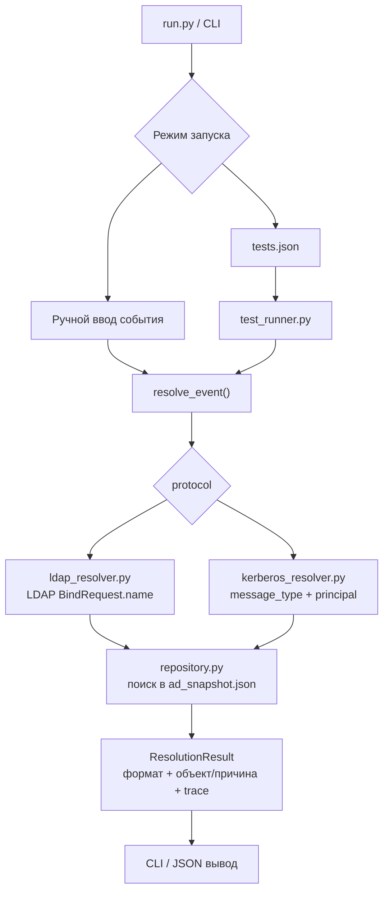

# Прототип AD-like Name Resolution

Прототип показывает, как ITDR-подобный продукт может разобрать имя из уже выделенного LDAP/Kerberos события, определить формат имени, найти объект в локальном снимке AD и вернуть результат проверки.

Проект не подключается к реальному AD, не выполняет LDAP Bind, не делает Kerberos-обмен и не парсит pcap. Здесь проверяется только логика разбора имени и сопоставления с объектами из локальной базы.

## Состав проекта

- `run.py` - точка запуска CLI.
- `ad_snapshot.json` - единая локальная база AD-объектов для ручного режима и тестов.
- `tests.json` - тестовые кейсы по таблицам и алгоритмам статьи.
- `ad_name_resolution/resolver.py` - общий роутер LDAP/Kerberos.
- `ad_name_resolution/ldap_resolver.py` - порядок проверок LDAP Simple Authentication.
- `ad_name_resolution/kerberos_resolver.py` - Kerberos Client Principal Lookup и Server Principal Lookup.
- `ad_name_resolution/repository.py` - функции поиска по локальному снимку AD.
- `ad_name_resolution/cli.py` - ручной режим, меню и вывод результата.
- `ad_name_resolution/test_runner.py` - запуск тестов из JSON.

Общий роутер - это небольшой слой, который сам ничего не ищет в базе. Он смотрит на поле `protocol` во входном событии и передает событие в нужный resolver: LDAP-событие уходит в `ldap_resolver.py`, Kerberos-событие уходит в `kerberos_resolver.py`.

## Схема прототипа



Коротко: CLI или тесты формируют уже разобранное событие, `resolve_event()` выбирает LDAP/Kerberos-ветку, resolver проверяет имя по алгоритму и ходит в локальный AD snapshot через repository. На выходе получается единый `ResolutionResult` с найденным форматом, объектом или причиной ошибки.

## Как идет LDAP-проверка

Для LDAP используется поле `LDAPMessage -> protocolOp: bindRequest -> bindRequest -> name`.

Порядок проверки:

1. `distinguishedName`
2. `userPrincipalName` / generated UPN
3. `DOMAIN\sAMAccountName`
4. `canonicalName`
5. `objectGUID`
6. `displayName`
7. `servicePrincipalName`
8. `MapSPN`
9. `objectSid`
10. `sIDHistory`
11. `canonicalName` с заменой последнего `/` на `\n`

Generated UPN проверяется после явного `userPrincipalName`. Сначала ищется точное значение `userPrincipalName`; если оно не найдено, строка вида `name@domain` может быть сопоставлена как `sAMAccountName=name` и `domainFQDN=domain`.

### Схема LDAP-проверки

Эта схема соответствует текущему LDAP-порядку: берется строка с именем, последовательно проверяются форматы из списка, при первом успешном совпадении возвращается найденный объект, иначе resolver переходит к следующему формату.


## Как идет Kerberos-проверка

Для Kerberos на вход подается уже разобранный principal из трафика: `message_type`, `cname` или `sname`, `name_type`, `name_string[]` и `realm`.

Выбор ветки:

```text
AS-REQ  -> cname -> Client Principal Lookup
TGS-REQ -> sname -> Server Principal Lookup
```

Поддержанные в прототипе `name_type`:

- `1` - `KRB5-NT-PRINCIPAL`
- `2` - `KRB5-NT-SRV-INST`
- `3` - `KRB5-NT-SRV-HST`
- `10` - `KRB5-NT-ENTERPRISE-PRINCIPAL`

`realm` оставлен отдельным полем, как в реальном Kerberos-трафике. CLI может подсказать значение по имени, но в сам resolver `realm` передается отдельно. Это важно: resolver не должен "угадывать" realm из строки имени, потому что в реальном Kerberos-событии realm уже приходит отдельным полем и задает доменный контекст поиска.

### Общая логика Kerberos-разбора

1. Сначала смотрим `message_type`.
2. Если это `AS-REQ`, берем `cname` и идем в `Client Principal Lookup`.
3. Если это `TGS-REQ`, берем `sname` и идем в `Server Principal Lookup`.
4. Из выбранного principal берутся `name_type` и `name_string[]`, а `realm` читается отдельно из события.
5. `realm` используется как контекст домена: например, чтобы понять, в каком домене искать `sAMAccountName`, машинный аккаунт с `$` или специальный объект `krbtgt`.
6. Дальше resolver выбирает ветку по `name_type` и проверяет значения по локальному AD snapshot.

Если тип сообщения, `name_type` или форма `name_string[]` не поддержаны, результат будет `unsupported` или `invalid_input`. Если формат понятен, но объект не найден, возвращается `object_not_found`.

### AS-REQ / Client Principal Lookup

`AS-REQ` используется для поиска клиентского объекта. В прототипе берется `cname`.

Для `KRB5-NT-ENTERPRISE-PRINCIPAL` / `name_type = 10`:

1. Ожидается один элемент в `cname.name_string[]`, например `userA@pastukhov.lab`.
2. Строка сначала ищется как точный `userPrincipalName`.
3. Если точного UPN нет, строка проверяется как generated UPN: `sAMAccountName@domainFQDN`.
4. Если suffix совпадает с доменом из `realm`, левая часть дополнительно проверяется как `sAMAccountName`.
5. Если не найдено, пробуется машинный вариант `sAMAccountName + "$"`.
6. `CrackNames` в прототипе не реализован: продукт работает по локальному AD snapshot и уже проверяет доступные идентификаторы напрямую.

Для `KRB5-NT-PRINCIPAL` / `name_type = 1`:

1. Ожидается один элемент в `cname.name_string[]`, например `userA`.
2. Имя ищется как `sAMAccountName` в контексте `realm`.
3. Если не найдено, пробуется `sAMAccountName + "$"`.
4. Если известен домен из `realm`, формируется UPN-вариант `account@domainFQDN` и проверяется как `userPrincipalName` / generated UPN.
5. Если внутри `NT-PRINCIPAL` пришла строка вида `DOMAIN\user`, домен используется как контекст, а дальше проверяется только account name.
6. `CrackNames` также остается за пределами прототипа.

### TGS-REQ / Server Principal Lookup

`TGS-REQ` используется для поиска сервисного или компьютерного объекта. В прототипе берется `sname`.

Для `KRB5-NT-PRINCIPAL` / `name_type = 1`, `KRB5-NT-SRV-INST` / `name_type = 2` и `KRB5-NT-SRV-HST` / `name_type = 3`:

1. Компоненты `sname.name_string[]` собираются в строку через `/`.
2. Отдельно обрабатывается случай `krbtgt/krbtgt`: для такого service principal берется второй компонент `krbtgt` и ищется объект с `sAMAccountName=krbtgt` в домене, который задан через `realm`.
3. Service-string проверяется как `userPrincipalName`.
4. Если `sname.name_string[]` содержит один элемент, он дополнительно проверяется как `sAMAccountName`.
5. Если не найдено, пробуется `sAMAccountName + "$"`.
6. Если совпадений нет, возвращается `object_not_found`.

Для `KRB5-NT-ENTERPRISE-PRINCIPAL` / `name_type = 10` в `TGS-REQ`:

1. Ожидается один элемент в `sname.name_string[]`, например `HTTP/userA` или `cifs/10-23-RP-DC-01.pastukhov.lab`.
2. Строка сначала ищется как `servicePrincipalName`.
3. Если SPN не найден, строка пробуется как `sAMAccountName`.
4. Затем пробуется `sAMAccountName + "$"`.
5. Для fallback по account name дополнительно проверяется, что у найденного объекта есть хотя бы один зарегистрированный SPN. Без этого объект не считается подходящим server principal.

Общее правило для всех Kerberos-веток: если на конкретном шаге найден ровно один объект, resolver возвращает `found`. Если найдено несколько объектов, возвращается `not_unique` без публикации candidate ids в стабильном JSON-результате. Если шаг дал 0 совпадений, resolver переходит к следующему применимому шагу.

## Объекты в базе

Все тесты используют одну базу `ad_snapshot.json`. Для корнеров добавлены отдельные объекты, чтобы не менять базовые проверки `userA` и `userB`.

В таблице ниже колонка `id` соответствует полю `id` объекта, а в колонке "Поля объекта" перечислены все остальные поля из реального `ad_snapshot.json`.

| id | Поля объекта | Зачем нужен |
|---|---|---|
| userA | - object_type: user<br>- sAMAccountName: userA<br>- userPrincipalName: userA@pastukhov.lab<br>- distinguishedName: CN=userA,CN=Users,DC=pastukhov,DC=lab<br>- canonicalName: pastukhov.lab/Users/userA<br>- displayName: User A<br>- objectGUID: {5c69b042-e0e9-475a-ae37-1751ef9e05e7}<br>- objectSid: S-1-5-21-2845156888-2425353457-3474467337-1114<br>- servicePrincipalName: HTTP/userA<br>- sIDHistory: S-1-5-21-2845156888-2425353457-3474467337-5114<br>- domainFQDN: pastukhov.lab<br>- domainNetBIOS: PASTUKHOV | Базовый пользователь домена pastukhov.lab для проверок LDAP и Kerberos. |
| userB | - object_type: user<br>- sAMAccountName: userB<br>- userPrincipalName: userB@domain3.lab<br>- distinguishedName: CN=userB,CN=Users,DC=domain3,DC=lab<br>- canonicalName: domain3.lab/Users/userB<br>- displayName: UserB<br>- objectGUID: {36eba909-f454-4695-918b-dcdf33b7cd88}<br>- objectSid: S-1-5-21-3677553567-317466416-2570716728-1106<br>- servicePrincipalName: HTTP/userB<br>- sIDHistory: S-1-5-21-3677553567-317466416-2570716728-5106<br>- domainFQDN: domain3.lab<br>- domainNetBIOS: DOMAIN3 | Базовый пользователь домена domain3.lab для проверок второго домена. |
| dc01 | - object_type: computer<br>- sAMAccountName: 10-23-RP-DC-01$<br>- userPrincipalName: null<br>- distinguishedName: CN=10-23-RP-DC-01,OU=Domain Controllers,DC=pastukhov,DC=lab<br>- canonicalName: pastukhov.lab/Domain Controllers/10-23-RP-DC-01<br>- displayName: 10-23-RP-DC-01<br>- objectGUID: {9a0e2d41-587a-4f0b-9e32-000000000001}<br>- objectSid: S-1-5-21-2845156888-2425353457-3474467337-1001<br>- servicePrincipalName: cifs/10-23-RP-DC-01.pastukhov.lab, HOST/10-23-RP-DC-01.pastukhov.lab<br>- sIDHistory: []<br>- domainFQDN: pastukhov.lab<br>- domainNetBIOS: PASTUKHOV | Компьютерный/сервисный объект для SPN и Kerberos TGS-REQ. |
| krbtgt | - object_type: service<br>- sAMAccountName: krbtgt<br>- userPrincipalName: null<br>- distinguishedName: CN=krbtgt,CN=Users,DC=pastukhov,DC=lab<br>- canonicalName: pastukhov.lab/Users/krbtgt<br>- displayName: krbtgt<br>- objectGUID: {aaaaaaaa-0000-0000-0000-000000000003}<br>- objectSid: S-1-5-21-2845156888-2425353457-3474467337-502<br>- servicePrincipalName: []<br>- sIDHistory: []<br>- domainFQDN: pastukhov.lab<br>- domainNetBIOS: PASTUKHOV | Сервисный объект для отдельного случая krbtgt. |
| userImplicit | - object_type: user<br>- sAMAccountName: userImplicit<br>- userPrincipalName: null<br>- distinguishedName: CN=userImplicit,CN=Users,DC=pastukhov,DC=lab<br>- canonicalName: pastukhov.lab/Users/userImplicit<br>- displayName: userImplicit<br>- objectGUID: {c23bf214-9e2d-4bf8-a799-f9dd34f0c0aa}<br>- objectSid: S-1-5-21-2845156888-2425353457-3474467337-1201<br>- servicePrincipalName: []<br>- sIDHistory: []<br>- domainFQDN: pastukhov.lab<br>- domainNetBIOS: PASTUKHOV | Проверка generated UPN: userPrincipalName не задан, но sAMAccountName@domainFQDN должен находиться. |
| userUpnSet | - object_type: user<br>- sAMAccountName: userUpnSet<br>- userPrincipalName: userUpnSetX@pastukhov.lab<br>- distinguishedName: CN=userUpnSet,CN=Users,DC=pastukhov,DC=lab<br>- canonicalName: pastukhov.lab/Users/userUpnSet<br>- displayName: userUpnSet<br>- objectGUID: {559f5da0-da9e-4734-a93e-63ceadb20cf6}<br>- objectSid: S-1-5-21-2845156888-2425353457-3474467337-1202<br>- servicePrincipalName: []<br>- sIDHistory: []<br>- domainFQDN: pastukhov.lab<br>- domainNetBIOS: PASTUKHOV | Проверка отличия явного UPN от generated UPN. |
| userImplicitOwner | - object_type: user<br>- sAMAccountName: userImplicitOwner<br>- userPrincipalName: null<br>- distinguishedName: CN=userImplicitOwner,CN=Users,DC=pastukhov,DC=lab<br>- canonicalName: pastukhov.lab/Users/userImplicitOwner<br>- displayName: userImplicitOwner<br>- objectGUID: {64b4b4d5-d4dd-425f-80d8-a36fcf650a8e}<br>- objectSid: S-1-5-21-2845156888-2425353457-3474467337-1203<br>- servicePrincipalName: []<br>- sIDHistory: []<br>- domainFQDN: pastukhov.lab<br>- domainNetBIOS: PASTUKHOV | Объект, у которого generated UPN пересекается с явным UPN другого объекта. |
| userConflict | - object_type: user<br>- sAMAccountName: userConflict<br>- userPrincipalName: userImplicitOwner@pastukhov.lab<br>- distinguishedName: CN=userConflict,CN=Users,DC=pastukhov,DC=lab<br>- canonicalName: pastukhov.lab/Users/userConflict<br>- displayName: userConflict<br>- objectGUID: {103b49ae-f526-4056-a8d5-97d596023770}<br>- objectSid: S-1-5-21-2845156888-2425353457-3474467337-1204<br>- servicePrincipalName: []<br>- sIDHistory: []<br>- domainFQDN: pastukhov.lab<br>- domainNetBIOS: PASTUKHOV | Объект с явным UPN, который должен иметь приоритет над generated UPN другого объекта. |
| userTrustPastukhov | - object_type: user<br>- sAMAccountName: userTrust<br>- userPrincipalName: userTrust@pastukhov.lab<br>- distinguishedName: CN=userTrust,CN=Users,DC=pastukhov,DC=lab<br>- canonicalName: pastukhov.lab/Users/userTrust<br>- displayName: userTrust<br>- objectGUID: {aaaaaaaa-0000-0000-0000-000000000021}<br>- objectSid: S-1-5-21-2845156888-2425353457-3474467337-1205<br>- servicePrincipalName: []<br>- sIDHistory: []<br>- domainFQDN: pastukhov.lab<br>- domainNetBIOS: PASTUKHOV | Проверка одинакового UPN-like значения в разных доменных контекстах: объект pastukhov.lab. |
| userTrustDomain3 | - object_type: user<br>- sAMAccountName: userTrust<br>- userPrincipalName: userTrust@pastukhov.lab<br>- distinguishedName: CN=userTrust,CN=Users,DC=domain3,DC=lab<br>- canonicalName: domain3.lab/Users/userTrust<br>- displayName: userTrust<br>- objectGUID: {aaaaaaaa-0000-0000-0000-000000000022}<br>- objectSid: S-1-5-21-3677553567-317466416-2570716728-1205<br>- servicePrincipalName: []<br>- sIDHistory: []<br>- domainFQDN: domain3.lab<br>- domainNetBIOS: DOMAIN3 | Проверка одинакового UPN-like значения в разных доменных контекстах: объект domain3.lab. |
| dnEscapedComma | - object_type: user<br>- sAMAccountName: dnEscapedComma<br>- userPrincipalName: dnEscapedComma@pastukhov.lab<br>- distinguishedName: CN=user\,A,CN=Users,DC=pastukhov,DC=lab<br>- canonicalName: pastukhov.lab/Users/dnEscapedComma<br>- displayName: dnEscapedComma<br>- objectGUID: {aaaaaaaa-0000-0000-0000-000000000031}<br>- objectSid: S-1-5-21-2845156888-2425353457-3474467337-1331<br>- servicePrincipalName: []<br>- sIDHistory: []<br>- domainFQDN: pastukhov.lab<br>- domainNetBIOS: PASTUKHOV | DN со спецсимволом запятая. |
| dnEscapedPlus | - object_type: user<br>- sAMAccountName: dnEscapedPlus<br>- userPrincipalName: dnEscapedPlus@pastukhov.lab<br>- distinguishedName: CN=user\+A,CN=Users,DC=pastukhov,DC=lab<br>- canonicalName: pastukhov.lab/Users/dnEscapedPlus<br>- displayName: dnEscapedPlus<br>- objectGUID: {aaaaaaaa-0000-0000-0000-000000000032}<br>- objectSid: S-1-5-21-2845156888-2425353457-3474467337-1332<br>- servicePrincipalName: []<br>- sIDHistory: []<br>- domainFQDN: pastukhov.lab<br>- domainNetBIOS: PASTUKHOV | DN со спецсимволом плюс. |
| dnEscapedQuote | - object_type: user<br>- sAMAccountName: dnEscapedQuote<br>- userPrincipalName: dnEscapedQuote@pastukhov.lab<br>- distinguishedName: CN=user\"A\",CN=Users,DC=pastukhov,DC=lab<br>- canonicalName: pastukhov.lab/Users/dnEscapedQuote<br>- displayName: dnEscapedQuote<br>- objectGUID: {aaaaaaaa-0000-0000-0000-000000000033}<br>- objectSid: S-1-5-21-2845156888-2425353457-3474467337-1333<br>- servicePrincipalName: []<br>- sIDHistory: []<br>- domainFQDN: pastukhov.lab<br>- domainNetBIOS: PASTUKHOV | DN с кавычками. |
| dnEscapedBackslash | - object_type: user<br>- sAMAccountName: dnEscapedBackslash<br>- userPrincipalName: dnEscapedBackslash@pastukhov.lab<br>- distinguishedName: CN=user\\A,CN=Users,DC=pastukhov,DC=lab<br>- canonicalName: pastukhov.lab/Users/dnEscapedBackslash<br>- displayName: dnEscapedBackslash<br>- objectGUID: {aaaaaaaa-0000-0000-0000-000000000034}<br>- objectSid: S-1-5-21-2845156888-2425353457-3474467337-1334<br>- servicePrincipalName: []<br>- sIDHistory: []<br>- domainFQDN: pastukhov.lab<br>- domainNetBIOS: PASTUKHOV | DN с обратным слешем. |
| dnEscapedAngle | - object_type: user<br>- sAMAccountName: dnEscapedAngle<br>- userPrincipalName: dnEscapedAngle@pastukhov.lab<br>- distinguishedName: CN=user\<A\>,CN=Users,DC=pastukhov,DC=lab<br>- canonicalName: pastukhov.lab/Users/dnEscapedAngle<br>- displayName: dnEscapedAngle<br>- objectGUID: {aaaaaaaa-0000-0000-0000-000000000035}<br>- objectSid: S-1-5-21-2845156888-2425353457-3474467337-1335<br>- servicePrincipalName: []<br>- sIDHistory: []<br>- domainFQDN: pastukhov.lab<br>- domainNetBIOS: PASTUKHOV | DN с угловыми скобками. |
| dnEscapedSemicolon | - object_type: user<br>- sAMAccountName: dnEscapedSemicolon<br>- userPrincipalName: dnEscapedSemicolon@pastukhov.lab<br>- distinguishedName: CN=user\;A,CN=Users,DC=pastukhov,DC=lab<br>- canonicalName: pastukhov.lab/Users/dnEscapedSemicolon<br>- displayName: dnEscapedSemicolon<br>- objectGUID: {aaaaaaaa-0000-0000-0000-000000000036}<br>- objectSid: S-1-5-21-2845156888-2425353457-3474467337-1336<br>- servicePrincipalName: []<br>- sIDHistory: []<br>- domainFQDN: pastukhov.lab<br>- domainNetBIOS: PASTUKHOV | DN с точкой с запятой. |
| dnEscapedEquals | - object_type: user<br>- sAMAccountName: dnEscapedEquals<br>- userPrincipalName: dnEscapedEquals@pastukhov.lab<br>- distinguishedName: CN=user\=A,CN=Users,DC=pastukhov,DC=lab<br>- canonicalName: pastukhov.lab/Users/dnEscapedEquals<br>- displayName: dnEscapedEquals<br>- objectGUID: {aaaaaaaa-0000-0000-0000-000000000037}<br>- objectSid: S-1-5-21-2845156888-2425353457-3474467337-1337<br>- servicePrincipalName: []<br>- sIDHistory: []<br>- domainFQDN: pastukhov.lab<br>- domainNetBIOS: PASTUKHOV | DN со знаком равно. |
| dnSlash | - object_type: user<br>- sAMAccountName: dnSlash<br>- userPrincipalName: dnSlash@pastukhov.lab<br>- distinguishedName: CN=user/A,CN=Users,DC=pastukhov,DC=lab<br>- canonicalName: pastukhov.lab/Users/dnSlash<br>- displayName: dnSlash<br>- objectGUID: {aaaaaaaa-0000-0000-0000-000000000038}<br>- objectSid: S-1-5-21-2845156888-2425353457-3474467337-1338<br>- servicePrincipalName: []<br>- sIDHistory: []<br>- domainFQDN: pastukhov.lab<br>- domainNetBIOS: PASTUKHOV | DN со слешем. |
| dnEscapedHash | - object_type: user<br>- sAMAccountName: dnEscapedHash<br>- userPrincipalName: dnEscapedHash@pastukhov.lab<br>- distinguishedName: CN=\#userA,CN=Users,DC=pastukhov,DC=lab<br>- canonicalName: pastukhov.lab/Users/dnEscapedHash<br>- displayName: dnEscapedHash<br>- objectGUID: {aaaaaaaa-0000-0000-0000-000000000039}<br>- objectSid: S-1-5-21-2845156888-2425353457-3474467337-1339<br>- servicePrincipalName: []<br>- sIDHistory: []<br>- domainFQDN: pastukhov.lab<br>- domainNetBIOS: PASTUKHOV | DN с экранированным # в начале CN. |
| cornerSamTarget | - object_type: user<br>- sAMAccountName: cornerSamTarget<br>- userPrincipalName: cornerSamTarget@pastukhov.lab<br>- distinguishedName: CN=cornerSamTarget,CN=Users,DC=pastukhov,DC=lab<br>- canonicalName: pastukhov.lab/Users/cornerSamTarget<br>- displayName: Corner SAM Target<br>- objectGUID: {cccccccc-0000-0000-0000-000000000061}<br>- objectSid: S-1-5-21-2845156888-2425353457-3474467337-1661<br>- servicePrincipalName: []<br>- sIDHistory: []<br>- domainFQDN: pastukhov.lab<br>- domainNetBIOS: PASTUKHOV | Целевой объект для проверки, что sAMAccountName/UPN-подобные форматы проверяются раньше displayName. |
| cornerUpnTarget | - object_type: user<br>- sAMAccountName: cornerUpnTarget<br>- userPrincipalName: cornerUpnTarget@pastukhov.lab<br>- distinguishedName: CN=cornerUpnTarget,CN=Users,DC=pastukhov,DC=lab<br>- canonicalName: pastukhov.lab/Users/cornerUpnTarget<br>- displayName: cornerUpnTarget<br>- objectGUID: {cccccccc-0000-0000-0000-000000000062}<br>- objectSid: S-1-5-21-2845156888-2425353457-3474467337-1662<br>- servicePrincipalName: []<br>- sIDHistory: []<br>- domainFQDN: pastukhov.lab<br>- domainNetBIOS: PASTUKHOV | Целевой объект для проверки приоритета userPrincipalName над displayName. |
| cornerDownlevelTarget | - object_type: user<br>- sAMAccountName: cornerDownlevelTarget<br>- userPrincipalName: cornerDownlevelTarget@pastukhov.lab<br>- distinguishedName: CN=cornerDownlevelTarget,CN=Users,DC=pastukhov,DC=lab<br>- canonicalName: pastukhov.lab/Users/cornerDownlevelTarget<br>- displayName: cornerDownlevelTarget<br>- objectGUID: {cccccccc-0000-0000-0000-000000000063}<br>- objectSid: S-1-5-21-2845156888-2425353457-3474467337-1663<br>- servicePrincipalName: []<br>- sIDHistory: []<br>- domainFQDN: pastukhov.lab<br>- domainNetBIOS: PASTUKHOV | Целевой объект для проверки приоритета DOMAIN\user над displayName. |
| cornerDnTarget | - object_type: user<br>- sAMAccountName: cornerDnTarget<br>- userPrincipalName: cornerDnTarget@pastukhov.lab<br>- distinguishedName: CN=cornerDnTarget,CN=Users,DC=pastukhov,DC=lab<br>- canonicalName: pastukhov.lab/Users/cornerDnTarget<br>- displayName: cornerDnTarget<br>- objectGUID: {cccccccc-0000-0000-0000-000000000064}<br>- objectSid: S-1-5-21-2845156888-2425353457-3474467337-1664<br>- servicePrincipalName: []<br>- sIDHistory: []<br>- domainFQDN: pastukhov.lab<br>- domainNetBIOS: PASTUKHOV | Целевой объект для проверки приоритета distinguishedName над displayName. |
| cornerCanonicalTarget | - object_type: user<br>- sAMAccountName: cornerCanonicalTarget<br>- userPrincipalName: cornerCanonicalTarget@pastukhov.lab<br>- distinguishedName: CN=cornerCanonicalTarget,CN=Users,DC=pastukhov,DC=lab<br>- canonicalName: pastukhov.lab/Users/cornerCanonicalTarget<br>- displayName: cornerCanonicalTarget<br>- objectGUID: {cccccccc-0000-0000-0000-000000000065}<br>- objectSid: S-1-5-21-2845156888-2425353457-3474467337-1665<br>- servicePrincipalName: []<br>- sIDHistory: []<br>- domainFQDN: pastukhov.lab<br>- domainNetBIOS: PASTUKHOV | Целевой объект для проверки приоритета canonicalName над displayName. |
| cornerGuidTarget | - object_type: user<br>- sAMAccountName: cornerGuidTarget<br>- userPrincipalName: cornerGuidTarget@pastukhov.lab<br>- distinguishedName: CN=cornerGuidTarget,CN=Users,DC=pastukhov,DC=lab<br>- canonicalName: pastukhov.lab/Users/cornerGuidTarget<br>- displayName: cornerGuidTarget<br>- objectGUID: {cccccccc-0000-0000-0000-000000000066}<br>- objectSid: S-1-5-21-2845156888-2425353457-3474467337-1666<br>- servicePrincipalName: []<br>- sIDHistory: []<br>- domainFQDN: pastukhov.lab<br>- domainNetBIOS: PASTUKHOV | Целевой объект для проверки приоритета objectGUID над displayName. |
| cornerSpnTarget | - object_type: user<br>- sAMAccountName: cornerSpnTarget<br>- userPrincipalName: cornerSpnTarget@pastukhov.lab<br>- distinguishedName: CN=cornerSpnTarget,CN=Users,DC=pastukhov,DC=lab<br>- canonicalName: pastukhov.lab/Users/cornerSpnTarget<br>- displayName: cornerSpnTarget<br>- objectGUID: {cccccccc-0000-0000-0000-000000000067}<br>- objectSid: S-1-5-21-2845156888-2425353457-3474467337-1667<br>- servicePrincipalName: HTTP/cornerSpnTarget<br>- sIDHistory: []<br>- domainFQDN: pastukhov.lab<br>- domainNetBIOS: PASTUKHOV | Целевой объект для проверки пересечения SPN/displayName. |
| cornerSidTarget | - object_type: user<br>- sAMAccountName: cornerSidTarget<br>- userPrincipalName: cornerSidTarget@pastukhov.lab<br>- distinguishedName: CN=cornerSidTarget,CN=Users,DC=pastukhov,DC=lab<br>- canonicalName: pastukhov.lab/Users/cornerSidTarget<br>- displayName: cornerSidTarget<br>- objectGUID: {cccccccc-0000-0000-0000-000000000068}<br>- objectSid: S-1-5-21-2845156888-2425353457-3474467337-1668<br>- servicePrincipalName: []<br>- sIDHistory: []<br>- domainFQDN: pastukhov.lab<br>- domainNetBIOS: PASTUKHOV | Целевой объект для проверки пересечения objectSid/displayName. |
| userDisplaySam | - object_type: user<br>- sAMAccountName: userDisplaySam<br>- userPrincipalName: userDisplaySam@pastukhov.lab<br>- distinguishedName: CN=userDisplaySam,CN=Users,DC=pastukhov,DC=lab<br>- canonicalName: pastukhov.lab/Users/userDisplaySam<br>- displayName: cornerSamTarget<br>- objectGUID: {bbbbbbbb-0000-0000-0000-000000000081}<br>- objectSid: S-1-5-21-2845156888-2425353457-3474467337-1781<br>- servicePrincipalName: []<br>- sIDHistory: []<br>- domainFQDN: pastukhov.lab<br>- domainNetBIOS: PASTUKHOV | displayName намеренно совпадает с sAMAccountName другого объекта. |
| userDisplayUpn | - object_type: user<br>- sAMAccountName: userDisplayUpn<br>- userPrincipalName: userDisplayUpn@pastukhov.lab<br>- distinguishedName: CN=userDisplayUpn,CN=Users,DC=pastukhov,DC=lab<br>- canonicalName: pastukhov.lab/Users/userDisplayUpn<br>- displayName: cornerUpnTarget@pastukhov.lab<br>- objectGUID: {bbbbbbbb-0000-0000-0000-000000000082}<br>- objectSid: S-1-5-21-2845156888-2425353457-3474467337-1782<br>- servicePrincipalName: []<br>- sIDHistory: []<br>- domainFQDN: pastukhov.lab<br>- domainNetBIOS: PASTUKHOV | displayName намеренно совпадает с UPN другого объекта. |
| userDisplayNetbios | - object_type: user<br>- sAMAccountName: userDisplayNetbios<br>- userPrincipalName: userDisplayNetbios@pastukhov.lab<br>- distinguishedName: CN=userDisplayNetbios,CN=Users,DC=pastukhov,DC=lab<br>- canonicalName: pastukhov.lab/Users/userDisplayNetbios<br>- displayName: PASTUKHOV\cornerDownlevelTarget<br>- objectGUID: {bbbbbbbb-0000-0000-0000-000000000083}<br>- objectSid: S-1-5-21-2845156888-2425353457-3474467337-1783<br>- servicePrincipalName: []<br>- sIDHistory: []<br>- domainFQDN: pastukhov.lab<br>- domainNetBIOS: PASTUKHOV | displayName намеренно совпадает с down-level именем другого объекта. |
| userDisplayDn | - object_type: user<br>- sAMAccountName: userDisplayDn<br>- userPrincipalName: userDisplayDn@pastukhov.lab<br>- distinguishedName: CN=userDisplayDn,CN=Users,DC=pastukhov,DC=lab<br>- canonicalName: pastukhov.lab/Users/userDisplayDn<br>- displayName: CN=cornerDnTarget,CN=Users,DC=pastukhov,DC=lab<br>- objectGUID: {bbbbbbbb-0000-0000-0000-000000000084}<br>- objectSid: S-1-5-21-2845156888-2425353457-3474467337-1784<br>- servicePrincipalName: []<br>- sIDHistory: []<br>- domainFQDN: pastukhov.lab<br>- domainNetBIOS: PASTUKHOV | displayName намеренно совпадает с DN другого объекта. |
| userDisplayCanonical | - object_type: user<br>- sAMAccountName: userDisplayCanonical<br>- userPrincipalName: userDisplayCanonical@pastukhov.lab<br>- distinguishedName: CN=userDisplayCanonical,CN=Users,DC=pastukhov,DC=lab<br>- canonicalName: pastukhov.lab/Users/userDisplayCanonical<br>- displayName: pastukhov.lab/Users/cornerCanonicalTarget<br>- objectGUID: {bbbbbbbb-0000-0000-0000-000000000085}<br>- objectSid: S-1-5-21-2845156888-2425353457-3474467337-1785<br>- servicePrincipalName: []<br>- sIDHistory: []<br>- domainFQDN: pastukhov.lab<br>- domainNetBIOS: PASTUKHOV | displayName намеренно совпадает с canonicalName другого объекта. |
| userDisplayGuid | - object_type: user<br>- sAMAccountName: userDisplayGuid<br>- userPrincipalName: userDisplayGuid@pastukhov.lab<br>- distinguishedName: CN=userDisplayGuid,CN=Users,DC=pastukhov,DC=lab<br>- canonicalName: pastukhov.lab/Users/userDisplayGuid<br>- displayName: {cccccccc-0000-0000-0000-000000000066}<br>- objectGUID: {bbbbbbbb-0000-0000-0000-000000000086}<br>- objectSid: S-1-5-21-2845156888-2425353457-3474467337-1786<br>- servicePrincipalName: []<br>- sIDHistory: []<br>- domainFQDN: pastukhov.lab<br>- domainNetBIOS: PASTUKHOV | displayName намеренно совпадает с GUID другого объекта. |
| userDisplaySpn | - object_type: user<br>- sAMAccountName: userDisplaySpn<br>- userPrincipalName: userDisplaySpn@pastukhov.lab<br>- distinguishedName: CN=userDisplaySpn,CN=Users,DC=pastukhov,DC=lab<br>- canonicalName: pastukhov.lab/Users/userDisplaySpn<br>- displayName: HTTP/cornerSpnTarget<br>- objectGUID: {bbbbbbbb-0000-0000-0000-000000000087}<br>- objectSid: S-1-5-21-2845156888-2425353457-3474467337-1787<br>- servicePrincipalName: []<br>- sIDHistory: []<br>- domainFQDN: pastukhov.lab<br>- domainNetBIOS: PASTUKHOV | displayName намеренно совпадает с SPN другого объекта. |
| userDisplaySid | - object_type: user<br>- sAMAccountName: userDisplaySid<br>- userPrincipalName: userDisplaySid@pastukhov.lab<br>- distinguishedName: CN=userDisplaySid,CN=Users,DC=pastukhov,DC=lab<br>- canonicalName: pastukhov.lab/Users/userDisplaySid<br>- displayName: S-1-5-21-2845156888-2425353457-3474467337-1668<br>- objectGUID: {bbbbbbbb-0000-0000-0000-000000000088}<br>- objectSid: S-1-5-21-2845156888-2425353457-3474467337-1788<br>- servicePrincipalName: []<br>- sIDHistory: []<br>- domainFQDN: pastukhov.lab<br>- domainNetBIOS: PASTUKHOV | displayName намеренно совпадает с SID другого объекта. |
| userSameDisplayOne | - object_type: user<br>- sAMAccountName: userSameDisplayOne<br>- userPrincipalName: userSameDisplayOne@pastukhov.lab<br>- distinguishedName: CN=userSameDisplayOne,CN=Users,DC=pastukhov,DC=lab<br>- canonicalName: pastukhov.lab/Users/userSameDisplayOne<br>- displayName: Same Display<br>- objectGUID: {bbbbbbbb-0000-0000-0000-000000000101}<br>- objectSid: S-1-5-21-2845156888-2425353457-3474467337-1501<br>- servicePrincipalName: []<br>- sIDHistory: []<br>- domainFQDN: pastukhov.lab<br>- domainNetBIOS: PASTUKHOV | Первый объект с одинаковым displayName. |
| userSameDisplayTwo | - object_type: user<br>- sAMAccountName: userSameDisplayTwo<br>- userPrincipalName: userSameDisplayTwo@pastukhov.lab<br>- distinguishedName: CN=userSameDisplayTwo,CN=Users,DC=pastukhov,DC=lab<br>- canonicalName: pastukhov.lab/Users/userSameDisplayTwo<br>- displayName: Same Display<br>- objectGUID: {bbbbbbbb-0000-0000-0000-000000000102}<br>- objectSid: S-1-5-21-2845156888-2425353457-3474467337-1502<br>- servicePrincipalName: []<br>- sIDHistory: []<br>- domainFQDN: pastukhov.lab<br>- domainNetBIOS: PASTUKHOV | Второй объект с таким же displayName для проверки not_unique. |

## Тестовые кейсы

В `tests.json` у каждого кейса есть технический `id`, но в консоли теперь показывается короткое человеческое название `title`. Ориентироваться лучше по номеру теста, названию и формату, а `id` нужен как стабильная ссылка на кейс в файле.

Разделы тестов:

| id раздела | Название в консоли | Количество |
|---|---|---|
| `ldap_table` | LDAP: базовые форматы имени | 19 |
| `ldap_algorithm` | LDAP: дополнительные форматы | 2 |
| `ldap_dn_special` | LDAP: DN со спецсимволами | 9 |
| `ldap_corner` | LDAP: корнеры и приоритет форматов | 15 |
| `kerberos_client_lookup` | Kerberos: AS-REQ / Client Principal Lookup | 11 |
| `kerberos_server_lookup` | Kerberos: TGS-REQ / Server Principal Lookup | 7 |

Список кейсов:

| № | Название | Формат / ветка | Раздел | id |
|---|---|---|---|---|
| 1 | LDAP: короткое имя userA без домена не находится | displayName / not_found | LDAP: базовые форматы имени | `ldap_sam_userA_not_accepted` |
| 2 | LDAP: найти userA по UPN | userPrincipalName | LDAP: базовые форматы имени | `ldap_upn_userA` |
| 3 | LDAP: найти userB по UPN | userPrincipalName | LDAP: базовые форматы имени | `ldap_upn_userB` |
| 4 | LDAP: найти userA по DOMAIN\user | downLevelLogonName | LDAP: базовые форматы имени | `ldap_downlevel_userA` |
| 5 | LDAP: найти userB по DOMAIN\user | downLevelLogonName | LDAP: базовые форматы имени | `ldap_downlevel_userB` |
| 6 | LDAP: найти userA по DN | distinguishedName | LDAP: базовые форматы имени | `ldap_dn_userA` |
| 7 | LDAP: найти userB по DN | distinguishedName | LDAP: базовые форматы имени | `ldap_dn_userB` |
| 8 | LDAP: найти userA по canonicalName | canonicalName | LDAP: базовые форматы имени | `ldap_canonical_userA` |
| 9 | LDAP: найти userB по canonicalName | canonicalName | LDAP: базовые форматы имени | `ldap_canonical_userB` |
| 10 | LDAP: найти userA по displayName | displayName | LDAP: базовые форматы имени | `ldap_display_userA` |
| 11 | LDAP: найти userB по displayName | displayName | LDAP: базовые форматы имени | `ldap_display_userB` |
| 12 | LDAP: найти userA по objectGUID | objectGUID | LDAP: базовые форматы имени | `ldap_guid_userA` |
| 13 | LDAP: найти userB по objectGUID | objectGUID | LDAP: базовые форматы имени | `ldap_guid_userB` |
| 14 | LDAP: найти userA по SPN | servicePrincipalName | LDAP: базовые форматы имени | `ldap_spn_userA` |
| 15 | LDAP: найти userB по SPN | servicePrincipalName | LDAP: базовые форматы имени | `ldap_spn_userB` |
| 16 | LDAP: найти userA по objectSid | objectSid | LDAP: базовые форматы имени | `ldap_object_sid_userA` |
| 17 | LDAP: найти userB по objectSid | objectSid | LDAP: базовые форматы имени | `ldap_object_sid_userB` |
| 18 | LDAP: найти userA через MapSPN | MapSPN | LDAP: базовые форматы имени | `ldap_mapspn_userA` |
| 19 | LDAP: найти userB через MapSPN | MapSPN | LDAP: базовые форматы имени | `ldap_mapspn_userB` |
| 20 | LDAP: найти userA по sIDHistory | sIDHistory | LDAP: дополнительные форматы | `ldap_sid_history_userA` |
| 21 | LDAP: найти userA по canonicalName с переводом строки | canonicalNameWithLF | LDAP: дополнительные форматы | `ldap_canonical_lf_userA` |
| 22 | LDAP DN: запятая в CN | distinguishedName | LDAP: DN со спецсимволами | `ldap_dnEscapedComma` |
| 23 | LDAP DN: плюс в CN | distinguishedName | LDAP: DN со спецсимволами | `ldap_dnEscapedPlus` |
| 24 | LDAP DN: кавычки в CN | distinguishedName | LDAP: DN со спецсимволами | `ldap_dnEscapedQuote` |
| 25 | LDAP DN: обратный слеш в CN | distinguishedName | LDAP: DN со спецсимволами | `ldap_dnEscapedBackslash` |
| 26 | LDAP DN: угловые скобки в CN | distinguishedName | LDAP: DN со спецсимволами | `ldap_dnEscapedAngle` |
| 27 | LDAP DN: точка с запятой в CN | distinguishedName | LDAP: DN со спецсимволами | `ldap_dnEscapedSemicolon` |
| 28 | LDAP DN: знак равно в CN | distinguishedName | LDAP: DN со спецсимволами | `ldap_dnEscapedEquals` |
| 29 | LDAP DN: слеш в CN | distinguishedName | LDAP: DN со спецсимволами | `ldap_dnSlash` |
| 30 | LDAP DN: # в начале CN | distinguishedName | LDAP: DN со спецсимволами | `ldap_dnEscapedHash` |
| 31 | LDAP: generated UPN находит объект без явного UPN | generatedUPN | LDAP: корнеры и приоритет форматов | `ldap_generated_upn` |
| 32 | LDAP: generated UPN работает при другом явном UPN | generatedUPN | LDAP: корнеры и приоритет форматов | `ldap_implicit_upn_still_resolves_when_explicit_set` |
| 33 | LDAP: явный UPN отличается от generated UPN | userPrincipalName | LDAP: корнеры и приоритет форматов | `ldap_explicit_changed_upn` |
| 34 | LDAP: явный UPN выигрывает у generated UPN | userPrincipalName | LDAP: корнеры и приоритет форматов | `ldap_explicit_upn_wins` |
| 35 | LDAP: одинаковый UPN-like в контексте pastukhov.lab | userPrincipalName + domain_context | LDAP: корнеры и приоритет форматов | `ldap_trust_local_pastukhov_wins` |
| 36 | LDAP: одинаковый UPN-like в контексте domain3.lab | userPrincipalName + domain_context | LDAP: корнеры и приоритет форматов | `ldap_trust_local_domain3_wins` |
| 37 | LDAP: одинаковый displayName дает not_unique | displayName / not_unique | LDAP: корнеры и приоритет форматов | `ldap_duplicate_display_name` |
| 38 | LDAP: displayName совпал с SAM другого объекта | displayName | LDAP: корнеры и приоритет форматов | `ldap_display_equals_sam` |
| 39 | LDAP: UPN выигрывает у displayName | userPrincipalName | LDAP: корнеры и приоритет форматов | `ldap_display_equals_upn` |
| 40 | LDAP: DOMAIN\user выигрывает у displayName | downLevelLogonName | LDAP: корнеры и приоритет форматов | `ldap_display_equals_downlevel` |
| 41 | LDAP: DN выигрывает у displayName | distinguishedName | LDAP: корнеры и приоритет форматов | `ldap_display_equals_dn` |
| 42 | LDAP: canonicalName выигрывает у displayName | canonicalName | LDAP: корнеры и приоритет форматов | `ldap_display_equals_canonical` |
| 43 | LDAP: objectGUID выигрывает у displayName | objectGUID | LDAP: корнеры и приоритет форматов | `ldap_display_equals_guid` |
| 44 | LDAP: displayName проверяется раньше SPN | displayName | LDAP: корнеры и приоритет форматов | `ldap_display_equals_spn` |
| 45 | LDAP: displayName проверяется раньше SID | displayName | LDAP: корнеры и приоритет форматов | `ldap_display_equals_sid` |
| 46 | Kerberos AS-REQ: найти userA по UPN | NT-ENTERPRISE/userPrincipalName | Kerberos: AS-REQ / Client Principal Lookup | `krb_as_enterprise_upn_userA` |
| 47 | Kerberos AS-REQ: найти userB по UPN | NT-ENTERPRISE/userPrincipalName | Kerberos: AS-REQ / Client Principal Lookup | `krb_as_enterprise_upn_userB` |
| 48 | Kerberos AS-REQ: generated UPN находит userImplicit | NT-ENTERPRISE/generatedUPN | Kerberos: AS-REQ / Client Principal Lookup | `krb_as_enterprise_generated_upn` |
| 49 | Kerberos AS-REQ: generated UPN при другом явном UPN | NT-ENTERPRISE/generatedUPN | Kerberos: AS-REQ / Client Principal Lookup | `krb_as_enterprise_implicit_upn_with_explicit_set` |
| 50 | Kerberos AS-REQ: явный UPN отличается от generated UPN | NT-ENTERPRISE/userPrincipalName | Kerberos: AS-REQ / Client Principal Lookup | `krb_as_enterprise_explicit_changed_upn` |
| 51 | Kerberos AS-REQ: явный UPN выигрывает у generated UPN | NT-ENTERPRISE/userPrincipalName | Kerberos: AS-REQ / Client Principal Lookup | `krb_as_enterprise_explicit_wins` |
| 52 | Kerberos AS-REQ: найти userA по account name | NT-PRINCIPAL/sAMAccountName | Kerberos: AS-REQ / Client Principal Lookup | `krb_as_principal_sam_userA` |
| 53 | Kerberos AS-REQ: найти userB по account name | NT-PRINCIPAL/sAMAccountName | Kerberos: AS-REQ / Client Principal Lookup | `krb_as_principal_sam_userB` |
| 54 | Kerberos AS-REQ: найти компьютер через account+$ | NT-PRINCIPAL/sAMAccountName+$ | Kerberos: AS-REQ / Client Principal Lookup | `krb_as_principal_sam_dollar` |
| 55 | Kerberos AS-REQ: fallback из account name в UPN | NT-PRINCIPAL/userPrincipalName | Kerberos: AS-REQ / Client Principal Lookup | `krb_as_principal_upn_fallback` |
| 56 | Kerberos AS-REQ: DN не считается principal-форматом | NT-ENTERPRISE / not_found | Kerberos: AS-REQ / Client Principal Lookup | `krb_as_dn_not_accepted` |
| 57 | Kerberos TGS-REQ: service/host не ищется как SPN в NT-SRV-INST | NT-SRV-INST/userPrincipalName / not_found | Kerberos: TGS-REQ / Server Principal Lookup | `krb_tgs_srv_inst_userprincipalname_not_found` |
| 58 | Kerberos TGS-REQ: специальный случай krbtgt/krbtgt | NT-SRV-INST/krbtgt/sAMAccountName | Kerberos: TGS-REQ / Server Principal Lookup | `krb_tgs_krbtgt_special_case` |
| 59 | Kerberos TGS-REQ: найти компьютер через account+$ | NT-SRV-INST/sAMAccountName+$ | Kerberos: TGS-REQ / Server Principal Lookup | `krb_tgs_srv_inst_sam_dollar` |
| 60 | Kerberos TGS-REQ: найти DC по SPN | NT-ENTERPRISE/servicePrincipalName | Kerberos: TGS-REQ / Server Principal Lookup | `krb_tgs_enterprise_spn_dc` |
| 61 | Kerberos TGS-REQ: найти userA по SPN | NT-ENTERPRISE/servicePrincipalName | Kerberos: TGS-REQ / Server Principal Lookup | `krb_tgs_enterprise_spn_userA` |
| 62 | Kerberos TGS-REQ: найти userA по account name при наличии SPN | NT-ENTERPRISE/sAMAccountName | Kerberos: TGS-REQ / Server Principal Lookup | `krb_tgs_enterprise_sam_with_spn` |
| 63 | Kerberos TGS-REQ: account без SPN не подходит как server principal | NT-ENTERPRISE/sAMAccountName / not_found | Kerberos: TGS-REQ / Server Principal Lookup | `krb_tgs_enterprise_fallback_without_spn_fails` |

## Как запускать

Открыть интерактивное меню:

```powershell
python run.py
```

В меню:

1. `Ручной ввод события` - руками ввести LDAP/Kerberos событие.
2. `Автоматические тесты` - посмотреть список, выбрать один тест, запустить все тесты или один раздел.

Самый удобный запуск одного теста:

1. Запустить `python run.py`.
2. Выбрать `2. Автоматические тесты`.
3. Выбрать `1. Показать список тестов`, чтобы увидеть сгруппированный список с номерами.
4. Выбрать `2. Выбрать тест из списка`.
5. Ввести номер теста из первой колонки, например `14` для `LDAP: найти userA по SPN`.

Запустить один раздел через меню:

1. Запустить `python run.py`.
2. Выбрать `2. Автоматические тесты`.
3. Выбрать `4. Запустить раздел тестов`.
4. Ввести номер раздела из списка или его id, например `ldap_table`.

Запустить все тесты:

```powershell
python run.py --run-all
```

Посмотреть список тестов:

```powershell
python run.py --list-tests
```

Запустить один раздел:

```powershell
python run.py --run-category ldap_table
```

Если указать несуществующий раздел, CLI покажет доступные разделы и вернет ненулевой exit code.
